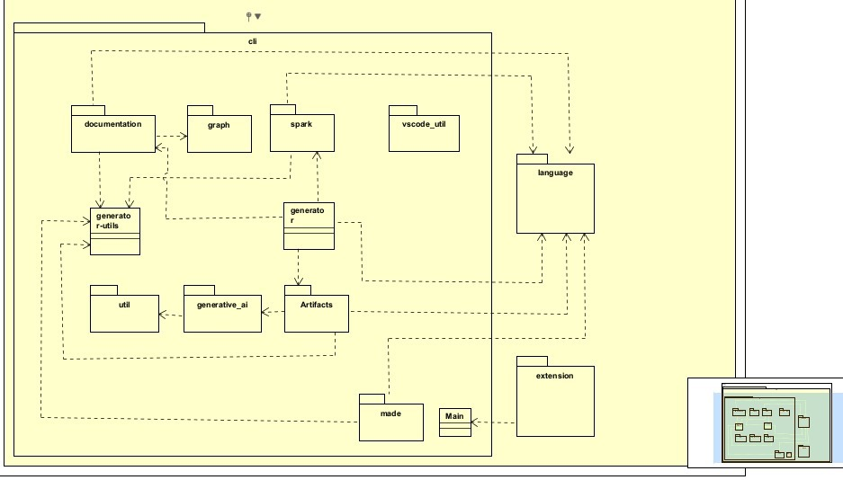

This file is an analysis of the Andes Architecture and aims to guide new developers of the tool in understanding each file or segment and how they communicate.

# Architecture Used

This software follows a **modular architecture**, which is a design approach where a system is divided into separate, independent components (or "modules") that each handle a specific responsibility. These modules interact with each other through well-defined interfaces, allowing for flexibility, maintainability, scalability, and ease of testing.

# Segments, Components, and Their Communication

While developing this software, you might encounter difficulties in understanding the folder structure and the role of each file. This section is meant to explain the communication between them.

## Modules and Component Functions

Following the modular structure, each module and file has its unique function. Below is an overview of the modules and files inside `src`:

📂 `src/`:

- 📂 `cli/`: Centralizes files that allow interaction with the system via the terminal.
  
  - 📂 `artifacts/`: Where BDD (.feature) files that describe use cases are created. The description of events linked to these use cases is automatically generated inside these files.
    
    - 📂 `bdd/`: The `BDDService` class in this module generates BDD (.feature) files from the events of a use case model using OpenAI to create BDD content based on event descriptions.
      
      - 📄 `application.ts`: Instantiates and runs the `BDDService`. It receives a model (which may contain one or more use cases) and defines a `target_folder` where `BDDService` will create the corresponding feature files.
      
      - 📄 `generator.ts`: Processes the use cases in the model and uses OpenAI to automatically turn their descriptions into BDD test files.
  
  - 📂 `documentation/`: Contains the module responsible for generating documentation and UML diagrams.
    
    - 📂 `docsaurus/`: Houses the `DocusaurusService` class, which generates structured documentation for Docusaurus based on the model.
      
      - 📄 `DocusaurusService.ts`: A generator of UML diagrams and documentation.
      
      - 📄 `ClassDiagram.ts`: Generates UML and Markdown documentation from the AST model created using Langium.
      
      - 📄 `ModelUseCases.ts`: Generates UML use case diagrams (.puml files) from the model. For each use case, it creates actors, defines use cases, links actors to use cases, and sets dependencies between them.
    
    - 📄 `application.ts`: Responsible for generating documentation from a model. It orchestrates the documentation creation process using `DocusaurusService`.

  - 📂 `generative_ai/`: Returns OpenAI responses and handles error checking.
  - 📂 `graph/`: Generates class diagram visualizations.
  - 📂 `made/`: Generates `Made` files.
  - 📂 `spark/`: Generates `Spark` files.
  - 📂 `util/`: Utility class for loading environment variables from `.env` files and securely accessing them throughout the project.
  - 📂 `vscode_util/`: Provides methods for interacting with VS Code.
    - 📄 `vscode_util.ts`: Displays visual progress messages.

- 📂 `extension/`: Initializes the VS Code extension and registers custom commands to generate documentation from active code.

- 📂 `language/`: Implements the custom DSL language (Andes), including rules, syntax, parsing, validation, and `.langium` files that define the language grammar and structure.

  - 📄 `andes-module.ts`: Implements the main Andes language structure in Langium, defines custom services such as validation and scoping, and integrates them into the language.
  
  - 📄 `andes-scope.ts`: Defines the custom scoping logic for the Andes language, ensuring that elements like internal requirements, use cases, events, actors, and entities can be referenced throughout the model.
  
  - 📄 `andes-validator.ts`: Implements the validation logic for Andes-specific semantic rules.
  
  - 📄 `main-browser.ts`: Initializes the Andes server in the browser, creating a Web Worker connection and activating the language services.
  
  - 📄 `main.ts`: Node.js version of the server initialization, for desktop VS Code use.

## Communication Between Modules

The image below shows which modules can access others, meaning they can use attributes, methods, or classes from those files.

Alternatively, here's a textual summary of the module interaction:

🗂️ `cli/`
- 📂 `artifacts/`
  - 📂 `bdd/`
    - 📄 `BDDService.ts`
      - 👁️ `"../../../language/generated/ast.js"`
      - 👁️ `"../../generative_ai/application.js"`
      - 👁️ `"../../generator-utils.js"`
  - 📄 `application.ts`
    - 👁️ `"../../language/generated/ast.js"`
    - 👁️ `"./bdd/BDDService.js"`
  - 📄 `generator.ts`
    - 👁️ `"../../language/generated/ast.js"`
    - 👁️ `"../cli-util.js"`
    - 👁️ `"../generative_ai/application.js"`
    - 👁️ `"../generator-utils.js"`

- 📂 `documentation/`
  - 📂 `docsaurus/`
    - 📄 `ClassDiagram.ts`
      - 👁️ `"../../../language/generated/ast.js"`
      - 👁️ `"../../generator-utils.js"`
    - 📄 `DocusaurusService.ts`
      - 👁️ `"../../../language/generated/ast.js"`
      - 👁️ `"../../generator-utils.js"`
      - 👁️ `"../../graph/graph.js"`
      - 👁️ `"../docsaurus/ClassDiagram.js"`
      - 👁️ `"../docsaurus/ModelUseCases.js"`
    - 📄 `ModelUseCases.ts`
      - 👁️ `"../../../language/generated/ast.js"`
  - 📄 `application.ts`
    - 👁️ `"../../language/generated/ast.js"`
    - 👁️ `"../documentation/docsaurus/DocusaurusService.js"`

- 📂 `generative_ai/`
  - 📄 `application.ts`
    - 👁️ `"../util/envLoader.js"`

- 📂 `graph/`
  - 📄 `graph.ts`

- 📂 `made/`
  - 📄 `application.ts`
    - 👁️ `"../../language/generated/ast.js"`
    - 👁️ `"../generator-utils.js"`
    - 👁️ `"langium/generate"`

- 📂 `spark/`
  - 📄 `application.ts`
    - 👁️ `"../../language/generated/ast.js"`
    - 👁️ `"../generator-utils.js"`

- 📂 `util/`
  - 📄 `envLoader.ts`

- 📂 `vscode_util/`
  - 📄 `vscodeutil.ts`

- 📄 `cli-util.ts`
- 📄 `generator-utils.ts`
- 📄 `generator.ts`
- 📄 `main.ts`

🗂️ `extension/`
- 📄 `main.ts`
  - 👁️ `"../cli/main.js"`

🗂️ `language/`
- 📄 `andes-module.ts`
  - 👁️ `"./generated/module.js"`
  - 👁️ `"./andes-validator.js"`
  - 👁️ `"./andes-scope.js"`

- 📄 `andes-scope.ts`
  - 👁️ `"./generated/ast.js"`

- 📄 `andes-validator.ts`
  - 👁️ `"./generated/ast.js"`
  - 👁️ `"./andes-module.js"`

- 📄 `*.langium`

- 📄 `main-browser.ts`
  - 👁️ `"./andes-module.js"`

- 📄 `main.ts`
  - 👁️ `"./andes-module.js"`

# References

- ["Modularity and Architectural Styles" by Software Architecture Monday](https://www.youtube.com/watch?v=Cmsyn7HK6YE&ab_channel=SoftwareArchitectureMonday)
- ["What is Modular Architecture? Benefits & Implementation Methods" by Cengiz Toru](https://medium.com/geekculture/what-is-modular-architecture-benefits-implementation-methods-8c272ebc05eb)

# A Structure Improvement Proposal

## Project Structure Proposal – Andes

This document presents improvement proposals for the directory architecture of the **Andes** project to make it more organized, scalable, and aligned with best practices. The suggestions are based on an analysis of responsibility separation, code reuse, and clarity in maintenance.

### Suggested Directory Structure

    src/
    ├── core/
    │   ├── grammar/
    │   ├── validation/
    │   ├── generation/
    │   └── utils/
    │
    ├── interfaces/
    │   ├── cli/
    │   ├── lsp/
    │   └── extension.ts
    │
    ├── config/
    │
    ├── types/
    │
    └── index.ts
    test/
    docs/

---

### `src/core/`

Contains the core logic related to the domain of the extension. This includes grammar definitions, validations, and artifact generation.

- **grammar/**: DSL definitions using Langium, including syntax and semantics.
- **validation/**: Validates user-written language rules.
- **generation/**: Transforms the DSL into artifacts (e.g., JSON, documentation).
- **utils/**: Utility functions used throughout the project.

---

### `src/interfaces/`

Holds entry points and interaction layers for users and external tools.

- **cli/**: For command-line usage (scripts, CI/CD).
- **lsp/**: Language Server Protocol integration (autocomplete, hover, etc.).
- **extension.ts**: Main entry for the VS Code extension.

---

### `src/config/`

Stores configuration files and constants, such as paths and settings.

---

### `src/types/`

Houses interfaces, enums, and shared types for consistency across the project.

---

### `test/`

Automated tests covering validations, generation, and other behaviors.

---

### `docs/`

Documentation, guides, and usage information.

---

### Summary

This structure aims to be modular, clean, and scalable. By grouping files by responsibility, we enhance readability, maintenance, and future development.

---

    