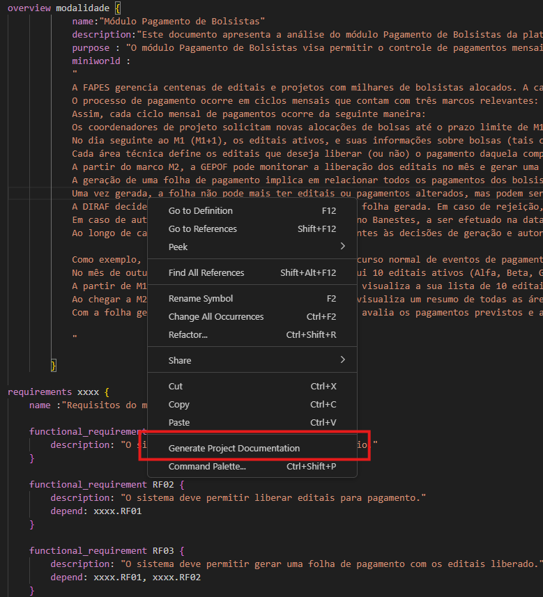

1. Create a file with extension `.andes` (e.g., slave_one.spark)
2. Define the [class diagram](5_lang)
3. Save the file `.andes`
4. Click with right botton and chose one option

5. After that, Andes will generate the software artifacts