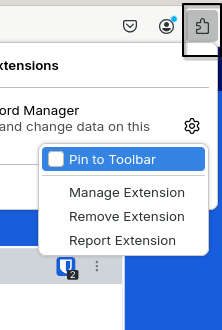
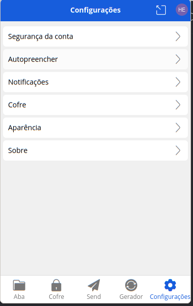
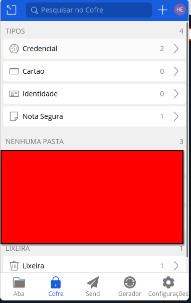

# Bitwarden

#### O Bitwarden é um gerenciador de senhas gratuito e open-source, e nunca teve sua segurança comprometida (como o LastPass foi).

O uso regular do Bitwarden ou algum gerenciador de senha é não só recomendado, como virtualmente OBRIGATÓRIO em um ambiente com informações sensiveis. O uso do **send** para informações sensíveis é **INDISPENSÁVEL**.

Tabela de contéudos:
- [Instalação](#instalação)
- [Como usar](#dicas)
- [Mandando informações de forma segura](#sends)

# Instalação
Recomendo usar a versão web do Bitwarden, tanto o webapp comum, quanto a extensão de browser. Eu vou usar, neste tutorial, a extensão do Mozilla Firefox, mas o procedimento é parecido em outras versões.

1. Acesse sua loja de extensões:  
    Para browsers baseados em Chromium (Edge, Chrome, etc):
        https://chromewebstore.google.com/detail/bitwarden-gerenciador-de/nngceckbapebfimnlniiiahkandclblb  
        Para Firefox:  
        https://addons.mozilla.org/en-US/firefox/addon/bitwarden-password-manager/?browser=firefox  
        (_tem pra todos os navegadores mainstream, mas se você não está usando um dos listados aqui, precisa se tratar._)

2. Baixe a extensão e fixe ela:  

    
_Clique em fixar_  

3. Faça login ou crie sua conta na extensão:

    Clique no ícone do Bitwarden para abrir a extensão.

    Faça login com seu endereço de e-mail e senha mestre que você criou ao fazer sua conta. Ou crie uma caso não tenha feito ainda.

      

4. REMOVA O AUTOCOMPLETAR.
    O autocomplete é muito disruptivo e acaba te atrapalhando e te dá muita raiva, pelo sem bem, desabilite ele nas opções.

      

Pronto! Seu bitwarden está pronto para uso.

# Dicas
Use o Bitwarden para guardar todas suas senhas, para criar um novo segredo, vá até _COFRE_.  
  

  

Existem alguns tipos de segredo:

- **Credencial**: Use para armazenar informações de login, como nome de usuário e senha para sites e aplicativos.
- **Cartão**: Use para armazenar informações de cartões de crédito e débito, incluindo número do cartão, data de validade e código de segurança.
- **Identidade**: Use para armazenar informações pessoais, como nome completo, endereço, número de telefone e outros dados de identificação.
- **Nota Segura**: Use para armazenar qualquer tipo de informação confidencial que não se encaixe nas outras categorias, como notas privadas, keys ou informações sensíveis.

Esses tipos de segredo ajudam a organizar e proteger suas informações de forma segura e acessível.

# Send

O recurso **Send** do Bitwarden permite que você envie informações de forma segura para outras pessoas. Isso é útil para compartilhar senhas, notas seguras ou qualquer outro tipo de informação confidencial sem comprometer a segurança. 

Para enviar informações usando o Send:
1. Vá até a seção **Send** no Bitwarden.
2. Crie um novo envio, preenchendo os detalhes necessários.
3. Compartilhe o link gerado com a pessoa que deve receber a informação.

No LEDS, toda informação deve ser enviada utilizando o recurso **Send** do Bitwarden para garantir a segurança e a confidencialidade dos dados compartilhados. Sob pena de morte, ou algo pior.

Você consegue, por ele, definir um número máximo de aberturas e uma senha É ALTAMENTE RECOMENADO QUE VOCÊ UTILIZE ESSES RECURSOS E DESTRUA O SEND LOGO APÓS O USO. EU ESTOU FALANDO SÉRIO.

### O Bitwarden pode parecer muito, mas segurança nunca é demais. É realmente indispensável. 