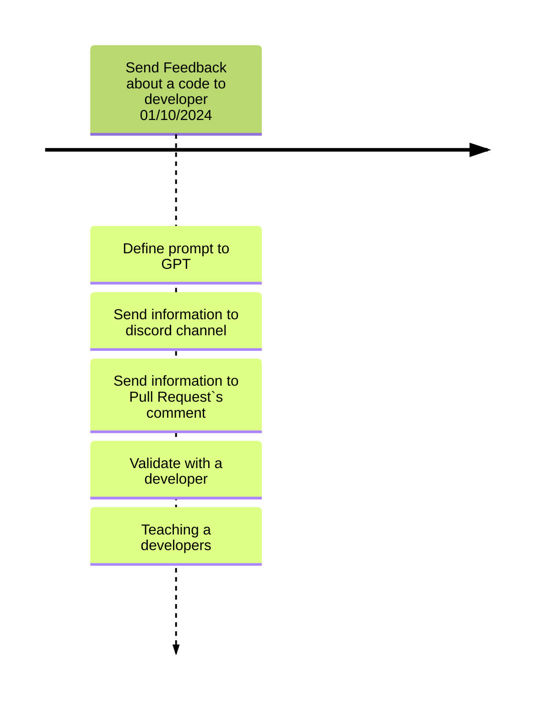

## Project Model Canvas (PMC)

### Justification  
Software developers face slow manual feedback cycles, difficulty identifying performance issues, accumulated technical debt, and a lack of reliable indicators to support code quality improvements.

### SMART Objective  
Develop and launch the CodeWise API within 3 months, with an 8-person team, to increase productivity and delivery quality by providing automated feedback and statistical insights.

### Final Product  
An API developed using FastAPI, integrated with OpenAI GPT-3 to analyze code in Python, C#, and Java. The API provides documented endpoints (Swagger/OpenAPI), real-time consultations, and performance and quality reports.

### Benefits  
- Automated code review generation  
- Reliable statistics on technical debt  
- Proven quality improvement in deliveries, supported by literature and team data  
- Direct impact on developer productivity

### Requirements  
- FastAPI and Python 3.x  
- Integration with the OpenAI GPT-3 API  
- Support for analyzing code in Python, C#, and Java  
- Docker containerization  
- Secure management of access keys and data

### External Stakeholders and Influencing Factors  
- Developers at LEDS  
- Developers and companies seeking to improve code quality  
- Open source communities and tech forums

### Premises  
- The development team has knowledge of Python and FastAPI  
- The project management team is familiar with delivery monitoring tools

### Constraints  
- OpenAI API limitations (rate limits and code size)  
- Strict security requirements for API keys and access credentials  
- Budget and delivery deadline limited to 3 months

### Risks  
- **External Dependency**: Reliance on the OpenAI API (risk of rate limits or downtime)  
- **Feedback Accuracy**: Possibility of imprecise suggestions from GPT-3  
- **Probability**: Moderate, due to integration complexity and request volume  
- **Mitigation Actions**: Continuous monitoring, robust testing, fallback plans; acceptance of potential limitations

### Team  
- **Project Management (GPS students)**: Planning, monitoring, coordination, and communication  
- **Development (Systems Project students)**: Coding, testing, deployment, and documentation

### Cost Estimate  
- **Team Load**: 8 people × 8 hours/week = 64 hours/week  
- **Rate per Hour** (Pleno Developer avg.): R$ 80/hour  
- **Estimated Weekly Cost**: 64 × R$ 80 = R$ 5,120  
- **Estimated Total over 12 Weeks**: R$ 61,440

### Team Topology  
- This project follows a **Platform Team** model.  
  The CodeWise team provides internal services and tools to **Stream-Aligned Teams** (e.g., the IT development teams), who deliver value directly to end users.  
  CodeWise supports them by enhancing the quality and efficiency of their code through automated analysis.

### Deliverables 
<!--*(To be completed)*  
 Define the major deliverables of the CodeWise project, e.g.:
- Code Analysis Module
- Discord Notification Integration
- Web-based Documentation Portal
-->
- **Code Analysis Module** – Rule-based code validation with Gemini API.  
- **Platform Integration** – GitHub Webhooks, Discord alerts via n8n.  
- **Feedback Engine** – Smart improvement suggestions with clean formatting.  
- **Metrics Dashboard** – PR scores, activity history, developer stats.

### Timeline   
<!--*(To be completed)*
Example structure:
- Month 1: Requirement gathering, design, prototyping
- Month 2: Module development, GPT-3 integration, early testing
- Month 3: Final testing, documentation, beta release
-->
- **Month 1**: Planning, prototyping, Gemini integration  
- **Month 2**: Core development, GitHub/Discord integration, testing  
- **Month 3**: Dashboard, final testing, documentation, beta release

## Team Topology

Our team follows the **Platform Team** topology model.

The CodeWise project is being developed by a platform team composed of the following members:

### 📌 Platform Team – CodeWise Project

#### Project Management
- **Perceu Oliveira**
- **Miguel Malini**
- **João Ferrareis**
- **Wal Candeia**

#### Systems and Development
- **Arthur Miguel**
- **Michele Altavilla**
- **Bernardo Rosa**
- **Gabriel Brito**
---

The CodeWise project is being developed by a platform team because our main customer is an internal client — specifically, the software development teams within the IT department. These internal teams are responsible for delivering direct value to end users and are aligned with the **Stream-Aligned Team** topology.

In this context, CodeWise serves as a **support tool** that enhances the efficiency and quality of the code produced by stream-aligned teams. It operates by analyzing already-written code and offering suggestions for improvements, thus contributing indirectly to the final value delivery.

This separation allows the Platform Team (CodeWise team) to focus on building and maintaining a reusable service that empowers and accelerates the work of Stream-Aligned Teams.

## DISC Profiles

### Project Management Team

- **Perceu Oliveira** – *Dominance*  
  Emphasis on achieving results, competitiveness, and confidence. Enjoys challenges and immediate outcomes.

- **Miguel Malini** – *Steadiness*  
  Emphasis on cooperation, sincerity, loyalty, and being a team player. Tends to be supportive and prefers to stay in the background.

- **João Ferrareis** – *Conscientiousness*  
  Focus on quality, precision, organization, and competence. Cooperative, sincere, loyal, cautious, and attentive to details.

- **Wal Candeia** – *Inactive*  
  Currently not participating in the project due to a health issue.

---

### Systems and Development Team

- **Arthur Miguel** – *Steadiness*  
  Emphasis on cooperation, sincerity, loyalty, and being a team player. Tends to be supportive and prefers to stay in the background.

- **Michele Altavilla** – *Influence*  
  Emphasis on influencing and connecting with others. Enjoys teamwork, sharing, and motivating others.

- **Bernardo Rosa** – *Steadiness*  
  Emphasis on cooperation, sincerity, loyalty, and being a team player. Tends to be supportive and prefers to stay in the background.

- **Gabriel Brito** – *Dominance*  
  Emphasis on achieving results, competitiveness, and confidence. Enjoys challenges and immediate outcomes.

## Communication Plan

### Communication Platform

The team has chosen **Telegram** as the primary communication platform. While Discord is often used in other campus projects, it tends to mix with personal chats. Telegram ensures that messages remain visible, organized, and free from unrelated content.

### Telegram Groups

Two distinct Telegram groups have been created:

1. **Management Group**  
   A private group that includes only the four members of the **Project Management Team**. This space is used for internal coordination, defining responsibilities, sharing feedback, and planning deliveries. It is not divided into topics.

2. **General Project Group**  
   This group includes all eight members from both the **Management** and **Project & Systems** teams. Inside this group, Telegram's **topic/thread feature** is used to organize communication into specific areas:

   - **General Discussion**: For daily conversation, updates, clarifying doubts, and discussing ideas between all members.
   - **Useful Links**: A dedicated topic to store and share project materials such as:
     - Google Drive links (e.g., drafts before publishing in Docusaurus)
     - GitHub repository (CodeWise)
     - Additional documentation or resources
   - **Announcements**: A focused topic for important messages like meeting schedules, professor feedback, or deadline changes.
   - **Frontend Discussion**: For questions, suggestions, and discussions specific to frontend development.
   - **Backend Discussion**: For backend-related planning, architecture, and problem-solving.

### Weekly Meetings

The team meets weekly with all project members every **Monday afternoon** (or **Tuesday if Monday is a holiday),** right before the regular class session with the Systems Project professor. This scheduling allows real-time integration of the professor's feedback into project planning.

**Common discussion topics in weekly meetings include:**

- Reviewing weekly progress and goals
- Aligning management and technical expectations
- Identifying blockers or dependencies
- Updating responsibilities and delivery timelines
- Syncing project documentation status
- Discussing professor or stakeholder feedback
- Planning upcoming tasks and priorities

## Backlog
<!--
| ID | Feature | Description | Importance |Proposal|
| -- | ------- | ----------- |----------- |--------|
| 1  | Send Feedback about a code to developer| Implements a code review automaticaly seen Performance and Code Smell | 100 |Improve software developmen quality in 10% |
| 2  | Create Improvement/Refactor test on management program| When a improment is detected a Improvement/Refactor Task is created on management software (e.g., Jira) | 90 |Improve software developmen quality and management in 15% |
| 3  | Send informartion about quality of code to a database to improve the developer| Send information about code smell and performance of code to a database to identify means to improve the developer that creates the code | 95 |Improve software developmen quality and management in 20% |
-->

| ID | Feature | Description | Importance | Proposal |
|----|---------|-------------|------------|----------|
| 1  | Code Analysis | Implement validation rules (style, security, performance, best practices), with integration to Gemini API and AgentOps. Include incremental analysis to avoid reprocessing. | 100 | Improve code quality by 20% |
| 2  | Platform Integration | Connect via GitHub Webhooks, n8n, and allow automatic comments on GitHub and messages on Discord. Add future support for Slack/GitLab. | 95 | Automate code review process by 70% |
| 3  | Intelligent Feedback | Create contextualized improvement suggestions, format comments and messages clearly for channels. | 90 | Increase adoption of best practices by 25% |
| 4  | Visualization and Metrics | Display individual and collective statistics, PR scores, activity history, and monitoring dashboard. Interface for visualization in API frontend. | 85 | Provide visibility on quality evolution |
| 5  | Observability and Monitoring | Monitor response time, log errors, and agent activities with AgentOps support. Implement cache and parallel workers. | 80 | Ensure 99.5% service availability |
| 6  | Administration and Configuration | Manage API keys, permissions, URLs, and database via configuration interface. | 75 | Simplify platform management |
| 7  | Testability and Quality | Refactor to use dependency injection, mocks, and unit tests in Models and Controllers. Automated coverage. | 70 | Achieve 80% test coverage |
| 8  | Performance and Scalability | Add asynchronous processing with queues (Redis, RabbitMQ, etc.). Process multiple PRs in parallel. | 65 | Reduce response time by 40% |
| 9  | Documentation (Docusaurus) | Migrate all documentation to Markdown structure in Docusaurus, with technical guides, overview, and usage instructions. | 60 | Improve adoption by new users |
| 10 | Tests and Quality | Implement automated test coverage with Jest and Pytest, separation of logic and external services for easy mocking, dependency injection for APIs, and incremental code analysis. | 55 | Reduce production bugs by 30% |

## General planning

* Release 1.0 (Done): Send Feedback about a code to developer
* Release 2.0 (Undefined): Code Analysis & Platform Integration
* Release 3.0 (Undefined): Feedback System & Visualization
* Release 4.0 (Undefined): Performance & Quality Enhancements
<!--* Release 2.0 (Undefined): Create Improvement/Refactor test on management program
* Release 3.0 (Undefined): Send informartion about quality of code to a database to improve the developerr-->

## Release 1.0 - 01/11/2024

* **Goal**: Send Feedback about a code to developer.

  * **Features**: ID 1
    * Intercep and analyses a code when a pul request is performed
    * Send information about analysis to a DIscord Channel
    * Send information about analysis to a pull request`s comment
    * **Problems**:
      * Spend much time to analysis many code, using GPT4
    * **Oportunity**
      * Develop our IA to improve time and no spend money with GPT4
  
  * **Deadline I**  01/10/2023: Send Feedback about a code to developer.      

