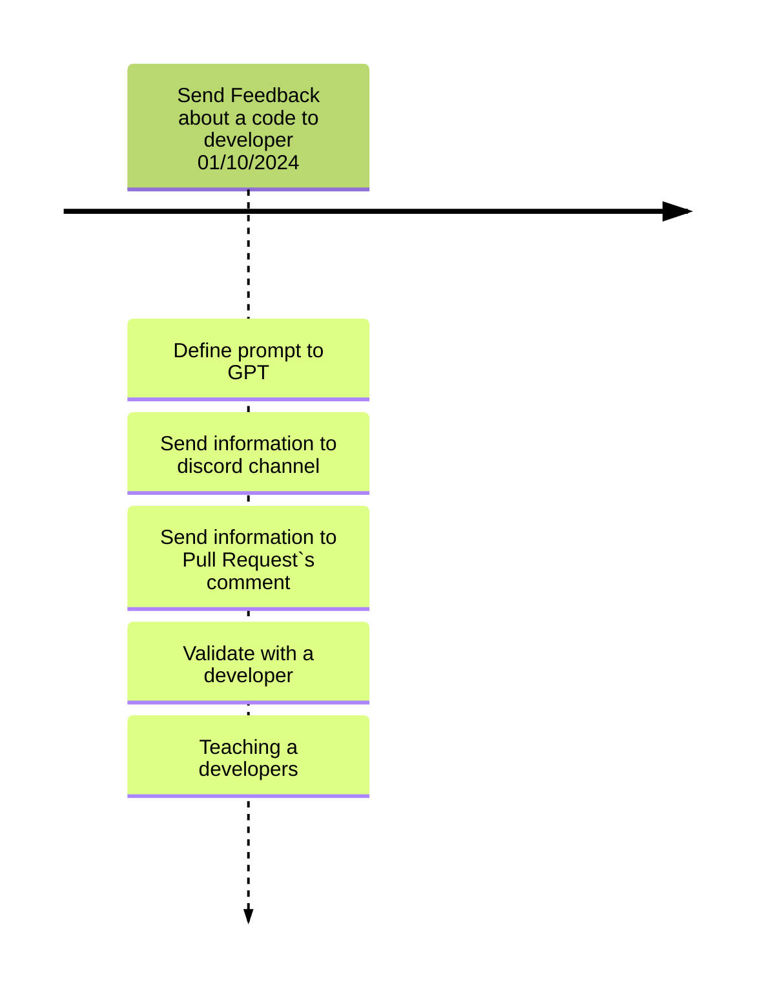

## Team Topology

Our team follows the **Platform Team** topology model.

The CodeWise project is being developed by a platform team because our main customer is an internal client — specifically, the software development teams within the IT department. These internal teams are responsible for delivering direct value to end users and are aligned with the **Stream-Aligned Team** topology.

In this context, CodeWise serves as a **support tool** that enhances the efficiency and quality of the code produced by stream-aligned teams. It operates by analyzing already-written code and offering suggestions for improvements, thus contributing indirectly to the final value delivery.

This separation allows the Platform Team (CodeWise team) to focus on building and maintaining a reusable service that empowers and accelerates the work of Stream-Aligned Teams.

## DISC Profiles

### Project Management Team

- **Perceu Oliveira** – *Dominance*  
  Emphasis on achieving results, competitiveness, and confidence. Enjoys challenges and immediate outcomes.

- **Miguel Malini** – *Steadiness*  
  Emphasis on cooperation, sincerity, loyalty, and being a team player. Tends to be supportive and prefers to stay in the background.

- **João Ferrareis** – *Conscientiousness*  
  Focus on quality, precision, organization, and competence. Cooperative, sincere, loyal, cautious, and attentive to details.

- **Wal Candeia** – *Inactive*  
  Currently not participating in the project due to a health issue.

---

### Systems and Development Team

- **Arthur Miguel** – *Steadiness*  
  Emphasis on cooperation, sincerity, loyalty, and being a team player. Tends to be supportive and prefers to stay in the background.

- **Michele Altavilla** – *Influence*  
  Emphasis on influencing and connecting with others. Enjoys teamwork, sharing, and motivating others.

- **Bernardo Rosa** – *Steadiness*  
  Emphasis on cooperation, sincerity, loyalty, and being a team player. Tends to be supportive and prefers to stay in the background.

- **Gabriel Brito** – *Dominance*  
  Emphasis on achieving results, competitiveness, and confidence. Enjoys challenges and immediate outcomes.

## Communication Plan

### Communication Platform

The team has chosen **Telegram** as the primary communication platform. While Discord is often used in other campus projects, it tends to mix with personal chats. Telegram ensures that messages remain visible, organized, and free from unrelated content.

### Telegram Groups

Two distinct Telegram groups have been created:

1. **Management Group**  
   A private group that includes only the four members of the **Project Management Team**. This space is used for internal coordination, defining responsibilities, sharing feedback, and planning deliveries. It is not divided into topics.

2. **General Project Group**  
   This group includes all eight members from both the **Management** and **Project & Systems** teams. Inside this group, Telegram's **topic/thread feature** is used to organize communication into specific areas:

   - **General Discussion**: For daily conversation, updates, clarifying doubts, and discussing ideas between all members.
   - **Useful Links**: A dedicated topic to store and share project materials such as:
     - Google Drive links (e.g., drafts before publishing in Docusaurus)
     - GitHub repository (CodeWise)
     - Additional documentation or resources
   - **Announcements**: A focused topic for important messages like meeting schedules, professor feedback, or deadline changes.
   - **Frontend Discussion**: For questions, suggestions, and discussions specific to frontend development.
   - **Backend Discussion**: For backend-related planning, architecture, and problem-solving.

### Weekly Meetings

The team meets weekly with all project members every **Monday afternoon** (or **Tuesday if Monday is a holiday),** right before the regular class session with the Systems Project professor. This scheduling allows real-time integration of the professor's feedback into project planning.

**Common discussion topics in weekly meetings include:**

- Reviewing weekly progress and goals
- Aligning management and technical expectations
- Identifying blockers or dependencies
- Updating responsibilities and delivery timelines
- Syncing project documentation status
- Discussing professor or stakeholder feedback
- Planning upcoming tasks and priorities

## Backlog

| ID | Feature | Description | Importance |Proposal|
| -- | ------- | ----------- |----------- |--------|
| 1  | Send Feedback about a code to developer| Implements a code review automaticaly seen Performance and Code Smell | 100 |Improve software developmen quality in 10% |
| 2  | Create Improvement/Refactor test on management program| When a improment is detected a Improvement/Refactor Task is created on management software (e.g., Jira) | 90 |Improve software developmen quality and management in 15% |
| 3  | Send informartion about quality of code to a database to improve the developer| Send information about code smell and performance of code to a database to identify means to improve the developer that creates the code | 95 |Improve software developmen quality and management in 20% |

## General planning

* Release 1.0 (Done): Send Feedback about a code to developer
* Release 2.0 (Undefined): Create Improvement/Refactor test on management program
* Release 3.0 (Undefined): Send informartion about quality of code to a database to improve the developerr

## Release 1.0 - 01/11/2024

* **Goal**: Send Feedback about a code to developer.

  * **Features**: ID 1
    * Intercep and analyses a code when a pul request is performed
    * Send information about analysis to a DIscord Channel
    * Send information about analysis to a pull request`s comment
    * **Problems**:
      * Spend much time to analysis many code, using GPT4
    * **Oportunity**
      * Develop our IA to improve time and no spend money with GPT4
  
  * **Deadline I**  01/10/2023: Send Feedback about a code to developer.      

