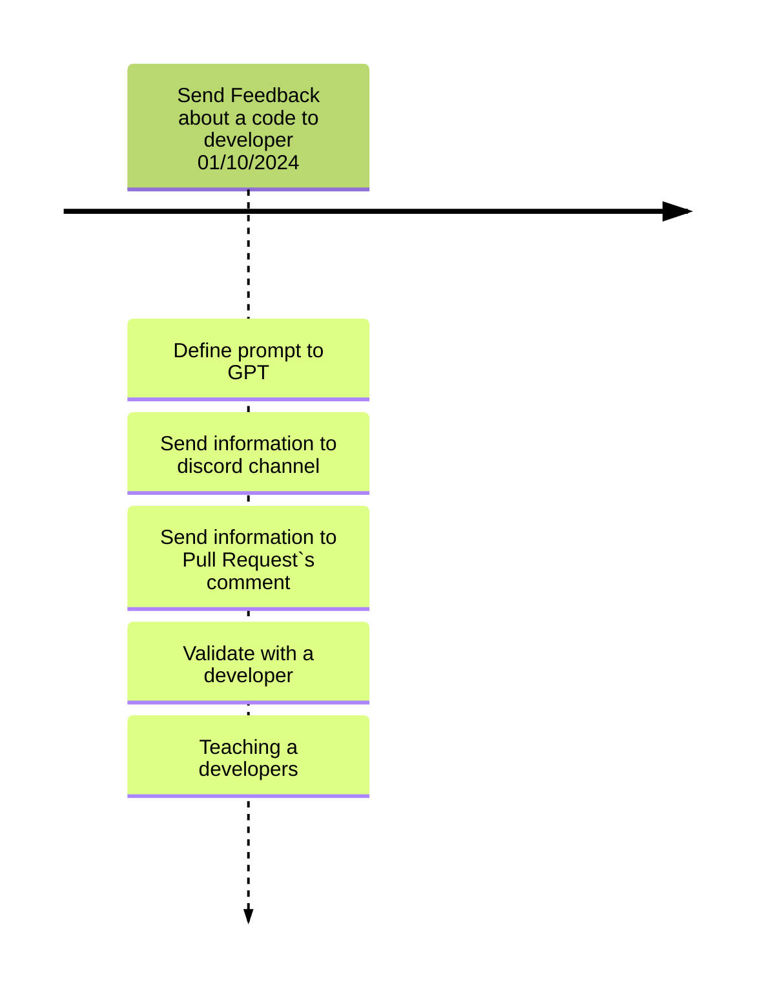

Presents the project`s developing planning.

## Backlog

| ID | Feature | Description | Importance |Proposal|
| -- | ------- | ----------- |----------- |--------|
| 1  | Send Feedback about a code to developer| Implements a code review automaticaly seen Performance and Code Smell | 100 |Improve software developmen quality in 10% |
| 2  | Create Improvement/Refactor test on management program| When a improment is detected a Improvement/Refactor Task is created on management software (e.g., Jira) | 90 |Improve software developmen quality and management in 15% |
| 3  | Send informartion about quality of code to a database to improve the developer| Send information about code smell and performance of code to a database to identify means to improve the developer that creates the code | 95 |Improve software developmen quality and management in 20% |

## General planning

* Release 1.0 (Done): Send Feedback about a code to developer
* Release 2.0 (Undefined): Create Improvement/Refactor test on management program
* Release 3.0 (Undefined): Send informartion about quality of code to a database to improve the developerr

## Release 1.0 - 01/11/2024

* **Goal**: Send Feedback about a code to developer.

  * **Features**: ID 1
    * Intercep and analyses a code when a pul request is performed
    * Send information about analysis to a DIscord Channel
    * Send information about analysis to a pull request`s comment
    * **Problems**:
      * Spend much time to analysis many code, using GPT4
    * **Oportunity**
      * Develop our IA to improve time and no spend money with GPT4
  
  * **Deadline I**  01/10/2023: Send Feedback about a code to developer.      

