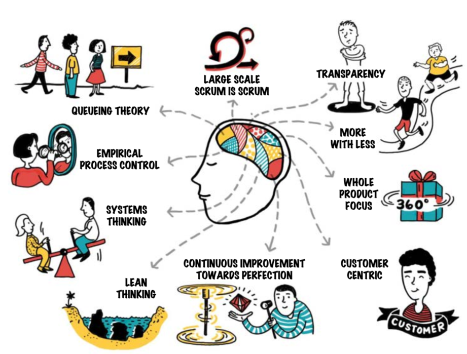
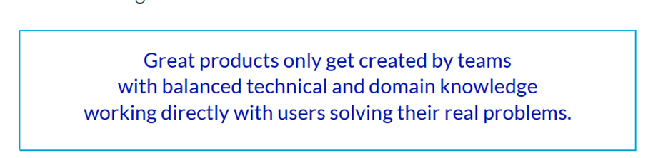

The image visually illustrates the principles, influences, and foundations that underpin LeSS (Large Scale Scrum). At the center, there is a representation of a brain, symbolizing the thinking, mindset, and the set of conceptual approaches that support the application of LeSS in large-scale product development contexts.

From this central “brain,” several arrows point to key ideas and fundamental concepts that guide LeSS. These concepts include:

1. **Queueing Theory**: Highlights the importance of understanding and managing workflow, reducing bottlenecks and waiting times in order to increase process efficiency.

2. **Empirical Process Control**: Emphasizes continuous inspection and adaptation, relying on real data and constant feedback instead of rigidly following predefined plans.

3. **Systems Thinking**: Invites us to view the product and the development process as an integrated system, understanding the interactions among its parts and avoiding localized optimizations that harm the whole.

4. **Lean Thinking**: Inspired by the Toyota Production System, encourages the elimination of waste, the continuous creation of value, and ongoing learning throughout product development.

5. **Continuous Improvement Towards Perfection**: LeSS pursues constant refinement, improving processes, workflows, and results with each iteration.

6. **Whole Product Focus**: Instead of having fragmented teams working on isolated parts, LeSS encourages an integrated view of the product, ensuring coherence and value from start to finish.

7. **More with Less**: LeSS seeks to simplify structures, reduce layers of management, and maximize the value delivered to the customer with minimal complexity.

8. **Transparency**: Making processes, progress, challenges, and metrics visible is fundamental to creating an environment of trust and collaboration.

9. **Large Scale Scrum is Scrum**: Reinforces the idea that LeSS is not an entirely new methodology, but rather an extension of Scrum’s principles and practices to larger contexts, maintaining its Agile essence.

10. **Customer Centricity**: At the core of LeSS is delivering value to the customer, ensuring that all decisions and efforts are aligned with the needs and expectations of the end users.

In summary, the image shows that LeSS is supported by a set of principles derived from various disciplines—ranging from queueing theory to lean thinking, from whole product focus to transparency—all converging to create a scalable, efficient, and customer-centered development environment.

# Remember:

