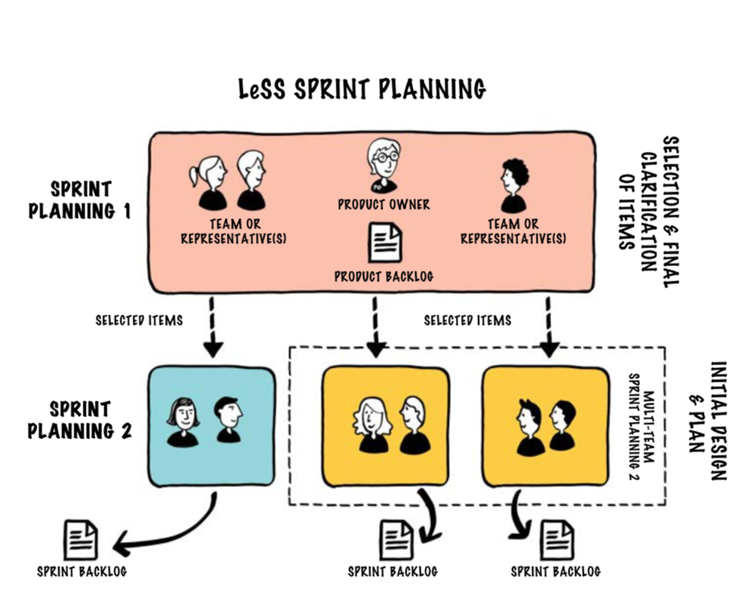

This image illustrates the Sprint Planning process within a LeSS (Large Scale Scrum) framework, adapting core Scrum practices for a multi-team environment while preserving a single Product Owner and Product Backlog.

**Key Points:**

1. **Single Product Owner, Single Product Backlog:**  
   Instead of having multiple Product Owners or separate backlogs for each team, LeSS maintains a single Product Owner who manages a unified Product Backlog. This ensures that all teams share the same high-level priorities and a cohesive product vision.

2. **Sprint Planning 1 – Selection and Clarification of Items:**  
   The first part of Sprint Planning involves the Product Owner and representatives from the teams. They meet to select the highest priority items from the Product Backlog that should be tackled in the upcoming Sprint. During this meeting, the team representatives clarify requirements with the Product Owner, ensuring everyone understands the selected items.

3. **From One Backlog to Multiple Teams:**  
   After the initial selection and clarification in Sprint Planning 1, the chosen items are distributed to each team. Even though multiple teams are involved, they all pull work from the same Product Backlog, thereby aligning their efforts toward a common product goal.

4. **Sprint Planning 2 – Detailed Planning for Each Team:**  
   Each team then conducts its own Sprint Planning 2 session. In this step, the teams take the selected backlog items and break them down into tasks, refine estimates, and create their individual Sprint Backlogs. This level of detail is handled by each team independently, allowing them autonomy over how they will deliver their portion of the product increment.

5. **Coordinated Yet Autonomous Execution:**  
   By having a single Product Backlog and a single Product Owner, LeSS ensures alignment and a shared understanding of priorities across all teams. At the same time, each team’s independent Sprint Planning 2 session allows for flexibility and self-organization within teams, leading to more efficient execution and fostering ownership over their work.

In summary, the image depicts how LeSS manages Sprint Planning at scale: one centralized Product Backlog and Product Owner for overall guidance, coupled with a two-stage planning process that integrates collaboration, clarity, and autonomy across multiple Scrum teams.

