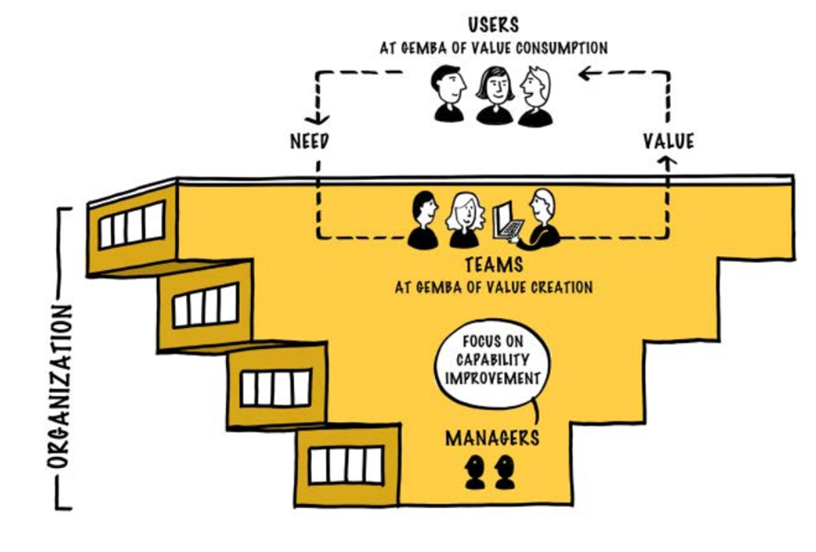

Lean Thinking emphasizes a focus on gemba—Japanese term for the real place of work, or the place where customer value is created. We distinguish two gembas:

> the place the product is used—the gemba of value consumption  
> the place the product is created—the gemba of value creation

In a LeSS organization, these two gembas should be brought as close together as possible. Needs flow from users to teams and Product Owner. Value flows back from teams to users. Value delivery should flow through the organization without having to be pushed up a hierarchy.

Managers aren’t involved with the decisions related to value delivery or product direction. So, what do they do? In a LeSS organization, they focus on the development system—on increasing the organizational-value delivery capability. Their job is improvement!

