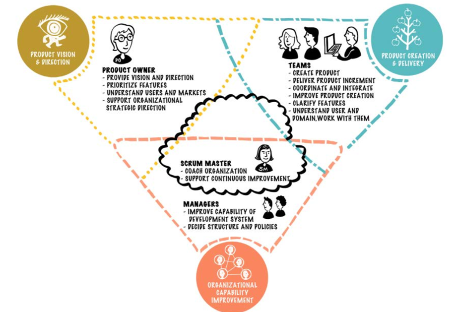

There are two key information flows in Scrum related to the Product Owner: (1) Adaptively deciding the direction to evolve the product and reflecting that decision in Product Backlog prioritization, and (2) Discovering and clarifying the details of user needs and items. In the first flow (direction and prioritization), information is sought and analyzed related to profit drivers, strategic customers, business risks, etc. In the second flow (details and clarification), the objective is to discover the fine-grained behavior and qualities of items, the user experience, etc.

