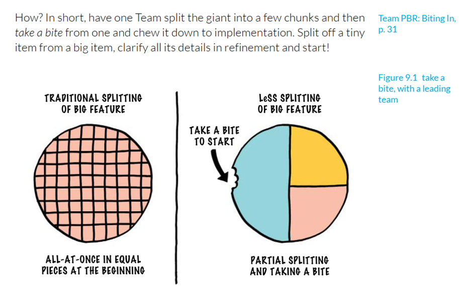

When we introduce LeSS, a frequent question is, “How is one Product Owner going to manage all those meetings with all those teams?” Fortunately, that question is based on a misunderstanding. The one Product Owner in LeSS does not attend a different meeting with each team. For example, there is only one common Sprint Planning One meeting, with people from all the teams together.

What LeSS meetings does the Product Owner attend, and what is their average actual duration in a typical two-week Sprint?

1. Sprint Planning Part One: 1 hour  
2. If doing overall Product Backlog refinement: 1 hour  
3. Sprint Review: 2 hours  
4. Overall Retrospective: 1.5 hours

So the total time together in meetings is less than a new Product Owner might imagine: realistically, perhaps six hours in a two-week Sprint.

