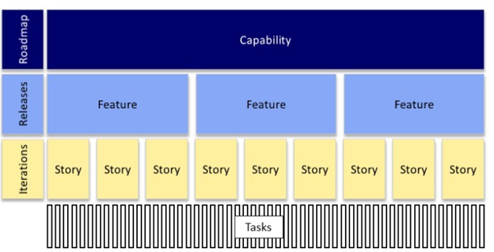

# MVP and Releases

The **Roadmap** is a plan where we define which features will be developed and when. Generally, a feature is described in the form of one or more stories. A **Story** is a simplified description, almost a reminder, about a functionality that brings benefits to the project’s client. The story is divided into tasks that aim to materialize the user story through a software artifact. Finally, **tasks** are executed in cycles, development periods throughout the software project. These development periods help bring rhythm to the team and create predictability in software development.

One of the biggest mistakes in software development is the team's attempt to deliver a large set of features all at once. Therefore, a best practice is to deliver small versions of the project and gradually increment the previous version. In the figure below, notice that a good practice is to increase the MVP (Minimum Viable Product) functionalities over time, starting with a few functionalities and increasing them as iterations are carried out.

