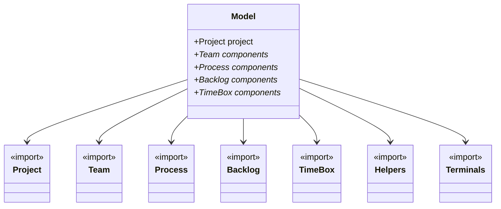
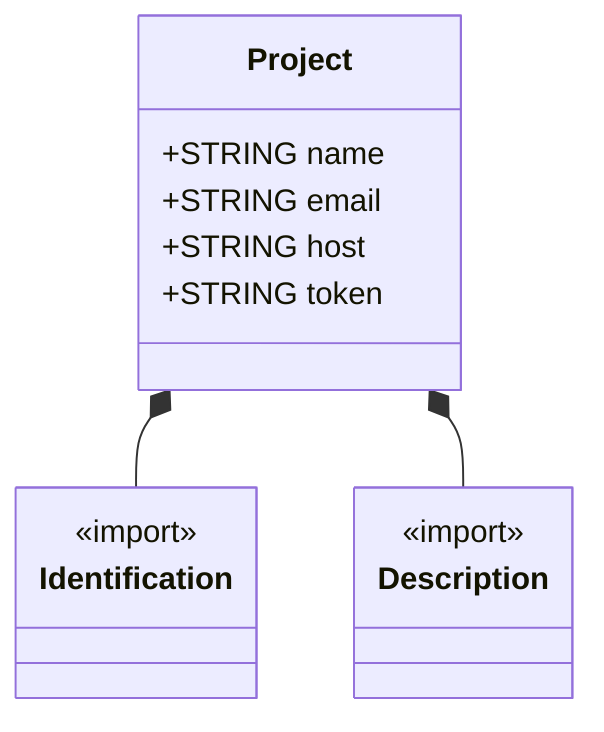
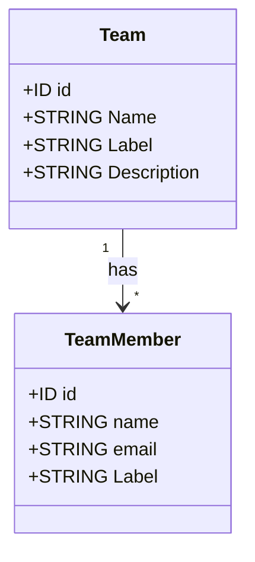
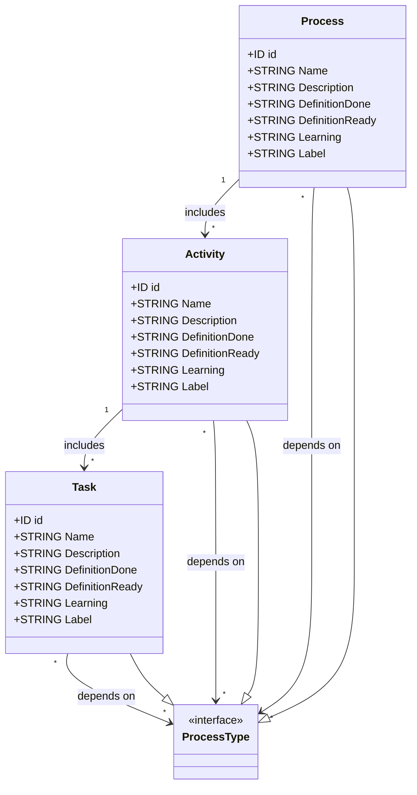
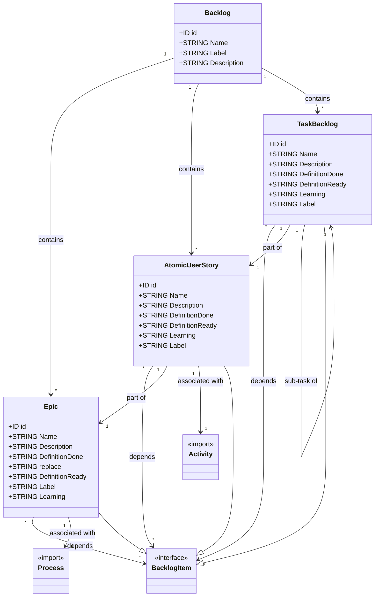
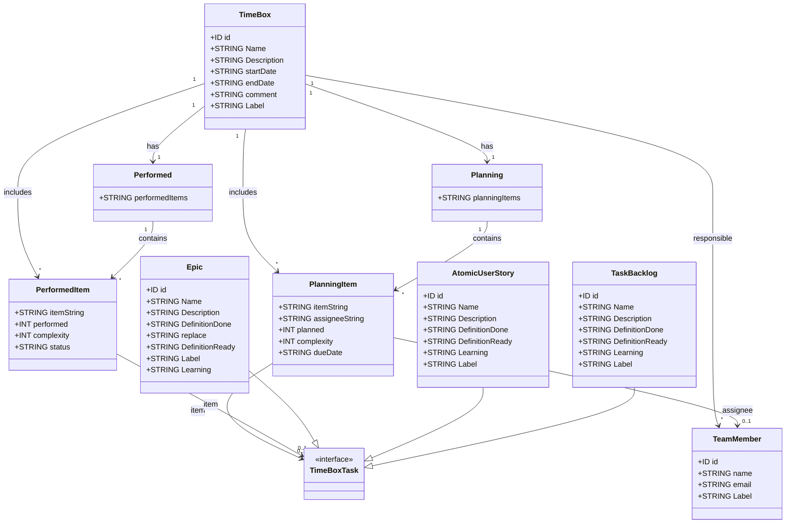

This metamodel defines the structure of a "Made" system, which consists of several key components used in project management, such as projects, teams, processes, backlogs, and timeboxes. Below is a breakdown of the elements and their relationships:

### Model (Entry Point)
The `Model` serves as the main entry point for the grammar. It consists of one mandatory `Project` and multiple optional components, which can include teams, processes, backlogs, and timeboxes.

### Components
- **Project**: A required element in the `Model`, representing the central project that the other components relate to. This element is imported from the `projects` package.
- **Team**: Represents teams working within the project. This is an optional component that can be added to the `Model` and is imported from the `team` package.
- **Process**: Represents processes within the project. Like teams, it is an optional component and is imported from the `processes` package.
- **Backlog**: Refers to the backlog of tasks or issues in the project. It is also optional and is imported from the `backlog` package.
- **TimeBox**: Represents time-based elements like sprints or deadlines. It is an optional component imported from the `timebox` package.

###  Supporting Packages
The model also relies on some supporting packages, including:
- **Helpers**: A package for utility or supporting elements.
- **Terminals**: Another supporting package, possibly used for defining basic terminal elements in the grammar.

## Project

The `Project` class defines the main entity, containing several key attributes:
- **name**: A string representing the name of the project.
- **email**: A string for the email address associated with the project.
- **host**: A string that represents the host where the project is located.
- **token**: A string used for authentication or access within the project.

In addition to these attributes, the `Project` class is linked to two important components:

### Identification Component
The `Identification` component represents a part of the project that is responsible for managing project identification. The details of this component are imported from external sources (`terminals` or `helpers`), and it is considered essential for the overall structure of the project.

### Description Component
The `Description` component handles descriptive information related to the project. Like the `Identification` component, its details are imported from external sources, making it an integral part of the project structure.

## Team

This class diagram represents the structure of a Team Management system, focusing on the `Team` and `TeamMember` classes. It outlines the attributes of each class and the relationship between them.

### Team
- **Description**: The `Team` class represents a group of individuals working together on a project or within an organization.
- **Attributes**:
  - `id`: A unique identifier for the team.
  - `Name`: The name of the team.
  - `Label`: A label used for categorizing or tagging the team.
  - `Description`: A detailed description of the team's purpose, goals, or activities.
- **Relationships**:
  - **Has**: Contains multiple `TeamMember` instances, indicating that a team comprises several members.

### TeamMember
- **Description**: The `TeamMember` class represents an individual member of a team.
- **Attributes**:
  - `id`: A unique identifier for the team member.
  - `name`: The name of the team member.
  - `email`: The email address of the team member.
  - `Label`: A label used for categorizing or tagging the team member (e.g., role, expertise).
- **Relationships**:
  - **Belongs To**: Part of one `Team`, indicating that each team member is associated with a specific team.

## Process

This class diagram represents the structure of a Process Management system, encompassing key elements such as `Process`, `Activity`, and `Task`. It also defines how these elements interact and depend on each other within the system.

### ProcessType (Interface)
- **Description**: The `ProcessType` interface serves as a common type for all process-related elements (`Process`, `Activity`, and `Task`). It allows these classes to be referenced polymorphically, enabling dependencies to be established between different types of process elements.
- **Note**: Implemented by `Process`, `Activity`, and `Task`.

### Process
- **Description**: The `Process` class represents a high-level process within the system. It can include multiple activities and has its own set of attributes that define its characteristics and state.
- **Attributes**:
  - `id`: A unique identifier for the process.
  - `Name`: The name of the process.
  - `Description`: A detailed description of the process.
  - `DefinitionDone`: Criteria that define when the process is considered complete.
  - `DefinitionReady`: Criteria that define when the process is ready to begin.
  - `Learning`: Learning outcomes or knowledge areas associated with the process.
  - `Label`: A label used for categorizing the process.
- **Relationships**:
  - **Includes**: Contains multiple `Activity` instances, indicating that a process comprises several activities.
  - **Depends On**: Can depend on multiple `ProcessType` instances (`Process`, `Activity`, `Task`), allowing for complex interdependencies between different process elements.

### Activity
- **Description**: The `Activity` class represents a specific activity within a process. Activities break down a process into manageable tasks and can include multiple tasks themselves.
- **Attributes**:
  - `id`: A unique identifier for the activity.
  - `Name`: The name of the activity.
  - `Description`: A detailed description of the activity.
  - `DefinitionDone`: Criteria that define when the activity is considered complete.
  - `DefinitionReady`: Criteria that define when the activity is ready to begin.
  - `Learning`: Learning outcomes or knowledge areas associated with the activity.
  - `Label`: A label used for categorizing the activity.
- **Relationships**:
  - **Includes**: Contains multiple `Task` instances, indicating that an activity comprises several tasks.
  - **Depends On**: Can depend on multiple `ProcessType` instances (`Process`, `Activity`, `Task`), allowing for dependencies between different activities and processes.

### Task
- **Description**: The `Task` class represents an individual task within an activity. Tasks are the smallest units of work and can depend on other tasks, activities, or processes.
- **Attributes**:
  - `id`: A unique identifier for the task.
  - `Name`: The name of the task.
  - `Description`: A detailed description of the task.
  - `DefinitionDone`: Criteria that define when the task is considered complete.
  - `DefinitionReady`: Criteria that define when the task is ready to begin.
  - `Learning`: Learning outcomes or knowledge areas associated with the task.
  - `Label`: A label used for categorizing the task.
- **Relationships**:
  - **Depends On**: Can depend on multiple `ProcessType` instances (`Process`, `Activity`, `Task`), enabling dependencies between various tasks and other process elements.

### Interfaces and Inheritance

#### ProcessType
- **Description**: An interface that is implemented by `Process`, `Activity`, and `Task`. This allows these classes to be treated uniformly when establishing dependencies, enabling flexible and dynamic relationships within the process management system.

## Backlog
This class diagram represents the structure of a Backlog Management system, encompassing key elements such as `Backlog`, `Epic`, `AtomicUserStory`, and `TaskBacklog`. Additionally, it integrates external components like `Process` and `Activity` to define relationships and dependencies among backlog items.

### Backlog
- **Description**: The `Backlog` class serves as the primary container for all backlog items.
- **Attributes**:
  - `id`: A unique identifier for the backlog.
  - `Name`: The name of the backlog.
  - `Label`: A label used for categorizing the backlog.
  - `Description`: A detailed description of the backlog.
- **Relationships**:
  - **Contains**: Holds multiple `BacklogItem` instances, which can be `Epic`, `AtomicUserStory`, or `TaskBacklog`.

### Epic
- **Description**: An `Epic` represents a large body of work that can be broken down into smaller tasks or user stories.
- **Attributes**:
  - `id`: A unique identifier for the epic.
  - `Name`: The name of the epic.
  - `Description`: A description of the epic.
  - `DefinitionDone`: Criteria that define when the epic is considered complete.
  - `replace`: Indicates if the epic is replacing another item.
  - `DefinitionReady`: Criteria that define when the epic is ready to begin.
  - `Label`: A label used for categorizing the epic.
  - `Learning`: Learning outcomes related to the epic.
- **Relationships**:
  - **Depends On**: Can depend on multiple `BacklogItem` instances.
  - **Associated With**: Linked to one `Process`.

### AtomicUserStory
- **Description**: An `AtomicUserStory` represents the smallest functional unit within the backlog, typically focused on a user-centered functionality.
- **Attributes**:
  - `id`: A unique identifier for the user story.
  - `Name`: The name of the user story.
  - `Description`: A description of the user story.
  - `DefinitionDone`: Criteria that define when the user story is considered complete.
  - `DefinitionReady`: Criteria that define when the user story is ready to begin.
  - `Learning`: Learning outcomes related to the user story.
  - `Label`: A label used for categorizing the user story.
- **Relationships**:
  - **Depends On**: Can depend on multiple `BacklogItem` instances.
  - **Part Of**: Belongs to one `Epic`.
  - **Associated With**: Linked to one `Activity`.

### TaskBacklog
- **Description**: The `TaskBacklog` class represents tasks that need to be completed as part of the project.
- **Attributes**:
  - `id`: A unique identifier for the task.
  - `Name`: The name of the task.
  - `Description`: A description of the task.
  - `DefinitionDone`: Criteria that define when the task is considered complete.
  - `DefinitionReady`: Criteria that define when the task is ready to begin.
  - `Learning`: Learning outcomes related to the task.
  - `Label`: A label used for categorizing the task.
- **Relationships**:
  - **Depends On**: Can depend on multiple `BacklogItem` instances.
  - **Part Of**: Belongs to one `AtomicUserStory`.
  - **Sub-Task Of**: Can be a sub-task of another `TaskBacklog`.

### Process
- **Description**: Represents processes associated with epics.
- **Note**: Imported from an external package.

### Activity
- **Description**: Represents activities associated with user stories.
- **Note**: Imported from an external package.

### Interfaces and Inheritance

#### BacklogItem
- **Description**: An interface implemented by `Epic`, `AtomicUserStory`, and `TaskBacklog`, indicating that these classes are types of backlog items.

## TimeBox

This class diagram provides a comprehensive view of the TimeBox Management metamodel, illustrating how `TimeBox`, `Planning`, `Performed`, `PlanningItem`, and `PerformedItem` interact and depend on each other. It integrates with existing components like `TeamMember`, `Epic`, `AtomicUserStory`, and `TaskBacklog`, enabling structured planning and tracking of tasks within designated time frames. The use of the `TimeBoxTask` interface facilitates flexible and dynamic dependencies among various task types, ensuring effective project management and progress monitoring.

### TimeBox
- **Description**: The `TimeBox` class represents a fixed period during which specific tasks or activities are planned and performed. It serves as a container for planning and tracking the progress of tasks within the designated time frame.
- **Attributes**:
  - `id`: A unique identifier for the TimeBox.
  - `Name`: The name of the TimeBox.
  - `Description`: A detailed description of the TimeBox.
  - `startDate`: The start date of the TimeBox.
  - `endDate`: The end date of the TimeBox.
  - `comment`: Additional comments or notes related to the TimeBox.
  - `Label`: A label used for categorizing the TimeBox.
- **Relationships**:
  - **Has**: Contains one `Planning` and one `Performed` instance.
  - **Responsible**: Assigned to multiple `TeamMember` instances.
  - **Includes**: Contains multiple `PlanningItem` and `PerformedItem` instances.

### Planning
- **Description**: The `Planning` class encapsulates the planning phase of a TimeBox, where various planning items are defined and organized.
- **Attributes**:
  - `planningItems`: A collection of `PlanningItem` instances associated with the TimeBox.
- **Relationships**:
  - **Contains**: Holds multiple `PlanningItem` instances.

### Performed
- **Description**: The `Performed` class encapsulates the execution phase of a TimeBox, where performed items are tracked and managed.
- **Attributes**:
  - `performedItems`: A collection of `PerformedItem` instances associated with the TimeBox.
- **Relationships**:
  - **Contains**: Holds multiple `PerformedItem` instances.

### PlanningItem
- **Description**: The `PlanningItem` class represents individual items that are planned within a TimeBox. These items can be tasks, user stories, or epics that need to be addressed during the TimeBox period.
- **Attributes**:
  - `itemString`: A string representation of the item, used if a reference is not provided.
  - `assigneeString`: A string representation of the assignee's name, used if a reference is not provided.
  - `planned`: An integer indicating the amount of effort planned for the item.
  - `complexity`: An integer representing the complexity level of the item.
  - `dueDate`: The due date for the planned item.
- **Relationships**:
  - **Item**: References a `TimeBoxTask` (`Epic`, `AtomicUserStory`, or `TaskBacklog`) or uses a string if no reference is provided.
  - **Assignee**: References a `TeamMember` or uses a string if no reference is provided.

### PerformedItem
- **Description**: The `PerformedItem` class represents individual items that have been performed or completed within a TimeBox. These items track the actual progress made during the TimeBox period.
- **Attributes**:
  - `itemString`: A string representation of the item, used if a reference is not provided.
  - `performed`: An integer indicating the amount of effort actually performed on the item.
  - `complexity`: An integer representing the complexity level of the item.
  - `status`: The current status of the item, which can be either `DOING` or `DONE`.
- **Relationships**:
  - **Item**: References a `TimeBoxTask` (`Epic`, `AtomicUserStory`, or `TaskBacklog`) or uses a string if no reference is provided.

### TeamMember
- **Description**: The `TeamMember` class represents an individual member of a team responsible for executing tasks within a TimeBox.
- **Attributes**:
  - `id`: A unique identifier for the team member.
  - `name`: The name of the team member.
  - `email`: The email address of the team member.
  - `Label`: A label used for categorizing or tagging the team member (e.g., role, expertise).
- **Relationships**:
  - **Responsible For**: Assigned to multiple `TimeBox` instances.
  - **Assignee**: Can be assigned to multiple `PlanningItem` instances.

### Epic
- **Description**: The `Epic` class represents a large body of work that can be broken down into smaller tasks or user stories. It is a type of `TimeBoxTask`.
- **Attributes**:
  - `id`: A unique identifier for the epic.
  - `Name`: The name of the epic.
  - `Description`: A description of the epic.
  - `DefinitionDone`: Criteria that define when the epic is considered complete.
  - `replace`: Indicates if the epic is replacing another item.
  - `DefinitionReady`: Criteria that define when the epic is ready to begin.
  - `Label`: A label used for categorizing the epic.
  - `Learning`: Learning outcomes related to the epic.
- **Relationships**:
  - **Depends On**: Can depend on multiple `TimeBoxTask` instances.
  - **Associated With**: Linked to one `Process`.

### AtomicUserStory
- **Description**: The `AtomicUserStory` class represents the smallest functional unit within the backlog, typically focused on a user-centered functionality. It is a type of `TimeBoxTask`.
- **Attributes**:
  - `id`: A unique identifier for the user story.
  - `Name`: The name of the user story.
  - `Description`: A description of the user story.
  - `DefinitionDone`: Criteria that define when the user story is considered complete.
  - `DefinitionReady`: Criteria that define when the user story is ready to begin.
  - `Learning`: Learning outcomes related to the user story.
  - `Label`: A label used for categorizing the user story.
- **Relationships**:
  - **Depends On**: Can depend on multiple `TimeBoxTask` instances.
  - **Part Of**: Belongs to one `Epic`.
  - **Associated With**: Linked to one `Activity`.

### TaskBacklog
- **Description**: The `TaskBacklog` class represents tasks that need to be completed as part of the project. It is a type of `TimeBoxTask`.
- **Attributes**:
  - `id`: A unique identifier for the task.
  - `Name`: The name of the task.
  - `Description`: A description of the task.
  - `DefinitionDone`: Criteria that define when the task is considered complete.
  - `DefinitionReady`: Criteria that define when the task is ready to begin.
  - `Learning`: Learning outcomes related to the task.
  - `Label`: A label used for categorizing the task.
- **Relationships**:
  - **Depends On**: Can depend on multiple `TimeBoxTask` instances.
  - **Part Of**: Belongs to one `AtomicUserStory`.
  - **Sub-Task Of**: Can be a sub-task of another `TaskBacklog`.

## Interfaces and Inheritance

### TimeBoxTask
- **Description**: The `TimeBoxTask` interface is implemented by `Epic`, `AtomicUserStory`, and `TaskBacklog`. This allows these classes to be treated uniformly when establishing dependencies, enabling flexible and dynamic relationships within the TimeBox Management system.

