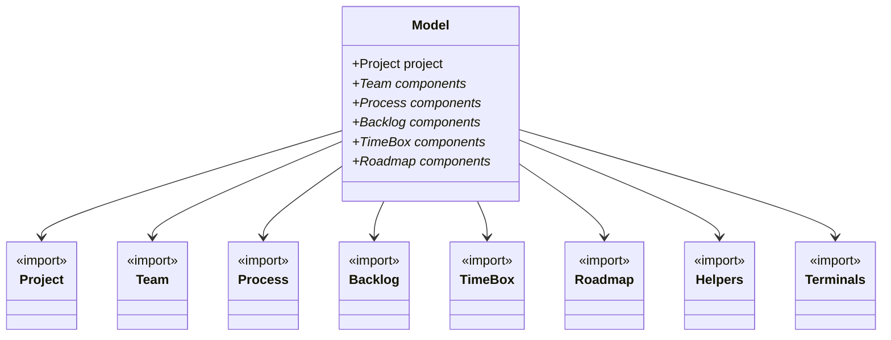

MADE's language is composed of the following parts: Project, Team, Backlog, TimeBox (Sprint), Roadmap, and Process.

## Meta Model



## Date Format

**Important:** MADE now uses the ISO 8601 date format (YYYY-MM-DD) for all date fields. This ensures consistency and proper parsing across different systems.

Examples:
- ✅ Correct: `startDate: 2024-01-15`
- ✅ Correct: `dueDate: 2024-12-31`
- ❌ Incorrect: `startDate: 15/01/2024`
- ❌ Incorrect: `dueDate: 31/12/2024`

## Project

The Project constructor configures the project's basic information and metadata. A Project consists of:

* **id**: Project identifier (automatically derived from the project declaration)
* **name**: Human-readable project name
* **description**: Detailed description of the project
* **startDate**: Project start date in ISO format (YYYY-MM-DD)
* **dueDate**: Project expected completion date in ISO format (YYYY-MM-DD)
* **completedDate**: Actual completion date (optional) in ISO format (YYYY-MM-DD)

**Example:**

```js
project myproject {
    name: "Module for Authentication, Authorization and Accounting"
    description: "Module responsible for user authentication, authorization and tracking in the system"
    startDate: 2024-01-15
    dueDate: 2024-12-31
    completedDate: 2024-11-30
}
```

**Note:** All date fields must follow the ISO 8601 format (YYYY-MM-DD). This ensures proper validation and compatibility with GitHub integration and documentation generation.


## Team

Teams define the people responsible for executing tasks and stories. MADE allows creating multiple teams as needed.

**Team Structure:**
- **id**: Team identifier
- **name**: Team display name
- **description**: Team purpose and responsibilities
- **teammember**: Individual team members with their details

**Team Member Attributes:**
- **id**: Member identifier
- **name**: Member's full name
- **email**: Member's email address
- **discord**: Member's Discord handle (optional)

**Example:**

```js
team blackops {
    name: "Team Black Ops"
    description: "Team responsible for producing security artifacts"
    teammember rafaelemerick {
        name: "Rafael Emerick" 
        email: "rafael.emerick@blackops.com"
        discord: "rafael#1234"
    }
    teammember joaomarcos {
        name: "João Marcos" 
        email: "joao.marcos@blackops.com"
        discord: "joao#5678"
    }
    teammember arthur {
        name: "Arthur Cremasco" 
        email: "arthur.cremasco@blackops.com"
        discord: "arthur#9999"
    }
}
```

**Note:** Team members defined here can be assigned to tasks in sprints and will be reflected in GitHub issue assignments when using GitHub integration.

## Backlog

It allows us to define a project backlog. MADE allows to creating as many backlogs as we want.

A backlog is composed of: EPIC, User Story, and Task. Link about [EPIC, USer Story and Task](https://scrum-master.org/en/epic-feature-and-user-story-in-agile-a-beginners-guide/).


A Epic is composed of User Stories and User Stories is composed of tasks. MADE allows to define this relation. Beside allow us define a relation of dependecies, i.e., It is possible to define that a task will be performed only when other task or user story was performed.

**New Attributes:**
- **criterions**: Acceptance criteria for epics and stories (list of strings)
- **requirements**: Prerequisites for stories (list of strings)  
- **deliverables**: Expected outputs for tasks (list of strings)
- **observation**: Additional notes or observations (string)

```js
backlog Spike {
   name: "Backlog de Estudo"
   description: "Backlog dedicado a estudo da equipe"
   
   epic epic1 {
        name: "Estudar sobre Autorização"
        description: "Estudo sobre autorização de usuários a recursos de redes"
        criterions: "Pesquisa completa sobre OPA", "Comparação entre tecnologias"
        observation: "Foco em soluções open source"
        
        story story1 {
            name: "Estudar a arquitetura proposta pelo OPA"
            requirements: "Conhecimento básico de autorização", "Acesso a documentação OPA"
            criterions: "Entendimento da arquitetura", "Exemplos práticos implementados"
            
            task estudar {
                name: "Estudar sobre OPA"
                deliverables: "Documento de estudo", "Exemplos de código"
            }
            task apresentar {
                name: "Apresentar o estudo OPA"  
                depends: Spike.epic1.story1.estudar, Spike.epic1.story2.estudar
                deliverables: "Apresentação em slides", "Demo prático"                      
            }
        }
        story story2 {
            name: "Estudar a arquitetura proposta pelo OpenFGA"
            requirements: "Comparação com OPA", "Análise de casos de uso"
            criterions: "Entendimento da arquitetura OpenFGA", "Prós e contras identificados"
            
            task estudar {
                name: "Estudar sobre OpenFGA"
                deliverables: "Documento comparativo"           
            }
            task apresentar {
                name: "Apresentar o estudo OpenFGA"
                depends: Spike.epic1.story1.estudar, Spike.epic1.story2.estudar
                deliverables: "Apresentação comparativa"                      
            }
        }
    }    
}
```

## Sprint

Sprints (TimeBox) represent time-boxed iterations for development work. They organize work items and track progress during a specific period.

**Sprint Attributes:**
- **id**: Sprint identifier
- **name**: Sprint display name
- **description**: Sprint objectives and goals
- **startDate**: Sprint start date (YYYY-MM-DD format)
- **endDate**: Sprint end date (YYYY-MM-DD format)
- **status**: Current sprint status (PLANNED, IN_PROGRESS, COMPLETED)

**Sprint Backlog:**
Each sprint contains a sprintbacklog that references items from the project backlog with additional sprint-specific information:

- **item**: Reference to backlog item (epic.story.task)
- **assignee**: Team member assigned to the item
- **complexity**: Item complexity level (EASY, MEDIUM, HARD, SPIKE)
- **dueDate**: Expected completion date within the sprint (YYYY-MM-DD format)
- **status**: Item status (TODO, DOING, DONE)
- **startDate**: When work on the item actually started (optional)
- **completedDate**: When the item was actually completed (optional)

**Example:**

```js
sprint estudo {
    name: "Authorization Study Sprint"
    description: "Conduct studies on authorization technologies"
    startDate: 2024-01-15
    endDate: 2024-01-29
    status: IN_PROGRESS
    
    sprintbacklog estudo {
        item Spike.epic1.story1.estudar {
            assignee: blackops.joaomarcos
            complexity: MEDIUM  
            dueDate: 2024-01-25 
            status: DOING
        }
        item Spike.epic1.story1.apresentar {
            assignee: blackops.joaomarcos
            complexity: EASY 
            startDate: 2024-01-20 
            completedDate: 2024-01-26
            dueDate: 2024-01-28 
            status: DONE
        }         
        item Spike.epic1.story2.apresentar {
            assignee: blackops.joaomarcos
            complexity: HARD 
            startDate: 2024-01-20 
            dueDate: 2024-01-28 
            status: DOING
        }         
    }
}
```

**Status Values:**
- **PLANNED**: Sprint is planned but not started
- **IN_PROGRESS**: Sprint is currently active
- **CLOSED**: Sprint has been finished

**Item Status Values:**
- **TODO**: Item is planned but not started
- **DOING**: Item is currently being worked on
- **DONE**: Item has been completed

**Complexity Values:**
- **EASY**: Simple task requiring minimal effort
- **MEDIUM**: Standard task requiring moderate effort
- **HARD**: Complex task requiring significant effort
- **SPIKE**: Research or investigation task with unknown scope

**Important Notes:**
- All dates must be in ISO format (YYYY-MM-DD)
- Items referenced must exist in the backlog
- Assignees must be defined team members
- Sprint items generate detailed metrics and charts in documentation


## Process

In projects, it's common for some activities to be repeated throughout their duration. To handle this, we've introduced the concept of a **process**, which can be used to instantiate repetitive activities in the project.

```js
process DevelopmentProcess {
    name: "Development Process"
    description: "Description of a process"

    activity UseCaseModelling {
        name: "Use Case Modelling"
        description: "Use Case Modelling"
        DefinitionDone: "The criteria that define when the activity is considered complete."
        DefinitionReady: "The criteria that define when the activity is ready to be worked on."
        Learning: "Specifies what needs to be studied or learned for the activity."
        Label: UseCaseModelling
       
    }

    task UseCaseDescription {
        name: "Use Case Description"
        description: "Use Case Description "
        DefinitionDone: "The criteria that define when the activity is considered complete."
        DefinitionReady: "The criteria that define when the activity is ready to be worked on."
        Learning: "Specifies what needs to be studied or learned for the activity."
        Label: UseCaseDescription
        Depends: DevelopmentProcess.UseCaseModelling
    }    
}
```
The dependency can occur in both the **user story** and the **epic**, functioning in the same way.

## RoadMap

Roadmaps define the strategic direction of your project, organizing work into milestones and releases over time.

**Roadmap Structure:**
- **id**: Roadmap identifier
- **name**: Roadmap display name
- **description**: Overall roadmap description and purpose

**Milestones:**
Milestones represent major project phases or goals:
- **id**: Milestone identifier
- **name**: Milestone display name
- **description**: Milestone objectives and deliverables
- **startDate**: Milestone start date (YYYY-MM-DD format)
- **dueDate**: Milestone target completion date (YYYY-MM-DD format)
- **completedDate**: Actual completion date (optional, YYYY-MM-DD format)
- **status**: Milestone status (PLANNED, IN_PROGRESS, COMPLETED, DELAYED)

**Releases:**
Releases are specific deliverables within milestones:
- **id**: Release identifier
- **name**: Release display name
- **description**: Release content and purpose
- **version**: Semantic version number (e.g., "1.0.0", "2.1.3")
- **dueDate**: Release target date (YYYY-MM-DD format)
- **releasedDate**: Actual release date (optional, YYYY-MM-DD format)
- **status**: Release status (PLANNED, IN_DEVELOPMENT, TESTING, RELEASED)
- **item**: Single backlog item included in the release
- **items**: Multiple backlog items included in the release

**Example:**

```js
roadmap projeto {
    name: "Project Roadmap"
    description: "Complete project roadmap with all major milestones"
    
    milestone beta {
        name: "Beta Version"
        description: "Initial version with core technology studies"
        startDate: 2024-01-15        
        dueDate: 2024-03-30
        completedDate: 2024-03-25
        status: COMPLETED
        
        release beta {
            name: "Beta Release v1.0"
            description: "Technology research and proof of concept"
            item: Spike.epic1
            status: RELEASED
            dueDate: 2024-03-30
            releasedDate: 2024-03-25
            version: "1.0.0"
        }
    }
    
    milestone production {
        name: "Production Release"
        description: "Full production-ready version"
        startDate: 2024-04-01
        dueDate: 2024-06-30
        status: IN_PROGRESS
        depends: projeto.beta
        
        release v2 {
            name: "Production Release v2.0"
            description: "Complete feature set for production use"
            items: Backlog.epic2, Backlog.epic3, Backlog.epic4
            status: IN_DEVELOPMENT
            dueDate: 2024-06-30
            version: "2.0.0"
        }
    }
}
```

**Status Values:**

*Milestone Status:*
- **PLANNED**: Milestone is planned but not started
- **IN_PROGRESS**: Milestone work is currently active
- **COMPLETED**: All milestone objectives have been achieved

*Release Status:*
- **PLANNED**: Release is planned but development hasn't started
- **IN_DEVELOPMENT**: Release is currently being developed
- **RELEASED**: Release has been completed and delivered

**Dependencies:**
Milestones can depend on other milestones using the `depends` attribute, creating a dependency chain that helps with project planning and scheduling.

**Integration:**
- Roadmap items automatically sync with GitHub milestones when using GitHub integration
- Documentation generation includes visual roadmap charts and timeline views
- Releases can reference any combination of epics, stories, or tasks from your backlog

## Examples

### Simple Project Example
* [Basic Example](./simple-example.made): Example with Team, Sprint, and Backlog
* [Complete Example](./simple-example-roadmap.made): Example with Team, Sprint, Backlog, and Roadmap

### Key Features in Latest Version

**Enhanced Date Handling:**
- All dates now use ISO 8601 format (YYYY-MM-DD)
- Proper validation ensures date consistency
- Better integration with external tools and APIs

**Improved GitHub Integration:**
- Automatic synchronization with GitHub Issues and Projects
- Milestone creation for roadmap items  
- Team member assignment to GitHub issues
- Dependency tracking between issues

**Advanced Documentation Generation:**
- Comprehensive sprint reports with Monte Carlo probability analysis
- Visual roadmap charts and timeline tracking with milestone dependencies
- Cumulative flow diagrams and velocity tracking with trend analysis
- Monte Carlo simulation for delivery forecasts with risk assessment (10,000+ simulations)
- Team performance and workload analysis with task distribution metrics
- Project-level completion probability analysis with actionable recommendations

**CLI Tool Enhancements:**
- Updated package name: `made-beta`
- Improved command structure and help
- Better error messages and validation
- Environment-based configuration support

**Roadmap Capabilities:**
- Strategic project planning with milestones
- Release management with semantic versioning
- Cross-milestone dependencies
- Status tracking for milestones and releases

These enhancements make MADE a more powerful tool for agile project management, providing better integration with modern development workflows and comprehensive project visibility.
