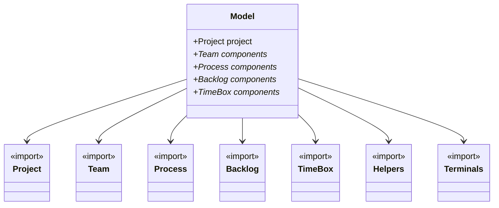

MADE`s language is compose of following parts: Project,Team, Backlog, TimeBox, Roadmap, and Process.

## Meta Model



## Project

This constructor enables the configuration of the MADE and JIRA integration. A Project is composed of:

* Id: Project Jira`s ID (e.g., DEV, INFRA). Each JIRA project has a ID
* description: a description about the project
* email: user's email that has permition to create JIRA's elements using JIRA's API
* host: jira host (e.g., devxyz.jira.com)
* token: Token that allows to create elements using JIRA's API.

Example:

```js
project  {
    name: "Modulo de Autentication, Autorization e Accounting"
    description: "Modulo responsável pela autenticação, autorização e rastreio do usuário no sistema"
    startDate: 22/11/2022
    dueDate: 30/11/2022
}

```


## Team

It allows us create teams that will be responsible for one or more tasks. MADE allows creating as many teams as we want.

It is important to comment that each member needs to be registered on JIRA. 

```js
team blackops {
    name: "Team Black Ops"
    description: "Equipe responsável por produzir artefatos de segurança"
    teammember rafaelemerick {name: "Rafael Emerick" email: "rafael.emerick@blackops.com.br"}
    teammember joaomarcos {name: "João Marcos " email: "joao.marcos@blackops.com.br"}
    teammember Arthur {name: "Arthur Cremasco" email: "arthur.cremasco@blackops.com.br"}
  
  
}
```

## Backlog

It allows us to define a project backlog. MADE allows to creating as many backlogs as we want.

A backlog is composed of: EPIC, User Story, and Task. Link about [EPIC, USer Story and Task](https://scrum-master.org/en/epic-feature-and-user-story-in-agile-a-beginners-guide/).


A Epic is composed of User Stories and User Stories is composed of tasks. MADE allows to define this relation. Beside allow us define a relation of dependecies, i.e., It is possible to define that a task will be performed only when other task or user story was performed. 

```js
backlog Spike {
   name: "Backlog de Estudo"
   description: "Backlog dedicado a estudo da equipe"
   
   epic epic1 {
    name: "Estudar sobre Autorização"
    description: "Estudo sobre autorização de usuários a recursos de redes"
    story story1 {
        name: "Estudar a arquitetura proposta pelo OPA"
        task estudar {
            name: "Estudar sobre OPA"
            }
        task apresentar {
            name: "Apresentar o estudo OPA"  
            depends: Spike.epic1.story1.estudar, Spike.epic1.story2.estudar                       
            }
        }
        story story2 {
        name: "Estudar a arquitetura proposta pelo OpenFGA"
        task estudar {
            name: "Estudar sobre OpenFGA"            
            }
        task apresentar {
            name: "Apresentar o estudo OpenFGA"
            depends: Spike.epic1.story1.estudar, Spike.epic1.story2.estudar                       
            }
        }
    }    
}
```

## Sprint

Define a work period for the project team (e.g., sprint) with work tasks, responsible by time box  and other data to manager a timebox. 

```js

sprint estudo {
    name: "Estudar Autorizacao"
    description: "Realizar estudos sobre autorizacao"
    startDate: 20/11/2024
    endDate: 30/11/2024
    status: IN_PROGRESS
    
    sprintbacklog estudo {
        item Spike.epic1.story1.estudar {assignee: blackops.joaomarcos  dueDate: 30/11/2024 status: TODO}
        item Spike.epic1.story1.apresentar {assignee: blackops.joaomarcos startDate: 20/11/2024 completedDate:26/11/2024 dueDate: 30/11/2024 status: DONE}         
        item Spike.epic1.story2.apresentar {assignee: blackops.joaomarcos startDate: 20/11/2024 dueDate: 30/11/2024 status: DOING}         
    }
    
}
```
Definition: 

* **Label**: A label is a tag that can be used to track activities of a specific department, categorizing tasks.

* **Complexity**: Indicates the complexity of items, represented by an integer.

* **Planning**: References items from the backlog, inserting them into the sprint and creating the Sprint Backlog.

* **Performed**: References items from the planning and assigns their status as `DOING` or `DONE`. This is useful for sprint reviews, as it allows the status of tasks within the timebox to be checked.


## Process

In projects, it's common for some activities to be repeated throughout their duration. To handle this, we've introduced the concept of a **process**, which can be used to instantiate repetitive activities in the project.

```js
process DevelopmentProcess {
    name: "Development Process"
    description: "Description of a process"

    activity UseCaseModelling {
        name: "Use Case Modelling"
        description: "Use Case Modelling"
        DefinitionDone: "The criteria that define when the activity is considered complete."
        DefinitionReady: "The criteria that define when the activity is ready to be worked on."
        Learning: "Specifies what needs to be studied or learned for the activity."
        Label: UseCaseModelling
       
    }

    task UseCaseDescription {
        name: "Use Case Description"
        description: "Use Case Description "
        DefinitionDone: "The criteria that define when the activity is considered complete."
        DefinitionReady: "The criteria that define when the activity is ready to be worked on."
        Learning: "Specifies what needs to be studied or learned for the activity."
        Label: UseCaseDescription
        Depends: DevelopmentProcess.UseCaseModelling
    }    
}
```
The dependency can occur in both the **user story** and the **epic**, functioning in the same way.

## RoadMap

Define o roteiro, suas versões e o planejamento das versões.
```js
roadmap projeto {
    name: "Rodmap do projeto"
    description: "Roadmap de todo do projeto"
    milestone beta {
        name: "Primeira versão"
        description: "Contem apenas estudo das tecnologias do projeto"
        startDate: 20/11/2024        
        dueDate: 30/11/2024
        status: IN_PROGRESS
        release beta {
            description: "Estudo para entender as tecnologias"
            item : Spike.epic1
            status: IN_DEVELOPMENT
            dueDate: 30/11/2024
            version: "1.0"
        }
    }
}
```

## Examples:

* [Simple Example](./simple-example-roadmap.made): Example with Team, Sprint, Backlog.
* [Simple Example with Roadmap](./simple-example-roadmap.made): Example Team, Sprint, Backlog, and Roadmap.
