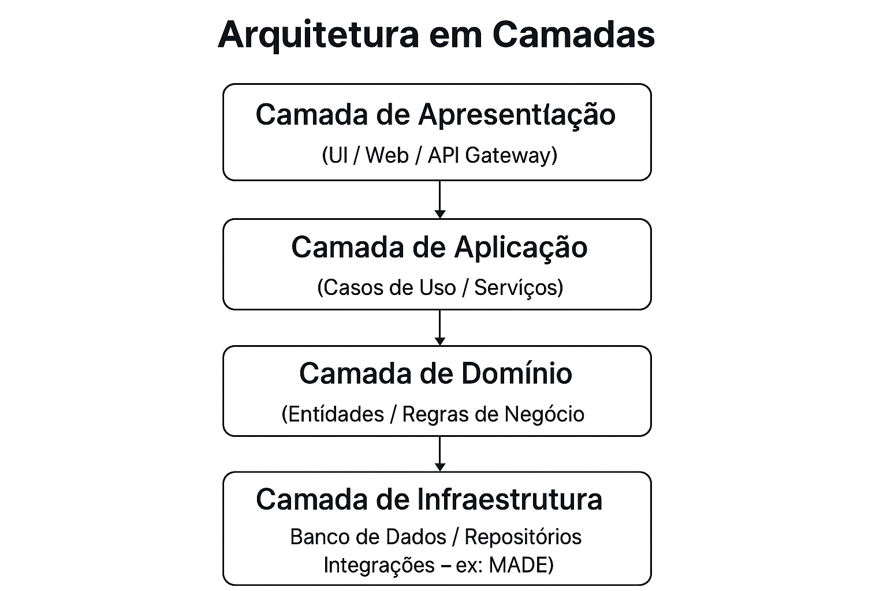

# 1. Proposed Architecture

To support Agile Management modules with MADE (EPICs, user stories, backlog, sprints, releases, and dashboards) in a scalable and testable web application, I adopt **Clean Architecture**:

---

## Architecture Layers

### 1. Presentation Layer
- UI / Web / API Gateway

### 2. Application Layer
- Use Cases
- Services

### 3. Domain Layer
- Entities
- Business Rules

### 4. Infrastructure Layer
- Database
- Repositories
- Integrations (e.g., MADE)

---

# 2. Layer Explanation

1. **Presentation Layer**  
   - Responsible for exposing REST/GraphQL interfaces or web UI (React/Vue) to users and other systems.  
   - Orchestrates requests and converts input/output data into DTOs.

2. **Application Layer**  
   - Contains _Use Cases_ that implement business scenarios (e.g., "Create Sprint," "Generate Roadmap," etc.).  
   - Should not contain infrastructure logic or direct database access.

3. **Domain Layer**  
   - The core of the application, with entities (such as `Epic`, `UserStory`, `Sprint`) and their pure business rules (validations, calculations).  
   - Independent of frameworks and external libraries.

4. **Infrastructure Layer**  
   - Implements details such as data repositories (SQL/NoSQL), HTTP clients to integrate with the MADE engine, queue services, caching mechanisms, and logging.  
   - Provides concrete implementations of the interfaces defined in the application and domain layers.

---

# 3. Bibliographic References

- **Robert C. Martin**, *Clean Architecture: A Craftsman’s Guide to Software Structure and Design*, 2017.  
- **Eric Evans**, *Domain-Driven Design: Tackling Complexity in the Heart of Software*, 2004.  
- **Vaughn Vernon**, *Implementing Domain-Driven Design*, 2013.  
- **Martin Fowler**, *Patterns of Enterprise Application Architecture*, 2002.

---

# 4. Improvement Points

1. **Interface Isolation**  
   - Extract repository and service interfaces into separate packages to facilitate testing and allow implementation swaps without impact.

2. **CQRS and Event Sourcing**  
   - For reporting and dashboard modules (burn-down, velocity), separate read and write operations using _Command Query Responsibility Segregation_ and potentially _Event Sourcing_ for detailed traceability.

3. **Micro–frontends or Modularized APIs**  
   - Split the presentation layer into micro-frontends (backlog management, sprint planning, roadmap) or micro-APIs for scalability and independent deployment.

4. **Integration Test Automation**  
   - Introduce automated tests that simulate complete end-to-end flows against a MADE staging environment, ensuring minimal regressions in each release.

5. **Observability and Telemetry**  
   - Incorporate metrics tools (Prometheus/Grafana) and distributed tracing (OpenTelemetry) to monitor performance and debug production issues.

6. **Contract Documentation (OpenAPI/AsyncAPI)**  
   - Generate interactive documentation for endpoints and events to facilitate the integration of new clients and external teams.

---
