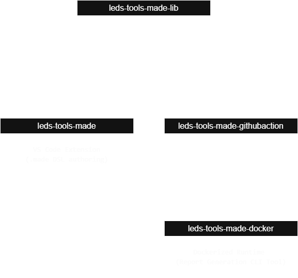

# MADE Project Overview

**MADE (Modular Agile Development Environment)** is a modular system built to support agile teams in organizing their workflows, sprints, backlogs, and reporting. It aims to provide reusable, standardized, and automated solutions for agile project planning and documentation.

The project is split into four main repositories, each with a specific role:

1. `leds-tools-made` – Core VS Code plugin and logic.
2. `leds-tools-made-lib` – Analytical library for reports and diagrams.
3. `leds-tools-made-docker` – Dockerized automation and CI/CD support.
4. `leds-tools-made-githubaction` – Automated workflows using GitHub Actions.

## Architecture Diagram

