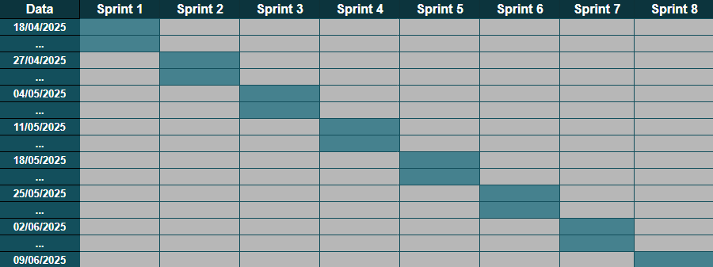

# 📌 Project Development Plan

Presents the project's overall development planning and structure, including backlog, team organization, goals, and estimated costs.

---

## 📋 Backlog

| ID | Team         | Feature                            | Description                                                                                      | Importance | Proposal                                |
|----|--------------|------------------------------------|--------------------------------------------------------------------------------------------------|------------|------------------------------------------|
| 1  | Management   | PMC & Documentation                | Create the initial project documentation and PMC structure.                                     | 95         | Improve documentation clarity            |
| 2  | Management   | Technology Research & Metrics      | Research suitable technologies and define performance metrics.                                  | 90         | Enhance metric-based decision making     |
| 3  | Management   | Metric Results                     | Collect, analyze, and document project metrics throughout development.                          | 85         | Improve performance tracking             |
| 4  | Management   | Automated Reports                  | Generate and document automated metrics and performance reports.                                | 80         | Reduce manual effort and errors          |
| 5  | Developers   | Architectural Documentation        | Document the system architecture to guide the development phase.                                | 95         | Improve development alignment            |
| 6  | Developers   | Technology Implementation          | Implement technologies previously discussed and approved.                                       | 90         | Speed up development cycle               |
| 7  | Developers   | Code Improvement & Docs            | Refactor code, enhance documentation, and ensure alignment with best practices.                 | 85         | Improve code quality and maintainability |
| 8  | Developers   | Functional App                     | Deliver the fully functional and documented application, ready for deployment.                  | 100        | Ensure delivery of project goal          |

---

## 🧩 Project Model Canvas

### 🔍 Justifications
1. LEDS mentors have difficulty discovering the efficiency of students in completing tasks.  
2. Students lack a platform to check tasks and have them assigned.  
3. The repository analysis process is time-consuming when done manually.

---

### 🎯 Product
A chatbot to assist in managing LEDS projects.

---

### 🧠 SMART Goal
Collect data from GitHub repositories to create a chatbot that uses AI (Google Gemini) to provide real-time information about LEDS project progress in natural language.

---

### ✅ Requirements
- Friendly interface;  
- Extract data from GitHub repositories;  
- Automate analysis of team and individual performance.

---

### 🎁 Benefits
- Display team performance in sprint progress;  
- Improve decision-making;  
- Check individual performance metrics.

---

### 👥 External Stakeholders & Factors
Advisors, scholarship holders, staff, and other stakeholders involved in LEDS and FAPES.

---

### 🔮 Assumptions
- Team commitment.  
- Knowledge of the required technologies.

---

### ⚠️ Risks

#### 1. Requirement changes during the project  
- **Probability**: 20%  
- **Mitigation**: Ensure a solid requirements phase and allow flexibility in development to accommodate changes.

#### 2. Lack of technical knowledge  
- **Probability**: 60%  
- **Mitigation**: Allocate time during sprints for learning and mastery.

#### 3. Team member time constraints  
- **Probability**: 80%  
- **Mitigation**: Coordinate schedules and design viable sprints based on available time.

---

### 👥 Team

#### 🧭 Management:
- Ana Júlia Caetano (Dominance)  
- Caio Lessa  (Compliance)
- Davidson Santos (Steadiness)
- Thiago Borges (Compliance)

#### 🛠️ Developers:
- Alicia Caporalli (Steadiness)  
- Lívia Hombre (Steadiness)
- Pedro Henrique Fonseca (Steadiness) 
- Thiago Fabiano (Dominance) 
- Vítor Nascimento (Compliance)

---

### 🧱 Team Topology

**Platform Team**  
Enables stream-aligned teams to deliver work autonomously. While stream-aligned teams maintain full ownership of their work, the platform team provides internal services and tools to support delivery.

---

### 📦 Deliverables

#### Management:
- **Sprint 1**: PMC and documentation  
- **Sprint 2**: Technology research and metric definition  
- **Sprints 3, 4, 5, 6**: Results with collected metrics  
- **Sprints 7 and 8**: Automated metrics and performance report

#### Developers:
- **Sprint 1**: Architectural documentation  
- **Sprint 2**: Implementation of discussed technologies  
- **Sprints 3, 4, 5**: Code improvements and documentation  
- **Sprints 7 and 8**: Functional and documented application

---

### ⛓ Constraints
- Must use OpenWebUI, FastAPI, Airbyte, PostgreSQL, and Gemini (via MyVanna) 
- Dependent on AWS Marketplace / VSC environment  
- Delivery deadline: 3 months

---

### 🗓 Timeline

---

### 💰 Costs

- **Team effort**: R$1,000.00 × 9 members = **R$9,000.00**  
- **Transportation (3 months)**: R$4.90 × 60 days × 9 members = **R$2,646.00**  
- **Food**: R$12.00 × 60 days × 9 members = **R$6,480.00**  
- **Team mental health**: **R$0.00**

#### **Total: R$18,126.00**

---

