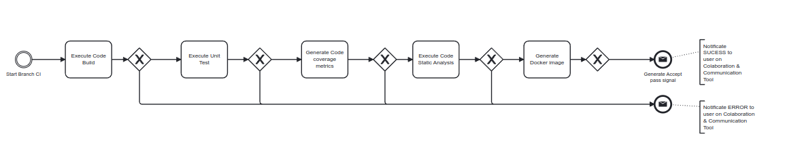

# Pipeline Conditions

## Why pipelines have conditions?

Conditions are important to better organize the pipeline execution. They allow the pipeline to execute different steps according to the action on Git. For example, when opening a Pull Request, the pipeline executes only the build and check steps, while when merging, the pipeline executes all the steps. There are also differences between branches. For example, the 'develop' branch publishes the application in the development environment, while feature branches only build, check, and test the code.

So, in our pipeline, theres two types of conditions: the Git action and the branch. So, here are the following BPMN diagram and the conditions for each stage.

## When Pull Request is opened

When a Pull Request is opened, in any branch, the pipeline executes the following steps:

1. Build the image or compile the code.

2. Check the code quality on SonarQube.

3. Run the tests and get the code coverage.

Note that this only checks the quality of the code, that means that only the CI Pipeline is executed, not the CD one. And, because the pipeline status is shown in the PR, an alert is sent to the team if the pipeline fails.

## When pushing to any branch

When pushing or merging a PR to any branch, the pipeline executes the following steps:

_Feature Branch BPMN Diagram_

1. Build the image or compile the code.

2. Check the code quality on SonarQube.

3. Run the tests and get the code coverage.

#### if the branch is _feature branch_:

4. Generate a candidate image for Deployment.

#### if the branch is _special branch_:

5. Generate a image for deployment with the branch tag and publish the image to the GitHub Container Registry.

6. Deploy the image to the respective environment.

#### On any push, an alert will be sent to the team if the pipeline fails.