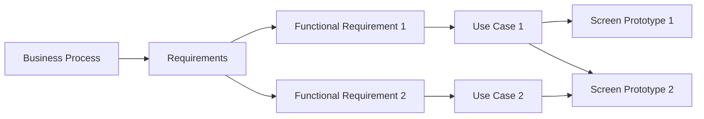

import BpmnViewer from '@site/src/components/BpmnViewer';

Presents examples of process that implements Inception.

## Example 1: When Soluction was defined before

This process describes an example of a inception process when a soluction (e.g. Web Application or Mobile apps) was defined before.  

<BpmnViewer diagramUrl="/diagrams/processo_software/inception/example.bpmn" height="550px"/>

### Modelling Business Process Models

Requirement Enginner, or Business Process Modeler, models, and validates with stakeholders, one or more business Pprocess models to understand how the organization works. 

### Define Software Requirements

Requirement Enginner defines, and validades, functionals and non-funcionals software requirements based on information in business process models and other artifacts (e.g., interviews). 

### Create Prototype

Designer creates a non-functional prototypes and validade with statkeholders.

### Mapping Among Artifacts

This figure above presents relations among artifacts created in this processes. 

