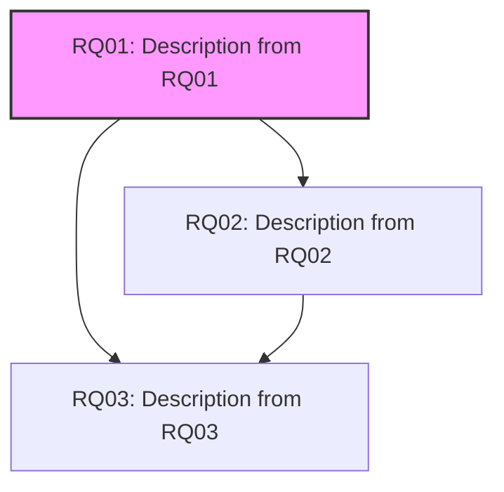

import BpmnViewer from '@site/src/components/BpmnViewer';

Presents examples of process that implements Inception.

## Exempla 1: When Soluction was defined before

This process describes an example of a inception process when a soluction (e.g. Web Application or Mobile apps) was defined before.  

<BpmnViewer diagramUrl="/diagrams/processo_software/inception/example.bpmn" height="550px"/>

### Modelling Business Process Models

Requirement Enginner, or Business Process Modeler, models, and validates with stakeholders, one or more business Pprocess models to understand how the organization works. 

**Inputs**:
    1. Organization`s documents
    2. Project`s Scope

**Results**: 
    1.  Business Process Models validades

### Define Software Requirements

Requirement Enginner defines, and validades, functionals and non-funcionals software requirements based on information in business process models and other artifacts (e.g., interviews). 

**Inputs**:
    1. Organization`s documents
    2. Project`s Scope
    3. Business Processes

**Results**: 
    1.  Software Requirement: define and describes the software requirements
    2.  Graph with relation among software requirements: presents the relationship among the software requirements

**Example**:

**Software Requirements**

|ID|Requirement|Type|Relation|
|--|-----------|----|--------|
|RQ01| Description from RQ01|Non-Functional|-|
|RQ02| Description from RQ02|Functional|RQ01|
|RQ03| Description from RQ03|Functional|RQ01,RQ02|

### Define Use Cases

### Create Prototype
