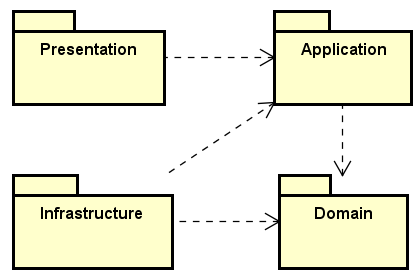
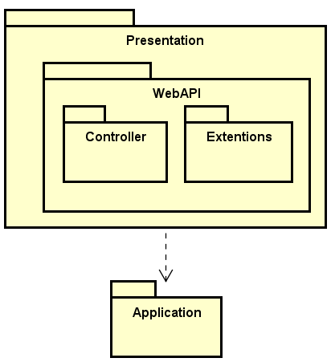
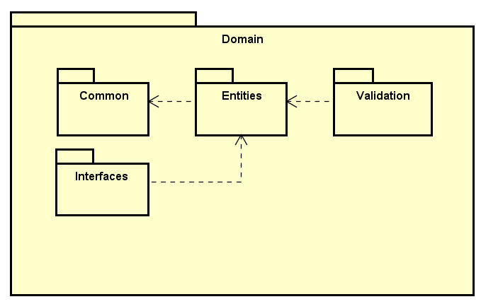

Clean Archictecture with CRQS Pattern implemented on Back-End

|Layer| Description    |
|------|--------------|
|Presentation|Interacts with end users or other systems through input interfaces|
|Application|Orchestrates data flow to and from the domain and coordinates business operations|
|Infrastructure|Implements infrastructure details such as data persistence and external communications|
|Domain|Contains the core business logic and system entities|

### Presentation Layer

|Component| Description    |
|------|--------------|
|Controller|Entry point for the system, receiving requests and returning responses. They do not contain business logic but call use cases from the application layer|
|Extensions|Extensions of the settings from the Program.cs file, which is the main file of the API|

### Application Layer

|Component| Description    |
|------|--------------|
|Configuration|Contains the configuration file for dependency injections used, as well as the configuration of external libraries|
|Mappers|Transform objects from one type to another, such as converting a DTO (Data Transfer Object) from the presentation layer into a domain entity|
|DTOs (Data Transfer Objects)| Data structures used to transfer information between the application layer and other layers|
|Interfaces|Define contracts that describe what the system needs to function, without worrying about specific implementations|
|Services|Contains the implementation of auxiliary functions for application logic, coordinating interactions between repositories and domain entities|
|Shared|Contains files with implementations of functions shared among the components of the application layer|
|Use Cases|Contain the application logic, coordinating interactions between domain entities and other services. They are responsible for performing specific actions requested by users or systems|

### Infrastructure Layer

|Component| Description    |
|------|--------------|
|Context|Defines the Entity Framework Core context configuration for the application|
|Entities Configuration|Contains the configuration of the database table models, such as type, constraints, default column values, as well as the definition of relationships between tables|
|Repositories|Implementations of interfaces defined in the application layer for data access|

### Domain Layer

|Component| Description    |
|------|--------------|
|Common|Defines abstract classes that contain attributes and methods common to other entities|
|Entities|Defines classes for the problem domain|
|Interfaces|Define the methods that must be implemented in the repositories of the Infrastructure layer and used in the application layer|
|Validation|Generates and returns validation errors for entities|