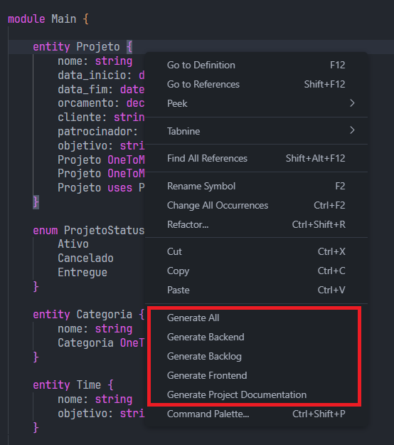

# Como Usar?

## Instalação:

1. Abra o Visual Studio Code
2. Clique em extensões
3. Pesquise R2D2
4. Clique para instalar a extensão R2D2 do LEDS IFES

## Geração:

1. Crie um arquivo de nome qualquer com a extensão .r2d2
2. Defina o que vai ser gerado utilizando a [linguagem do R2D2](lang.md)
3. Salve o arquivo .r2d2
4. Clique com o botão direito em qualquer lugar dentro do arquivo e escolha o que você deseja gerar

5. Após isso, ele gerará pastas com o que foi pedido na mesma pasta em que o arquivo está contido.
