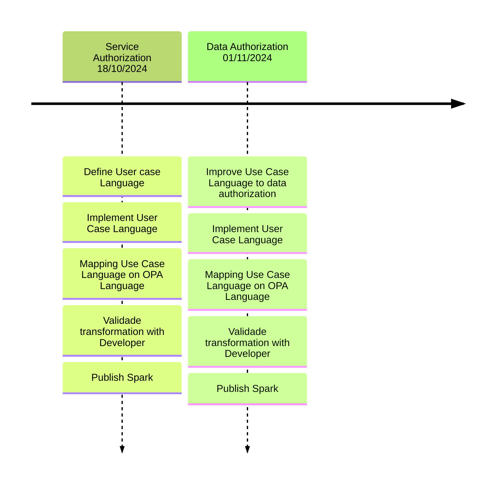

Presents the project`s developing planning.

## Backlog

| ID | Feature | Description | Importance | Proposal |
|----|---------|-------------|------------|----------|
| 1 | Create authorization service rules based on Actor and User Case's Events | Create authorization rules on Back-End and Front-End based on relations among actors and User Case's Events | 100 | Improve software development process by 10% |
| 2 | Create authorization data rules based on Actor and User Case's Events | Create authorization data rules on Back-End and Front-End based on relations among actors and User Case's Events (Owner Patterns) | 95 | Improve software development process by 10% |
| 3 | Implement Minimal API with M(domain, service)VC pattern | Apply M(domain, service)VC pattern using Minimal API approach in C#, Java, and Django projects | 90 | Standardize architecture to reduce rework |
| 4 | Fix document insertion error in Django | Identify and fix the issue preventing document insertion in Django | 85 | Ensure system integrity and functionality |
| 5 | Add missing library in Java project | Identify and integrate the required library to ensure proper execution of the Java project | 80 | Eliminate technical blockers for the team |
| 6 | Fix general errors in Django | Resolve various backend issues in the Django project | 88 | Reduce bugs and improve system stability |
| 7 | Generate classes based on use case type | Automate the creation (or not) of classes based on the use case type (e.g., CRUD or non-CRUD) | 82 | Boost productivity in software modeling |
| 8 | Generate code with AI based on use case comments | Use AI to analyze comments and automatically generate supporting code | 93 | Accelerate development with intelligent assistance |

## General planning

**Stopped development on creating OPA based on actor and use case events, without a link to C#.**

* Release 1.0 (14/10/2024 - 01/11/2024): Create authorization service rules based on Actor and User Case's Events on C# application and Create authorization data rules based on Actor and User Case`s Events  (Owner Patterns) on C#

## Release 1.0 - 01/11/2024

* **Goal**: Create authorization service and data based on User Case Diagram 

  * **Features**: ID 1 and ID 2

  * **Deadline I**  - 25/10/2024 
      * ID 1: Create authorization service rules based on Actor and User Case's Events on C# application  
  * **Deadline II** - 01/11/2024 
      * ID 2: Create authorization data rules based on Actor and User Case`s Events  (Owner Patterns) on C#

