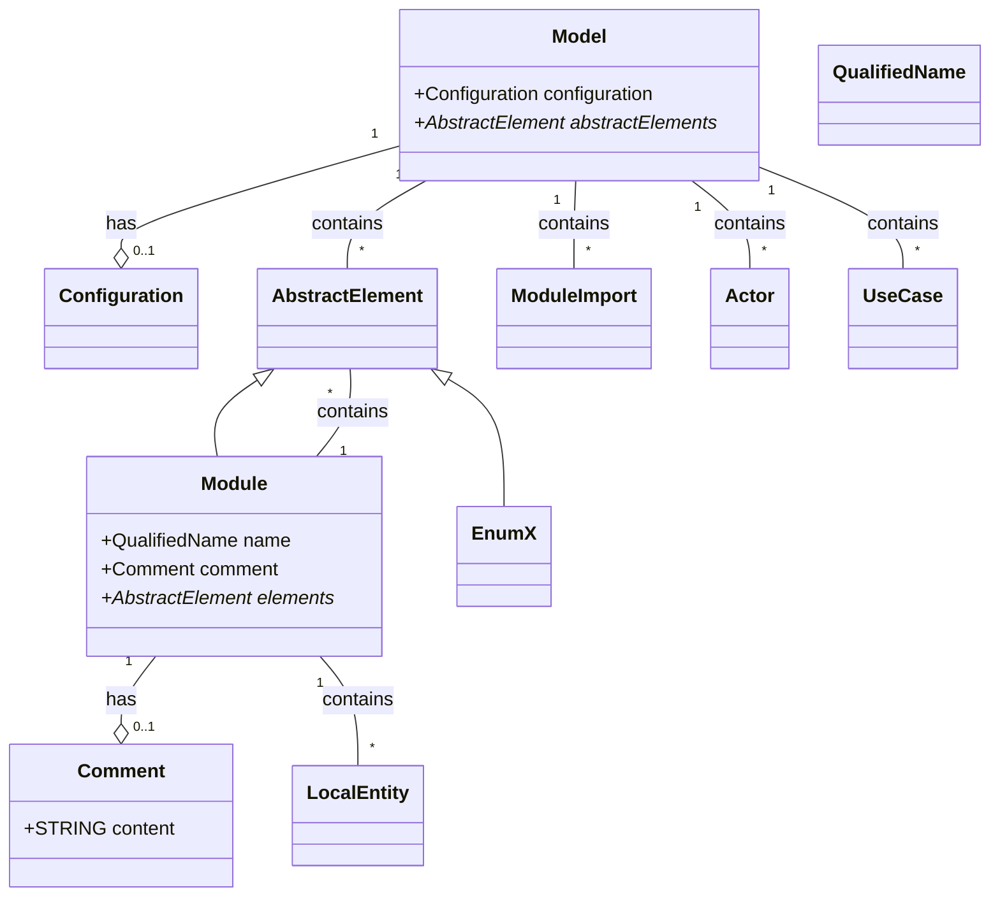
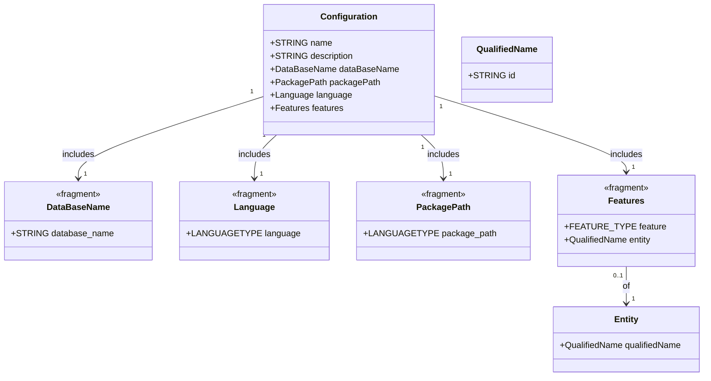
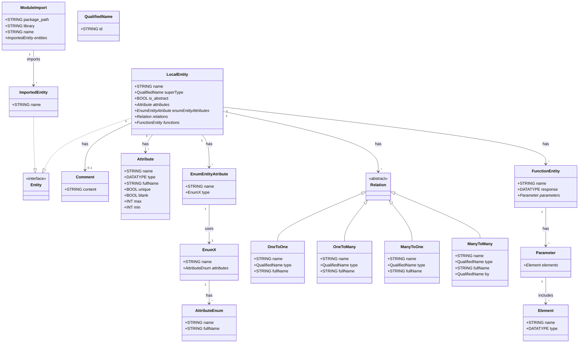
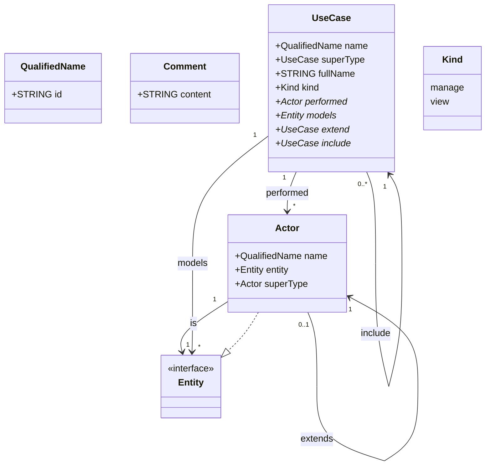

This class diagram provides a structured overview of the `SPARK` grammar, illustrating how various components such as `Model`, `Configuration`, `AbstractElement`, `Module`, `EnumX`, `Actor`, and `UseCase` interact and relate to each other. By defining `AbstractElement` as a base for `Module` and `EnumX`, the diagram promotes a hierarchical and organized approach to modeling system components. Additionally, the inclusion of fragments like `QualifiedName` and `Comment` ensures that elements are uniquely identifiable and well-documented within the system.

## Model

### Configuration
- **Description**: Represents the configuration settings of the system. This class is imported from the `config` package.
- **Attributes**: (Attributes are defined within the `config` package and are not detailed here.)

### AbstractElement
- **Description**: An abstract representation of system elements. It serves as a base for more specific elements like `Module` and `EnumX`.
- **Relationships**:
  - **Inheritance**: `Module` and `EnumX` inherit from `AbstractElement`.

### ModuleImport
- **Description**: Represents an import statement for modules. This class is imported from the `modules` package.
- **Attributes**: (Attributes are defined within the `modules` package and are not detailed here.)

### Actor
- **Description**: Represents an actor in the system, typically a user or external system that interacts with the system's use cases.
- **Attributes**: (Attributes are defined within the `entities` or `usescases` package and are not detailed here.)

### UseCase
- **Description**: Represents a use case within the system, defining a specific functionality or behavior that actors can perform.
- **Attributes**: (Attributes are defined within the `usescases` package and are not detailed here.)

### Module
- **Description**: Represents a module within the system, which can contain various elements such as other modules, enums, or local entities.
- **Attributes**:
  - `name`: A `QualifiedName` that uniquely identifies the module.
  - `comment`: An optional `Comment` providing additional information about the module.
  - `elements`: A collection of `AbstractElement` or `LocalEntity` instances contained within the module.
- **Relationships**:
  - **Has**: May contain one `Comment`.
  - **Contains**: Can contain multiple `AbstractElement` and `LocalEntity` instances.

### EnumX
- **Description**: Represents an enumeration within the system. Inherits from `AbstractElement`.
- **Attributes**: (Attributes specific to the enumeration are defined within the `entities` package and are not detailed here.)

### LocalEntity
- **Description**: Represents a local entity within a module. This could be a class, interface, or other construct defined within a module.
- **Attributes**: (Attributes are defined within the `entities` package and are not detailed here.)

### Comment
- **Description**: Represents a comment within the grammar, providing additional context or explanations for modules.
- **Attributes**:
  - `content`: A string containing the comment text.

### QualifiedName
- **Description**: Represents a qualified name used to uniquely identify elements within the system. Imported from the `terminals` package.
- **Attributes**: (Attributes are defined within the `terminals` package and are not detailed here.)

## Configuration

This class diagram provides a clear and organized view of the `Configuration` class within the `SPARK` grammar, demonstrating how it integrates various fragments to encapsulate different aspects of the system's configuration. By using fragments such as `DataBaseName`, `Language`, `PackagePath`, and `Features`, the model promotes reusability and consistency, ensuring that common configuration patterns are maintained across different components of the system. The optional association between `Features` and `Entity` allows for enhanced flexibility, enabling features to be contextually linked to specific entities as needed.

### Configuration
- **Description**: The `Configuration` class encapsulates the system's configuration settings. It includes various attributes that define the software's name, description, database configuration, package paths, programming language, and feature settings.
- **Attributes**:
  - `name`: A string representing the name of the software.
  - `description`: A string providing an overview or details about the software.
  - `dataBaseName`: An instance of the `DataBaseName` fragment specifying the database name.
  - `packagePath`: An instance of the `PackagePath` fragment specifying the package path.
  - `language`: An instance of the `Language` fragment specifying the programming language used.
  - `features`: An instance of the `Features` fragment defining various features of the software.

- **Relationships**:
  - **Includes**: 
    - **DataBaseName**: Defines the name of the database.
    - **PackagePath**: Specifies the package path used in the system.
    - **Language**: Indicates the programming language employed.
    - **Features**: Details the features available, optionally associating them with specific entities.

### DataBaseName
- **Stereotype**: `<<fragment>>`
- **Description**: Specifies the name of the database used by the system.
- **Attributes**:
  - `database_name`: A string representing the database name.

### Language
- **Stereotype**: `<<fragment>>`
- **Description**: Specifies the programming language used in the system.
- **Attributes**:
  - `language`: An enumeration (`LANGUAGETYPE`) representing the programming language (e.g., Java, Python).

### PackagePath
- **Stereotype**: `<<fragment>>`
- **Description**: Specifies the package path used in the system.
- **Attributes**:
  - `package_path`: An enumeration (`LANGUAGETYPE`) representing the package path.

### Features
- **Stereotype**: `<<fragment>>`
- **Description**: Defines features of the system, optionally associating them with specific entities.
- **Attributes**:
  - `feature`: An enumeration (`FEATURE_TYPE`) representing the type of feature.
  - `entity`: An optional reference to an `Entity` using a `QualifiedName`.

## Entity 

### Entity 
- **Description**: The `Entity` interface is implemented by both `LocalEntity` and `ImportedEntity`. This allows these classes to be treated uniformly when establishing relationships and dependencies.
- **Inheritance**:
  - `LocalEntity` ..|> `Entity`
  - `ImportedEntity` ..|> `Entity`

### ModuleImport
- **Description**: Represents an import statement for modules. It specifies the package path, library, module name, and the entities being imported.
- **Attributes**:
  - `package_path`: The path of the package as a string.
  - `library`: The name of the library from which modules are imported.
  - `name`: The name of the module.
  - `entities`: A list of `ImportedEntity` instances representing the entities being imported.
- **Relationships**:
  - **Imports**: Can import multiple `ImportedEntity` instances.

### ImportedEntity
- **Description**: Represents an entity that is imported into a module. It holds the name of the entity.
- **Attributes**:
  - `name`: The name of the imported entity.

### LocalEntity
- **Description**: Represents a local entity within a module. This could be a class, interface, or other construct defined within a module.
- **Attributes**:
  - `name`: The name of the entity.
  - `superType`: An optional reference to another `Entity` that this entity extends.
  - `is_abstract`: A boolean flag indicating whether the entity is abstract.
  - `attributes`: A collection of `Attribute` instances defining the entity's attributes.
  - `enumEntityAttributes`: A collection of `EnumEntityAtribute` instances.
  - `relations`: A collection of `Relation` instances defining relationships with other entities.
  - `functions`: A collection of `FunctionEntity` instances defining the entity's functions.
- **Relationships**:
  - **Inherits**: Implements the `Entity` interface.
  - **Contains**: Can contain multiple `Attribute`, `EnumEntityAtribute`, `Relation`, and `FunctionEntity` instances.
  - **Has**: May have an optional `Comment`.

### FunctionEntity
- **Description**: Represents a function within an entity, detailing its name, parameters, and return type.
- **Attributes**:
  - `name`: The name of the function.
  - `response`: The data type of the function's return value.
  - `parameters`: A collection of `Parameter` instances defining the function's parameters.
- **Relationships**:
  - **Has**: Can contain multiple `Parameter` instances.

### Parameter
- **Description**: Represents a parameter of a function within an entity.
- **Attributes**:
  - `elements`: A collection of `Element` instances defining the parameter's elements.
- **Relationships**:
  - **Includes**: Can contain multiple `Element` instances.

### Element
- **Description**: Represents an individual element within a parameter, specifying its name and type.
- **Attributes**:
  - `name`: The name of the element.
  - `type`: The data type of the element.

### Attribute
- **Description**: Represents an attribute of an entity, detailing its name, type, and various constraints.
- **Attributes**:
  - `name`: The name of the attribute.
  - `type`: The data type of the attribute.
  - `fullName`: An optional string specifying the full name.
  - `unique`: An optional boolean indicating if the attribute is unique.
  - `blank`: An optional boolean indicating if the attribute can be blank.
  - `max`: An optional integer specifying the maximum value.
  - `min`: An optional integer specifying the minimum value.

### EnumEntityAtribute
- **Description**: Represents an attribute of an enumeration within an entity.
- **Attributes**:
  - `name`: The name of the enumeration attribute.
  - `type`: A reference to an `EnumX` instance indicating the type of the enumeration.

### EnumX
- **Description**: Represents an enumeration type within the system.
- **Attributes**:
  - `name`: The name of the enumeration.
  - `attributes`: A collection of `AttributeEnum` instances defining the enumeration's attributes.
- **Relationships**:
  - **Contains**: Can contain multiple `AttributeEnum` instances.

### AttributeEnum
- **Description**: Represents a single attribute within an enumeration.
- **Attributes**:
  - `name`: The name of the enumeration value.
  - `fullName`: An optional string specifying the full name of the enumeration value.

### Relation (Abstract Class)
- **Description**: An abstract class representing relationships between entities. Specific types of relationships (`OneToOne`, `OneToMany`, `ManyToOne`, `ManyToMany`) inherit from this class.

#### OneToOne
- **Description**: Represents a one-to-one relationship between two entities.
- **Attributes**:
  - `name`: The name of the relationship.
  - `type`: A reference to the related `Entity`.
  - `fullName`: An optional string specifying the full name of the relationship.

#### OneToMany
- **Description**: Represents a one-to-many relationship between two entities.
- **Attributes**:
  - `name`: The name of the relationship.
  - `type`: A reference to the related `Entity`.
  - `fullName`: An optional string specifying the full name of the relationship.

#### ManyToOne
- **Description**: Represents a many-to-one relationship between two entities.
- **Attributes**:
  - `name`: The name of the relationship.
  - `type`: A reference to the related `Entity`.
  - `fullName`: An optional string specifying the full name of the relationship.

#### ManyToMany
- **Description**: Represents a many-to-many relationship between two entities.
- **Attributes**:
  - `name`: The name of the relationship.
  - `type`: A reference to the related `Entity`.
  - `fullName`: An optional string specifying the full name of the relationship.
  - `by`: An optional reference to a `LocalEntity` that mediates the relationship.

### QualifiedName
- **Description**: Represents a qualified name used to uniquely identify elements within the system. It typically follows the format `ID(.ID)*`, allowing for hierarchical naming.
- **Attributes**:
  - `id`: A string representing the qualified name, composed of one or more identifiers separated by dots (e.g., `com.example.project`).

### Comment
- **Description**: Represents a comment within the grammar, providing additional context or explanations for modules or other elements.
- **Attributes**:
  - `content`: A string containing the comment text.

## UseCase

This class diagram focuses on the `Actor` and `UseCase` elements defined in your `SPARK` grammar. It includes related classes such as `Entity`, `QualifiedName`, and `Comment` to fully represent the structure and relationships within your metamodel.

### Actor
- **Description**: Represents an actor within the system, typically a user or external system that interacts with use cases.
- **Attributes**:
  - `name`: A `QualifiedName` that uniquely identifies the actor.
  - `entity`: An `Entity` that the actor is associated with.
  - `superType`: An optional reference to another `Actor` that this actor extends.
- **Relationships**:
  - **Is**: Each `Actor` is associated with one `Entity`.
  - **Extends**: An `Actor` can optionally extend another `Actor`, establishing an inheritance relationship.

### UseCase
- **Description**: Represents a use case within the system, defining a specific functionality or behavior that actors can perform.
- **Attributes**:
  - `name`: A `QualifiedName` that uniquely identifies the use case.
  - `superType`: An optional reference to another `UseCase` that this use case extends.
  - `fullName`: A string representing the full name of the use case.
  - `kind`: An enumeration (`Kind`) indicating the type of use case (`manage` or `view`).
  - `performed`: A collection of `Actor` instances that perform this use case.
  - `models`: A collection of `Entity` instances that are involved in this use case.
  - `extend`: An optional collection of `UseCase` instances that this use case extends.
  - `include`: An optional collection of `UseCase` instances that this use case includes.
- **Relationships**:
  - **Extends**: A `UseCase` can optionally extend another `UseCase`, establishing an inheritance relationship.
  - **Includes**: A `UseCase` can optionally include other `UseCase` instances.
  - **Performed By**: A `UseCase` is performed by one or more `Actor` instances.
  - **Models**: A `UseCase` involves one or more `Entity` instances.

### Entity
- **Description**: An interface implemented by various entity classes (`LocalEntity`, `ImportedEntity`, etc.). Represents any entity within the system.
- **Attributes**: None (serves as a marker interface).
- **Relationships**:
  - **Implemented By**: `Actor` implements the `Entity` interface.

### QualifiedName
- **Description**: Represents a qualified name used to uniquely identify elements within the system. Typically follows the format `ID(.ID)*`, allowing for hierarchical naming.
- **Attributes**:
  - `id`: A string representing the qualified name, composed of one or more identifiers separated by dots (e.g., `com.example.project`).

### Kind (Enumeration)
- **Description**: Defines the type of use case.
- **Values**:
  - `manage`
  - `view`

