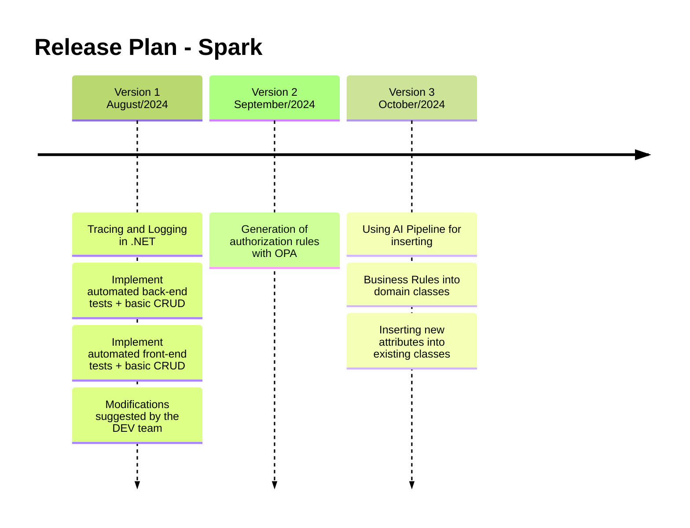

## Version 1 for .NET 
- **Estimated duration:** 2 Weeks
- **Expected delivery date:** End of August 
- **Features:** Tracing and Logging in .NET; Implement automated back-end tests + basic CRUD; Implement automated front-end tests + basic CRUD; Modifications suggested by the DEV team;

## Version 2
- **Estimated duration:** 4 Weeks
- **Expected delivery date:** September 
- **Features:** Generation of authorization rules with OPA

## Version 3
- **Estimated duration:** 3 Weeks
- **Expected delivery date:** October 
- **Features:** Using AI Pipeline for inserting; Business Rules into domain classes (2 weeks); Inserting new attributes into existing classes (1 week);

