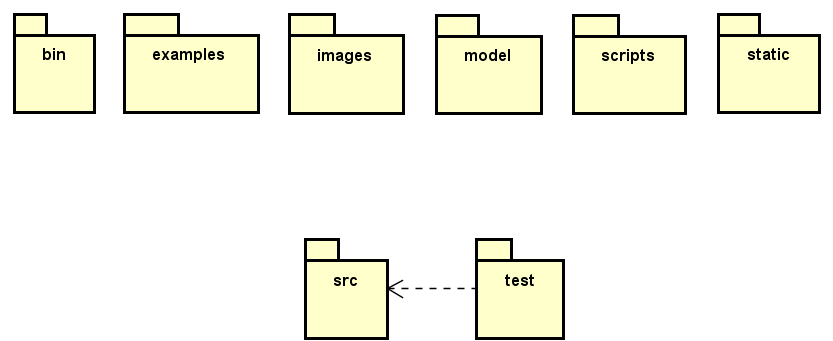

# Atention
The architecture description was based on the most recent version in the Main branch of the Spark source repository, namely November 2024.

# Breif
The Spark is a tool developed with Andes and is used as a plugin in VSCode, which forces its architecture to resemble other projects that have the same characteristics.

Observe Image 1 to have an overview of the architecture.

Image1: Architecture Overview

Note that the folders are divided into two sections: the top and the bottom ones. Unfortunately, the code in the main branch of the repository is not stable, making it impossible to fully explain the completeness and exact communication between the layers. However, it is still possible to interpret their intended purpose. Thus, the top layer are explained in an incomplete and interpretive manner, while the bottom layer will be explained in detail.