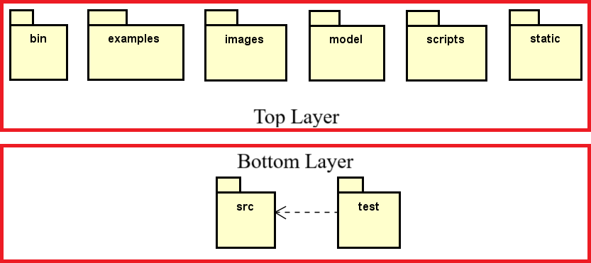
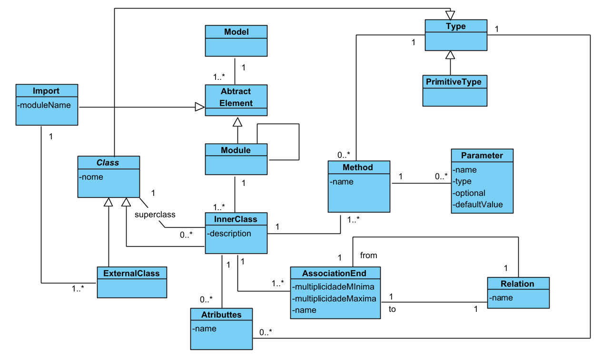

# Overview

    Image 2: Achitecture Layers Overview

The top layer is, to some extent, independent from the others, since there is no communication between them. However, they certainly do communicate in the final and correct version of the tool.

## Bin
This folder, normally used to store machine-compiled code, is responsible for containing the files that manage the execution of the available commands. These files are most likely executed via the Command Line Interface (CLI). Since the project is developed with NodeJS, it's possible to use JavaScript (JS) source code to access the system’s operating system calls (SCs). Therefore, there is no need for compiled code in this folder; all files here are JS source code, but their purpose is the same as that of a folder containing binary files.

## Examples
The examples folder contains files in the Spark format (.spark) with examples demonstrating how the tool's syntax works.

## Images
This folder contains images used in the repository’s documentation and in the tool’s documentation within VSCode. It is a folder with static files.

## Models
This folder is responsible for part of the documentation. It contains files that model the tool's reserved keywords and how they communicate and interact, using the Unified Modeling Language (UML).

The files are in the .vpp format, which is read by the <a href={"https://www.visual-paradigm.com/"}>Visual Paradigm tool</a>. The files in question were created with an unidentified version of the tool. Image 3 shows the internal content of the only file present in the folder, opened in the most recent version of the tool as of now, version 17.2. Therefore, it is not guaranteed that the internal content in the image is complete.

    Image 3: reserved keywords and how they communicate and interact

## Scripts
This folder is responsible for containing some code that will potentially be called by the **bin** folder but is not part of the CLI. Currently, its files are responsible for preparing the environment with the folder structure, ensuring that the generation of subsequent files does not encounter errors.

## Static
This folder is automatically generated by a Langium project along with Monaco to create static documentation for the tool under development. Since the documentation is now being created separately with an external tool, namely Docusaurus, it has been discontinued and no longer receives updates.