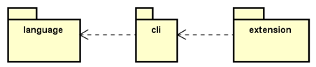

# Wellcome to Src Folder!
The src folder is the most important part of the project. It is automatically generated by a Langium project but has been heavily modified. Each folder within it follows the single responsibility principle — that is, each folder has a very well-defined purpose. See Image 5 for an overview of the folder.

Image5: Src Folder Architecture Overview

# Language
The language folder is part of Langium’s default structure. It contains the files responsible for establishing how the language is structured. These files can be divided into two different categories: syntax definition files and construction definition files.

<h3>Syntax Definition Files</h3>
These files, represented by the Langium extension (.langium), are responsible for defining how the language’s syntax is structured. Each file contains a set of data that determines which reserved keywords (for context and typing) exist, which keywords are accepted in which contexts, and how they should be interpreted. In short, they define a set of Regular Expressions (Regex).

<h3>Construction Definition Files</h3>
These files are represented by JavaScript (.js) and TypeScript (.ts) extensions. They are programming code files that implement specific validation rules for the language, aimed at facilitating the development of language tests.

# CLI
This folder is more relevant than the others. Due to its large number of subfolders and files, it will be explained in a separate section.

# Extensions
This folder contains the configuration files for Spark as a VSCode extension. It defines which files should be read to extract grammar checkers, editing assistants — for example, automatically inserting a closing ")" when typing an opening "(", as well as comment characters — and reserved keyword definitions. Additionally, it also registers commands that can be accessed via left-click on files with the `.spark` extension.