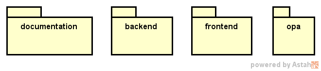
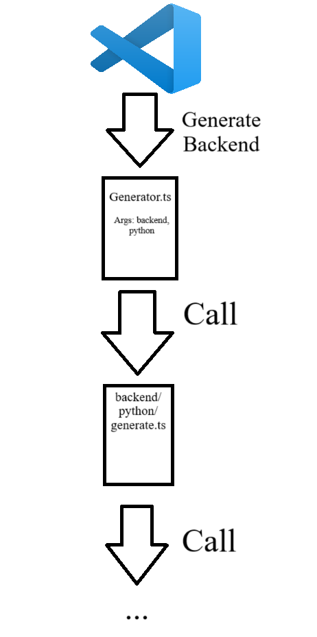

# Introduction

The CLI folder contains the necessary files to read the syntax definitions from the language folder, convert them into computational artifacts interpreted by JS/TS, and apply the commands needed to instantiate the project.


<span style={{ textAlign: "center" }}>
Image 6: The CLI folder struct
</span>

This structure follows a very interesting principle: each folder contains a corresponding Generate.ts file, which is responsible for generating the directory structure at its level and/or invoking the Generate.ts of the subsequent level. Furthermore, within the context of this level in the CLI folder, each subfolder refers to a specific command and, depending on the layer, may include subdirectories for more specific application configurations.

With these mechanisms, the code becomes not only extremely organized but also allows a clear visualization of the internal layer architectures without the need for diagramming.

# Understanding the Generate Structure Better
Consider the following example code:

```
Configuration {
    software_name: "Example Software" // Software's name
    about: "This software is just an example" // Description about the software
    language: python // Language and pattern used to develop the software
    database_name: "DataBase" // Database Name
}

module CollModule {
    entity CoolGuy {
        name: string
    }
}

module BadModule {
    entity DummyGu {
        name: string
    }
}
```

When reading the .spark file above, VSCode will begin constructing the selected command by following the folder structure within the CLI level. In this structure, we have the folders:
- documentation;
- backend;
- frontend; and
- opa.

The commands registered in VSCode are:
- generate project documentation;
- generate backend;
- generate frontend; and
- generate authorization;
Sound familiar?.

Thus, each folder represents a command registered in VSCode.

When a command is triggered, its specific generate file is located within the folder structure. Suppose you execute the command generate backend. Then, VSCode will call the Generator.ts file inside the CLI folder and pass the parameters defined in the configuration section of the .spark file. The Generator.ts file will then locate the specific generate file corresponding to the provided parameters—in our case, it accesses the backend folder (as the generation command is generate backend), then accesses the python folder (as specified in the project configuration), and finally calls the generate.ts file.

The generate.ts file, in turn, understands its internal structure and proceeds to create the necessary folders at its level, continuing to call the respective generate.ts files at lower levels, until the entire folder structure is properly built. As the folders are created, the files belonging to each level are also generated. See Image 7 to check an graphic representation.


<span style={{ textAlign: "center" }}>
Image 7: Generate struct representation
</span>
