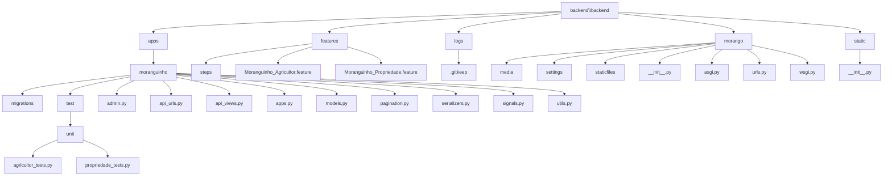

# Django Project Architecture

This document describes the backend project structure in **Django**, organized in layers to facilitate maintenance, testability, and component reuse.

---

## Layered Architecture

The project follows a modular, domain-driven layered architecture. This structure facilitates the separation of responsibilities, system scalability, and ease of maintenance and testing. Below, we detail each layer and component with examples of their responsibilities.

### Domain Layer — `apps/moranguinho/`

This folder represents a Django application specific to a system domain: the management of farmers and properties. Each functionality related to this domain is grouped here, promoting modularity and functional cohesion.

####  `models.py` — Data Models

The models represent the core entities of the system, such as `Farmer` and `Property`. Each model is linked to a database table, and its attributes reflect the table's columns. Business rules related to data behavior may also be included here.

####  `api_views.py` — API Controllers

This file contains the interfaces that handle REST API requests. These controllers receive user requests, delegate logic to appropriate layers, and return responses. Examples include listing farmers, creating properties, and updating records.

####  `serializers.py` — Serialization and Validation

Serializers convert Python objects into formats like JSON and handle both automatic and custom data validation. They act as an intermediary between database records and user-facing responses.

#### `pagination.py`, `utils.py`, `signals.py` — Supporting Features

- `pagination.py`: Manages pagination of list views.
- `utils.py`: Contains reusable utility functions (e.g., formatting, calculations).
- `signals.py`: Handles automatic actions triggered by events (e.g., creation of a new farmer).

####  `test/` and `features/` — Testing Layer

- `test/`: Contains unit and integration tests for component isolation.
- `features/`: Stores behavior-driven development (BDD) tests using Gherkin to simulate user behavior.

#### `migrations/` — Database Version Control

This folder includes Django migration files that track changes to the database schema over time, enabling safe evolution of the data model.

###  Global Project Settings — `morango/`

This directory contains the core configuration files of the Django project.

- `settings.py`: Defines project-wide settings such as database configuration, installed apps, middleware, and REST framework settings.
- `urls.py`: Defines main routes for the API and Django admin panel.
- `wsgi.py` and `asgi.py`: Handle communication between web servers and the application.

---

##  References

- [Django Official Documentation](https://docs.djangoproject.com/en/stable/)
- [Decoding DDD: A Three-Tiered Approach to Django Projects – DjangoCon US](https://2023.djangocon.us/talks/decoding-ddd-a-three-tiered-approach-to-django-projects/)

---

## Improvement Points

- **Project with growth potential**: Split the `moranguinho` app into multiple smaller apps, such as `farmers`, `properties`, and `reports`. Each app would target a specific subdomain, improving maintenance, cohesion, and testability.
