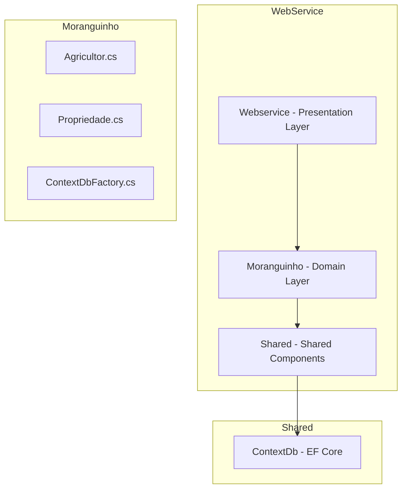

# C# Minimal API Architecture

This document describes the backend project structure in **C# Minimal API**, organized into layers and modular folders to ensure scalability, testability, and clarity in responsibilities.

---

## Layered Architecture

The backend follows a **modular layered architecture**, organizing components by domain and functionality. Each layer has a defined responsibility, as shown below:

### Presentation Layer

Located in the `Webservice/` folder.

- Contains the `Program.cs` file, responsible for configuring and exposing HTTP routes, middlewares (Swagger, CORS, authentication), and app services.
- Acts as the UI of the API, handling direct interaction with clients.

### Domain Layer

Located in the `Moranguinho/` folder.

- Includes domain-specific logic and models such as `Agricultor.cs`, `Propriedade.cs`, and `ContextDbFactory.cs`.
- Organizes code by feature, improving maintainability and separation of concerns.

### Shared Layer

Located in the `Shared/` folder.

- Provides cross-cutting utilities and shared components like models, enums, and helper classes.
- Contains the `ContextDb/` subfolder, which handles database access using EF Core (Entity Framework Core).

This structure enables a clean separation between domain logic, infrastructure, and service exposure.

---

## Main Folders

### Webservice

Service exposure layer of the application.

#### Program.cs

Initializes and configures the Minimal API app, sets up services, middlewares, and routes.

#### Endpoints and Middleware

Responsible for exposing routes to external consumers, including Swagger setup, CORS policy, and authentication (if applicable).

---

### Moranguinho

Represents the core domain logic.

#### Agricultor.cs

Defines the `Agricultor` entity and related domain logic.

#### Propriedade.cs

Represents the `Propriedade` entity, modeling the domain structure for rural properties.

#### ContextDbFactory.cs

A factory class used to instantiate the `DbContext`, especially useful for dependency injection or testing scenarios.

---

### Shared

Shared resources and infrastructure.

#### ContextDb/

Contains:

- `DbContext` definition used by EF Core
- Entity configurations and model mappings
- Responsible for database interaction (CRUD operations, migrations, etc.)

Used across the entire application to maintain a centralized and consistent data access approach.

---

## References

- https://learn.microsoft.com/en-us/aspnet/core/fundamentals/minimal-apis
- https://www.infoq.com/articles/minimal-api-dotnet6/
- https://learn.microsoft.com/en-us/ef/core/

---

## Improvement Points

- **Add Service Layer (optional):** Including a service layer between endpoints and domain classes could improve the separation of business logic. 
- **Program.cs too big:** Create the service layer, and routes configurations