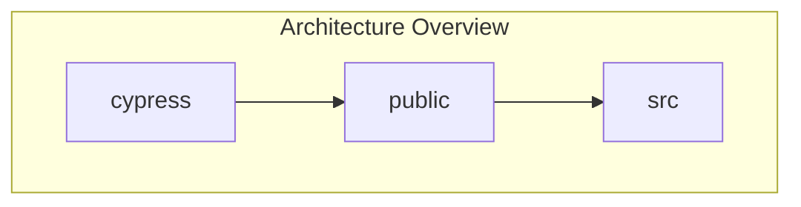
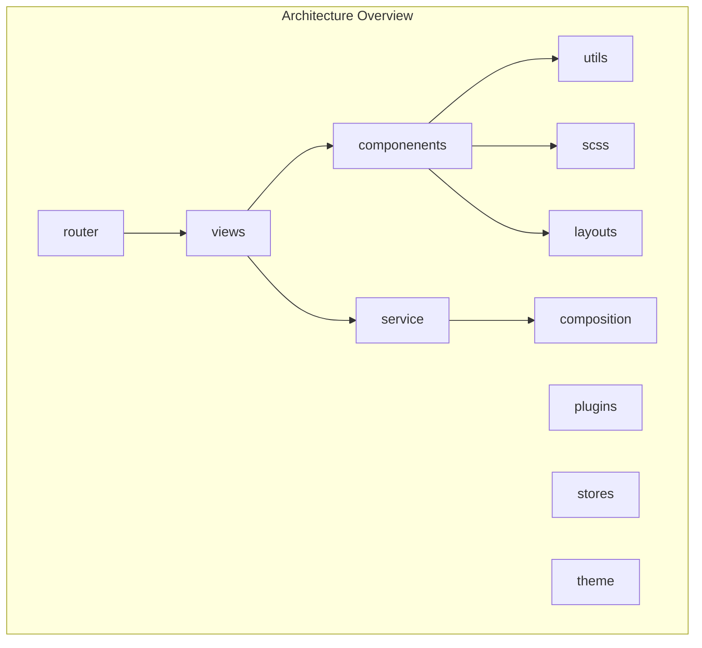
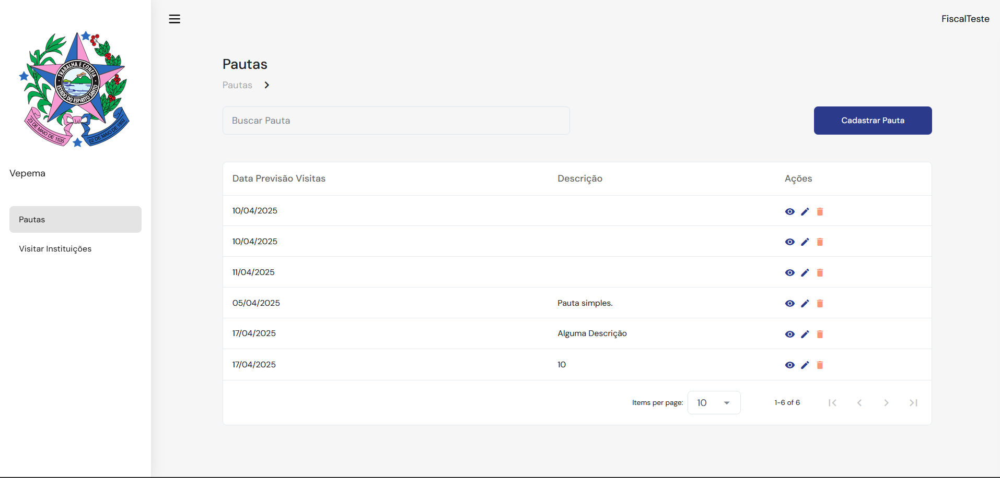

# Vue Plus Vuetfy
In this section, we will discuss the frontend architecture generated using **Vue** and **Vuetify**.

# 0. Versions
- <a href="https://vuejs.org/guide/introduction.html">Vue: 3.4.17</a>
- <a href="https://vuetifyjs.com/en/">Vuetify: 3.5.3</a>
- <a href="https://vite.dev/">Vite: ^5.1.1</a>

# 1. What is Vue?

Vue is a NodeJS-based framework that follows a component-based architecture. Just like React, Vue provides ways to abstract HTML — but in this case, the abstraction is done through files with Vue’s own extension: .vue.

A Vue file is structured using three main tags: template, script, and style.
- The template tag contains the HTML code.
- The script tag is used to handle logic, manage entities, and typically work with component reactivity.
- The style tag is used to define the page's styles.

To learn more, see: <a href="https://vuejs.org/guide/introduction.html"> Vue Documentation</a>

## 1.1 Vue VS Vuetfy VS Vite
The generated frontend relies on the participation of three main frameworks: Vue, Vuetify, and Vite.

Vue is the primary framework, meaning it is the most important in this list. It is responsible for component management, HTML preprocessing, object reactivity control, and more. Other frameworks and libraries can emerge from Vue, each serving a specific purpose.

Vuetify is one of these tools that emerge from Vue. It is essentially a collection of ready-to-use, reusable components, complete with a set of properties and useful features.

Lastly, Vite is an external tool used to optimize the development and build process of the project. With Vite, when editing code, a hot update is performed in real-time, applying only the changes made, which speeds up the development process. Additionally, when building the project, the site is optimized by Vite.

---

# 2. The Architecture

The project is divided into three layers: src, public, and cypress.
- The public layer contains static files used in development.
- The cypress layer is responsible for containing the code that generates the basic pages for each entity — currently, it includes pages for listing, viewing, updating, creating, and deleting entities.
- The src folder contains the actual page files and scripts — the core of the frontend.

# 2.1 Src Folder

## 2.2 Router
The router folder contains the configuration for the vue-router extension, which is responsible for managing the frontend endpoints. Currently, it has a single file that centralizes all the application's routes, but it is possible to break it up into separate files for smaller files and better organization.

## 2.3 Views
This layer is responsible for containing the application's page components. Within it, there is a subdivision based on the packages defined in the Spark model. Inside each package, the defined entities have separate folders, each containing the reference files IndexEntity.vue, FormIndex.vue, and DetailsIndex.vue. These pages, together, automatically enable the basic operations for each entity (CRUD). The view layer can also consume the SCSS layer directly.

## 2.5 Service plus Composition
The service layer is responsible for managing the HTTP requests from the frontend. With the help of a Factory, a series of EntityRequires files are created, each generating a set of requests defined in the composition/usesApi.ts file — including create, update, remove, list, and getById. In each EntityRequires, the basic endpoint URL for the entity's operations is hardcoded, which is then combined by the factory with the base URL of the API (the backend URL).

## 2.6 Components
The components layer is intended to store components that can be reused across multiple pages. Currently, a Breadcrumbs component is generated, which helps the user navigate the site, indicating the navigation path at the top of the screen and providing a sidebar for navigation.

    Image 7: Frontend Example. At top screen, the Breadcrumbs component.

## 2.7 SCSS and Layouts
The SCSS folder stores SCSS files (a variant of CSS) for custom styles that are shared across pages when needed. The layouts layer, on the other hand, contains configuration for the layout of certain elements throughout the application. As an example, the sidebar configuration is handled internally within the layouts folder. It can also be used to manage responsive behavior across the application.

## 2.8 Utils
The utils folder contains scripts that are used in various parts of the code but do not belong to a specific context. Simple functions for text manipulation or global configurations reside in the utils folder.

## 2.9 Plugins
The plugins folder contains the configuration of external plugins used in the application. In this case, only Vite is used, so it is the only one present in this folder. Any new external plugin configurations should be added here.

## 2.10 Stores
The stores layer is responsible for storing configurations locally in the client's browser. For example, authentication cookie settings are handled here.

## 2.11 Theme
The theme layer contains the application's color configuration. It is loaded by Vue itself and applies color styling across all layers of the application.

# 3. Suggestions for Improvements:
The view files are very large. In a single file, both interface control and entity manipulation are handled. It is preferable that for each page, a corresponding script be created to handle the entities, and the .vue file should deal only with the interface.

The routes file is very large. It would be better to create a folder for each module, and each entity should have its own routes file to make searching and reading easier.

The pages make little use of request interface definitions from each other. It would be better to have a layer to centralize the Data Transformation Objects from requests into JS objects.

Request handling is being done in a decentralized manner. It would be better to have a layer to configure and manage the requests and entities, while the views focus on displaying this data on the screen and calling these actions when necessary.