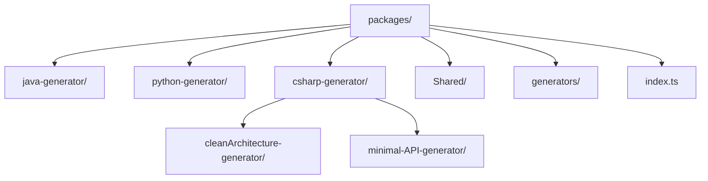
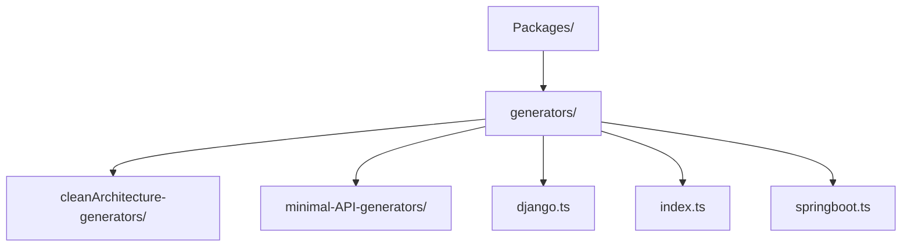
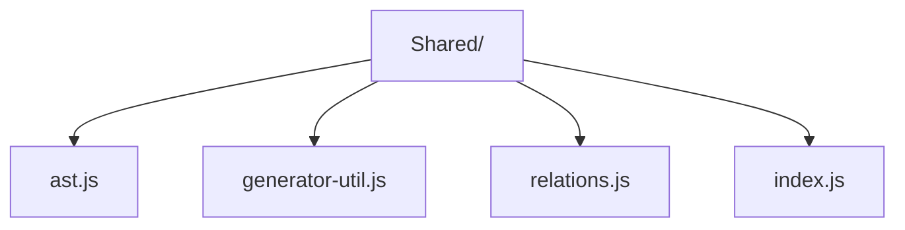

Para modularizar copiamos a estrutura de pasta dos geradores de backend para dentro da nossa lib, afim de remover essa parte do processamento de dentro do programa principal.

Criamos essa estrutura de diretório

Criamos a pasta generators para tornar as chamadas uniformes e num mesmo diretório, isso se torna necessário

A pasta Shared foi criada devido a necessidade comum de utilizar arquivos que eram também compartilhado na pasta util/ dentro da estrutura original do Spark.

