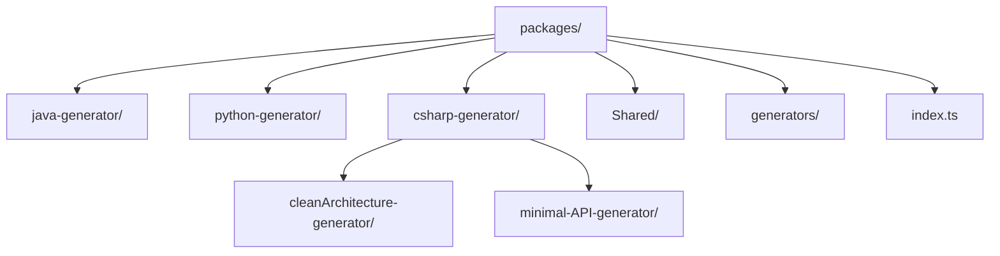
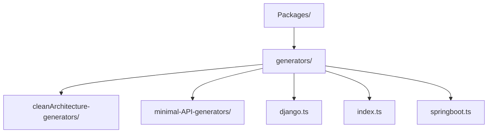
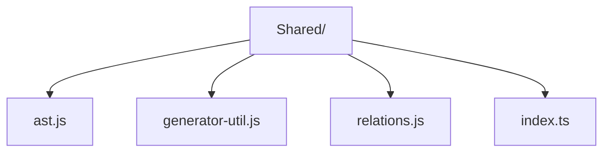

To modularize, we copy the folder structure of the backend generators into our lib, in order to remove this part of the processing from within the main program.

We created this directory structure

We created the generators folder to make the calls uniform and in the same directory, this is necessary npm
The final use of the lib is in referencing these generators folder

The Shared folder was created due to the common need to use files that were also shared in the application within the original Spark structure.

Index.ts is an extremely important part in the construction of our lib, it is where the logic imports are scaled between folders and referenced at the time of import for use in the source code.