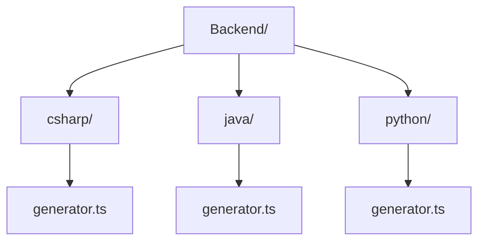

With the use of the lib we needed to modify our source code of the spark generators, where all code generation logic was within the source code, with the use of our lib we removed all this part of the product logic and kept only the lib calls we created, keeping only one generator.ts within each respective language.

This leaves us with the source code structure like this:

These generators are where spark-generators-lib is called for each language, thus communicating with the generators and index within the lib.