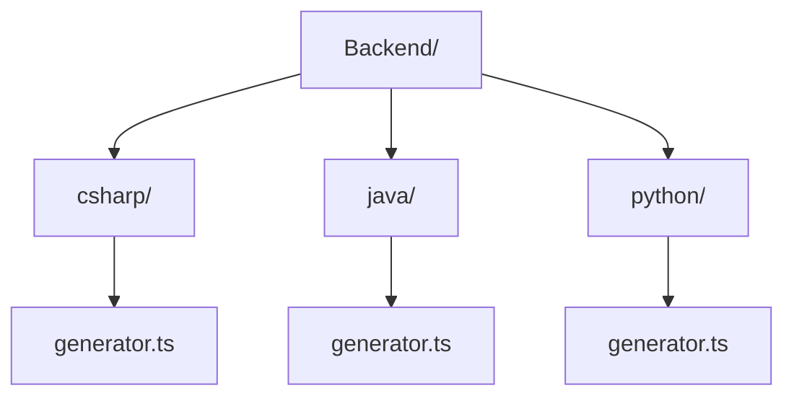

Com o uso da lib precisamos modificar nosso código fonte dos geradores do spark, onde toda lógica de geração de código ficava dentro do codigo fonte, com o uso da nossa lib removemos toda essa parte da lógica do produto e mantivemos apenas as chamadas das lib que criamos, mantendo apenas um generator.ts dentro de cada linguagem respectiva.

Com isso ficamos com a estrutura do código fonte assim:

Esses generators é aonde é feita a chamada da spark-generators-lib referente a cada linguagem, comunicando assim com os generators e index de dentro da lib.