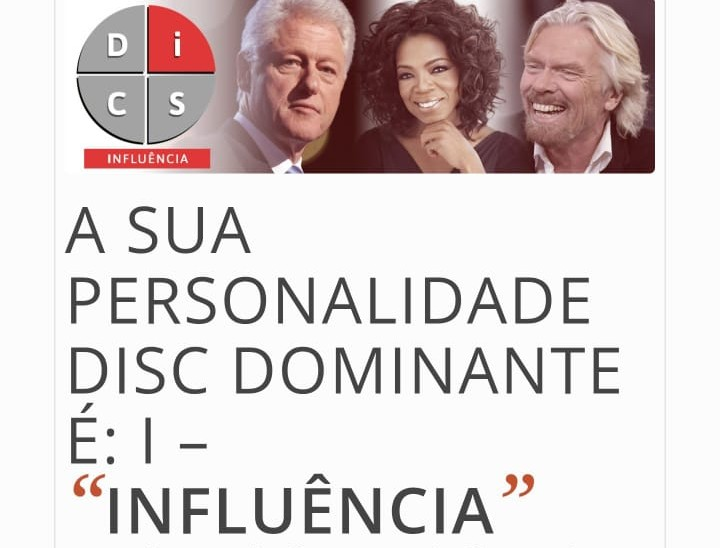
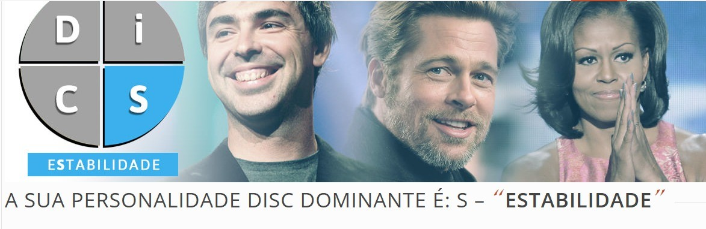
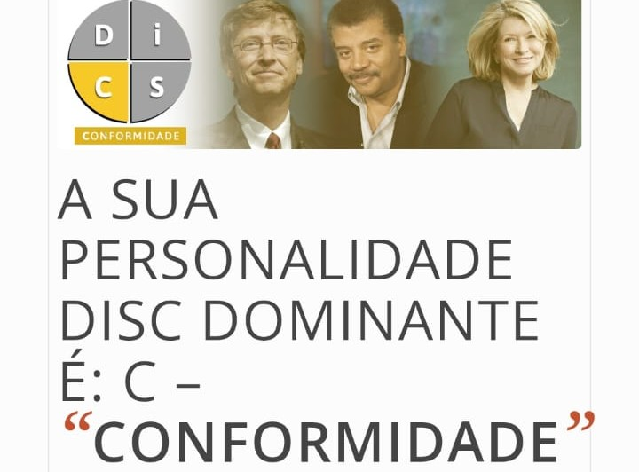

## Team DISC Profiles

Our team has taken the DISC assessment to identify each member's behavioral profile. This helps us better understand our strengths, working styles, and how we can collaborate more effectively.

---

### Dominance (D)

People with a Dominant profile are result-oriented, quick decision-makers, and thrive on challenges. They are great at leading initiatives and solving problems efficiently.

- **Caio Chiabai de Oliveira**  
  

---

### Influence (I)

The Influence profile is associated with communicative, enthusiastic, and motivating individuals. They tend to inspire others and create a positive work environment.

- **Lucas Codeco**  
  

---

### Steadiness (S)

People with this profile are patient, collaborative, and focused on maintaining harmony. They are reliable and consistent in their work.

- **Murilo Dias**  
  

- **Arthur Valentim Caldeira**  
  

- **Bruno Alves De Morais**  
  

---

### Conscientiousness (C)

The Conscientiousness profile values rules, precision, and quality. These individuals are detail-oriented, analytical, and committed to technical excellence.

- **Diego Bourguignon Rangel**  
  
