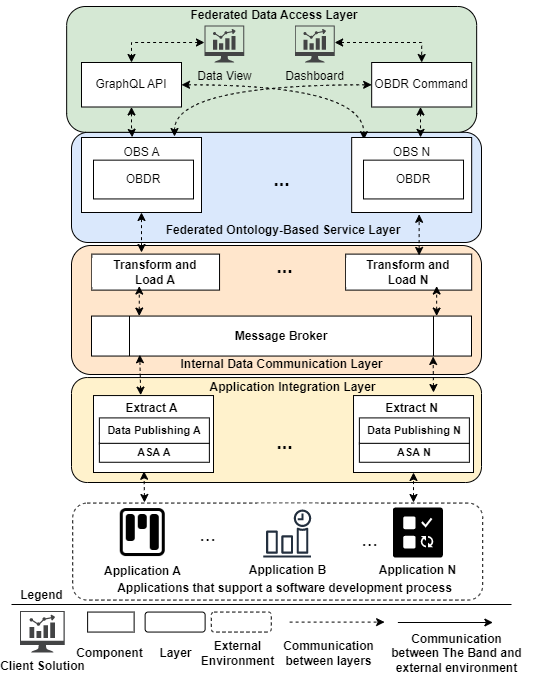

An overview of *The Band* architecture is presented in below. 
  

## Five components:

1. **Application Software Artifacts (ASAs):** ASAs are software items (e.g., a code library) that enable communication between applications and the federation. Each ASA is application-specific and is developed to communicate with an application based on its data model, allowing it to retrieve and send data.

2. **ETL Components:**  These components use ASAs to extract data from an application’s database, transform it, and load it into Ontology-Based Data Repositories (OBDRs). They are split into two parts:
    - **Extract Component:** Extracts data from an application and publishes it to a message queue.
    - **Transform/Load Component:** Consumes data from the message queue, applies transformations based on semantic mappings, and stores data in an OBDR. Multiple OBSs can consume data from a single queue, storing transformed data in distinct OBDRs.

3. **Ontology-Based Services (OBS):** OBSs correspond to networked ontologies (e.g., OBS for SRO handles data regarding sprints, development tasks, developers, user stories). Each OBS has an OBDR based on the networked ontology conceptual model. These OBDRs can be implemented as relational or graph databases. OBSs use their OBDRs to store and share data with other OBSs.

4. **Data Publishing Components:**  
   - Enable ETL components to share data with OBSs when data is extracted from an application.
   - Allow OBSs to exchange data with each other when changes happen in the data stored in the OBDRs (insertions, deletions, or updates). Data publishing components use a queue to propagate changes across all OBDRs, ensuring data consistency while allowing each OBS to remain autonomous.

5. **Data Access Components:** These components provide interfaces for data retrieval (e.g., dashboards, REST, GraphQL APIs) and visualization (e.g., dashboards).

## Four-Layer Architecture

The components are organized into a four-layer architecture:

1. **Application Integration Layer:**  This layer contains ASAs that communicate with applications and ETL components (extract components) that extract data and send it to the **Internal Data Communication Layer**. It also contains Data Publishing Components that support the propagation of data changes to different OBDRs within the **Federated Ontology-Based Service Layer**, maintaining data consistency.

2. **Internal Data Communication Layer:**  This layer contains Transform/Load Components, ASAs, and Data Publishing Components from the Application Integration Layer. It loads application data into OBDRs and supports data sharing among OBSs to keep data consistent.

3. **Federated Ontology-Based Service Layer:**   This layer receives retrieve commands from the **Federated Data Access Layer** and sends the requested data. When data changes occur in an OBDR, this layer communicates with the Internal Data Communication Layer to propagate changes across all relevant OBDRs, ensuring data consistency.

4. **Federated Data Access Layer:** This layer contains Data Access Components that provide interfaces for data retrieval (e.g., APIs) and visualization (e.g., dashboards). Clients can use GraphQL APIs and OBDR Command Data Access Components to manipulate (create, update, delete) or retrieve data from OBDRs using HTTP or SQL commands. Dashboards allow clients to visualize integrated data using charts and tables, retrieving data from one or more OBDRs.
