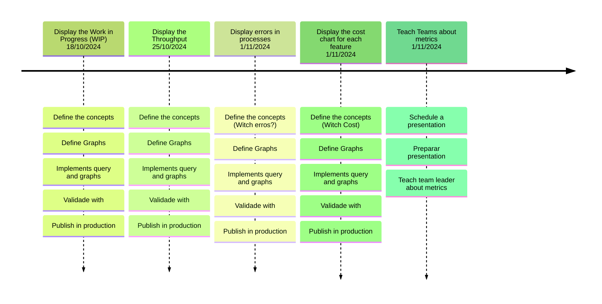

Presents the project`s developing planning.

## Backlog

| ID  | Feature |Description  | Importance | Proposal|
|--- | ------- |------------ | ---------- | ------- |
| 1   | Display the Work in Progress (WIP) of people and project teams | Display the WIP per sprint, per project, per person, and task difficulty level of each LEDs project to understand if planned tasks are being executed | 90         | Improve team planning and estimation by 10%    |
| 2   | Display the Throughput of people and project teams            | Display the Throughput per sprint, per project, per person, and task difficulty level of each LEDs project to understand if planned tasks are being executed | 91         | Improve team planning and estimation by 10%    |
| 3   | Display the Lead Time of project teams                        | Display the Lead Time per project and task difficulty level of each LEDs project to know how long it takes to complete a task                     | 80         | Improve team planning and estimation by 10%    |
| 4   | Display the Cycle Time of project teams                       | Display the Cycle Time per project and task difficulty level of each LEDs project to know how long it takes to complete a task                     | 79         | Improve team planning and estimation by 10%    |
| 5   | Display the cost chart for each feature (EPIC, US, and Task) and the project | Display the development cost per feature and project                                                                                              | 91         | Improve decision-making                        |
| 6   | Display the project's development flow using CFC over time    | Visualize the project's development process                                                                                                       | 93         | Improve decision-making                        |
| 7   | Display errors in processes                                   | Visualize errors from each sprint and project to fine-tune the development process                                                                | 94         | Improve development processes and deliveries by 10% |
| 8   | Display code smell errors by developer                        | Display common errors for each developer per project                                                                                              | 87         | Improve project and team performance by 14%    |
| 9   | Display test issues by developer, project, and LEDs           | Display common errors for each developer per project                                                                                              | 89         | Improve project and team performance by 14%    |
| 10  | Display deployment errors by developer, project, and LEDs     | Display common errors for each developer per project                                                                                              | 88         | Improve project and team performance by 14%    |

## General planning

* Release 1.0 - (14/10/2024 - 01/11/2024): 
    * **ID 1**: Display the Work in Progress (WIP) of people and project teams
    * **ID 2**: Display the Throughput of people and project teams 
    * **ID 7**: Display errors in processes 
    * **ID 5**: Display the cost chart for each feature (EPIC, US, and Task) and the project  
* Release 2.0 - (04/11/2024 - 31/11/2024): 
    * **ID 3**: Display the Lead Time of project teams  
    * **ID 4**: Display the Cycle Time of project teams  
    * **ID 8**: Display code smell errors by developer

## Release 1.0 - 01/11/2024

* **Goal**: Create dashboards to present information about Person, Sprint, Project and Team related to WIP, Throughput, Erros and cost. 

  * **Features**: ID 1, ID 2, ID7, and ID5

  * **Deadline I**  - 25/10/2024 
      * * **ID 1**: Display the Work in Progress (WIP) of people and project teams
        * **ID 2**: Display the Throughput of people and project teams published on Docusaurus  
  * **Deadline II** - 01/11/2024 
        * **ID 7**: Display errors in processes, by person, type of dificult, and type of task
        * **ID 5**: Display the cost chart for each feature (EPIC, US, and Task) and the project 

