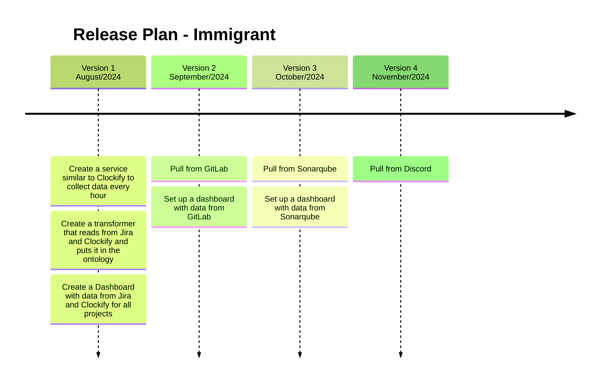

## Version 1
- **Expected delivery date:** End of August 
- **Features:** Create a service similar to Clockify to collect data every hour; Create a transformer that reads from Jira and Clockify and puts it in the ontology; Create a Dashboard with data from Jira and Clockify for all projects;

## Version 2
- **Expected delivery date:** September 
- **Features:** Pull from GitLab, Set up a dashboard with data from GitLab;

## Version 3
- **Expected delivery date:** October 
- **Features:** Pull from Sonarqube; Set up a dashboard with data from Sonarqube;

## Version 4
- **Expected delivery date:** November
- **Features:** Pull from Discord

