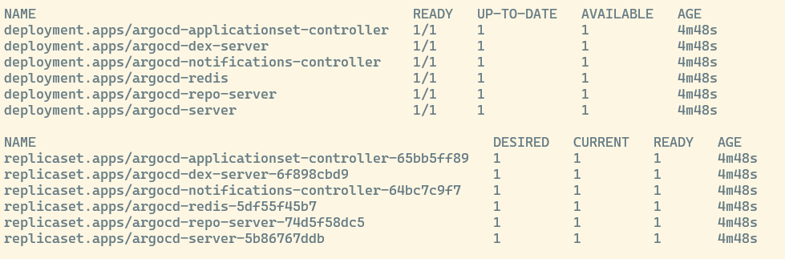
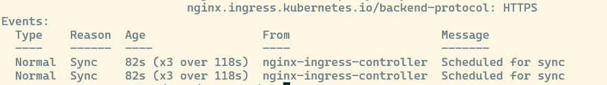
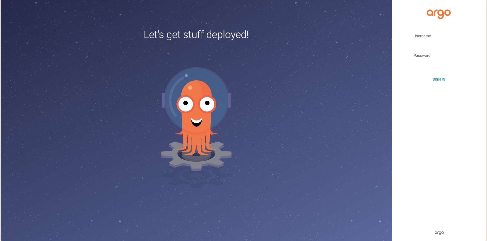
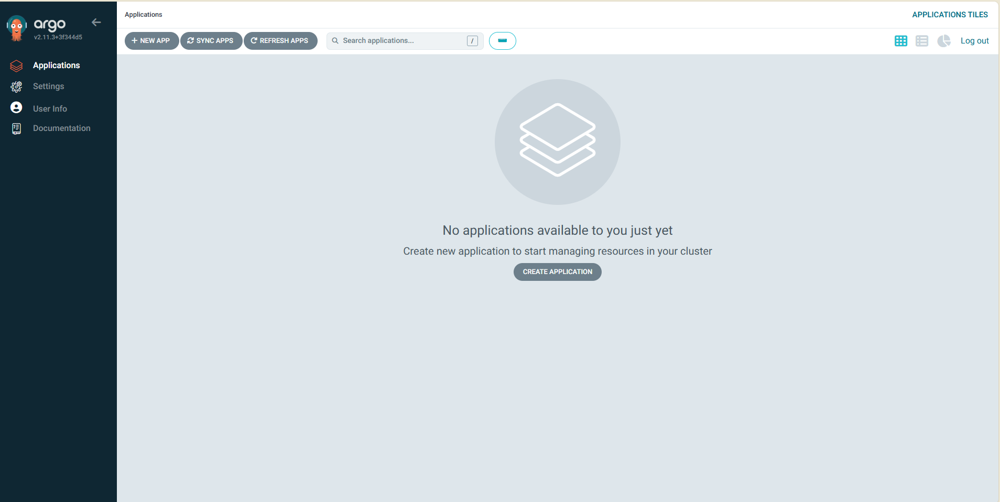

# Instalação Argo CD

Antes de tudo, leia a [Introdução ao ArgoCD](1IntroArgoCD.md).

Os requisitos para a instalação são: 
- Cluster Kubernetes
- Helm
- KubeCTL
- Arquivo Kubeconfig
- CoreDNS
- Conectividade a internet
- Nginx Ingress

Ter um Ingress te salva de uma enorme dor de cabeça setando outras coisas depois, portanto, usaremos ele nessa instalação.

Todos os requisitos são cumpridos, supondo que você tenha instalado o Rancher pelo nosso [tutorial](../../01-%20Kube/rancher.md).

## Começando a instalação:

No nosso servidor Kubernetes, no control node, insira o seguinte comando para criar o namespace do Argo:

```
# Criando o namespace
kubectl create namespace argocd
```

Cheque se o namespace foi criado com o comando `kubectl get namespace argocd` .


Se a saída for como acima, a criação do namespace deu certo, vamos agora instalar o Argo usando o manifesto disponível no Github:

```
# Aplicando o manifesto
kubectl apply -n argocd -f https://raw.githubusercontent.com/argoproj/argo-cd/stable/manifests/install.yaml
```
Cheque a integridade dos pods com `kubectl get all -n argocd` .



Se a saída for como acima, o Argo foi instalado com sucesso. Note que os pods podem demorar um pouco para entrarem no estado `"READY"`, por isso, espere e cheque novamente com o comando.

## IMPORTANTE: Gerando o ingress do Argo
Pelo fato da instalação do Rancher vir com um Ingress embutido, temos a vantagem de poder usar ele no Argo e pular uma etapa de port-fowarding, tls, um monte de coisa chata que com certeza daria problema na minha mão. Logo, iremos usar o Ingress. Sua instalação não é lá tão trivial, portanto, preste atenção!

Clone (ou copie e cole) o arquivo ingress.yaml do nosso repositório de Infra do Leds: [Repositório LEDS](https://gitlab.com/ledsifes/sistemas/conectafapes/infra)

O correto, seria ter um domínio para o Argo, mas a solução que eu achei foi usar o domínio .sslip.io juntamente com nosso IP. Sendo assim, mude essas informações no template, deixe o resto como está.

No diretório onde você tem o ingress.yaml, execute o comando

```
# Criando o Ingress para o namespace do Argo
kubectl apply -n argocd -f ingress.yaml
```
Para verificar se o ingress foi criado, execute o comando:
```
# listando os ingress
kubectl get ingress -n argocd
# verificando detalhes do ingress
kubectl describe ingress argocd-server-http-ingress -n argocd
```


Se a saída se parece com isto, vá até \<IPDAREDE>.sslip.io . Você deverá ver a GUI do Argo:



Se você vê esse polvo (ou lula?) feio demais, fique feliz, pois a configuração do ingress deu certo :D

## Acessando a GUI:

O username padrão é ```admin``` 

Para conseguir a senha, execute o comando:

```
kubectl -n argocd get secret argocd-initial-admin-secret -o jsonpath="{.data.password}" | base64 -d
```
Copie e cole a saída e insira na caixa de *Password*.



## Parabéns! Você tem um Argo funcionando e validado.

### Proximo recurso:
- [Deploy de uma aplicação Python com o Argo CD](https://gitlab.com/ledsifes/sistemas/conectafapes/infra)