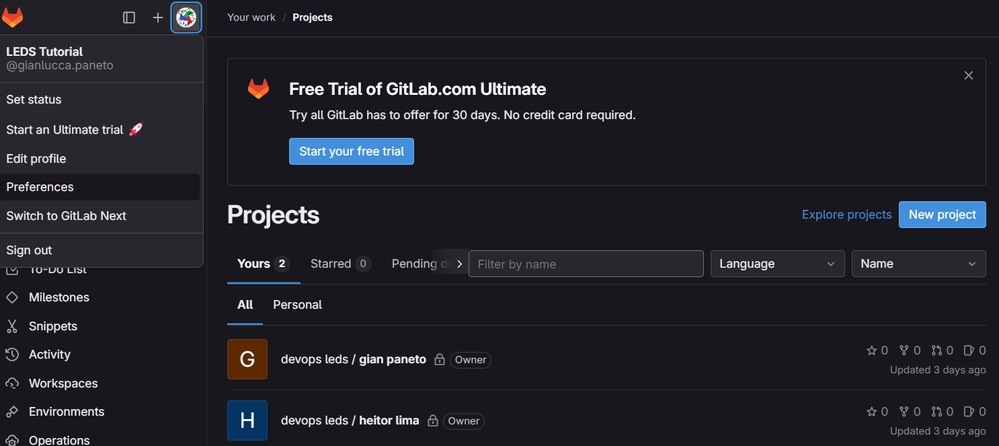
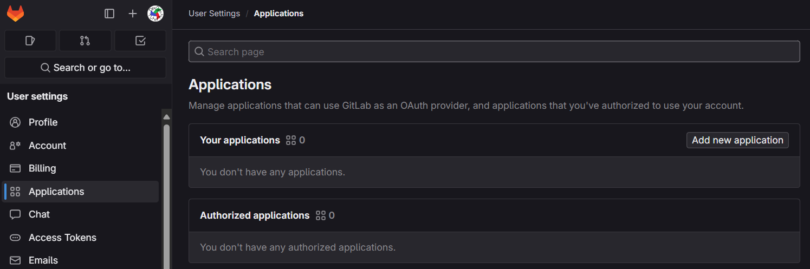
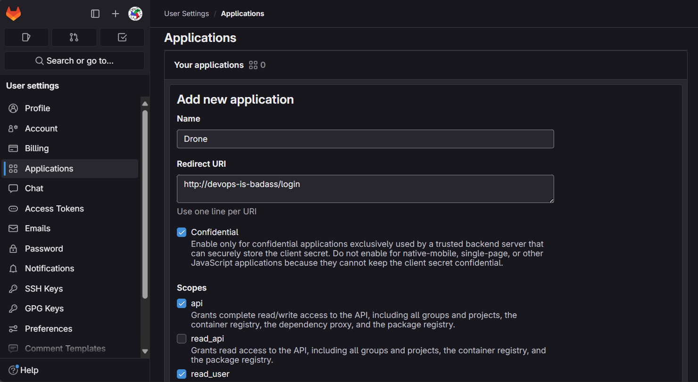
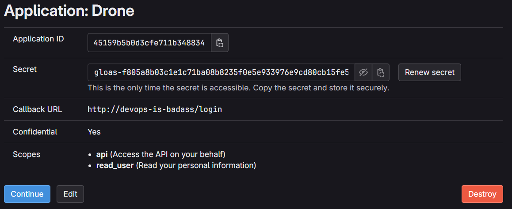
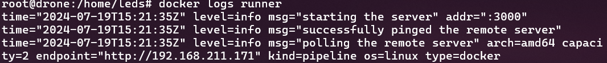
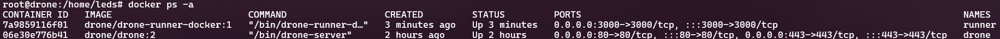

# Instalação Drone CI

## Antes de começar
Este é um guia de instalção do Drone CI e Runners e integração com o GitLab.

## Requisitos
- Docker instalado e configurado na máquina Linux onde o Drone CI será executado.

## 1. Preparação
#### Crie uma Aplicação OAuth

  
Adicione um nome para a aplicação a URL de login do drone. No nosso caso, a URL é http://drone.leds.dev.br/login

Adicione também as Scopes api e read_user

Por fim, após criar a aplicação, você será apresentado com o ID da aplicação, o Secret e informações adicionais. Lembre-se de guardar o Secret para passos futuros na instalação.


#### Crie um Shared Secret
```
$ openssl rand -hex 16
bea26a2221fd8090ea38720fc445eca6
```
Esse token será usado para conectar o Runner com o Drone.

## 2. Download
```$ docker pull drone/drone:2```

## 3. Inicie o Servidor
```
docker run \
    --volume=/var/lib/drone:/data \
    --env=DRONE_GITLAB_SERVER=https://gitlab.com \
    --env=DRONE_GITLAB_CLIENT_ID=[ID da Aplicação do Drone] \
    --env=DRONE_GITLAB_CLIENT_SECRET=[Secret da aplicação] \
    --env=DRONE_RPC_SECRET=[Shared Secret criado no passo 1] \
    --env=DRONE_SERVER_HOST=[Domínio onde será hosteado a interface do Drone] \
    --env=DRONE_SERVER_PROTO=[https ou http] \
    --env=DRONE_USER_CREATE=username:ogianpaneto,admin:true \
    --publish=80:80 \
    --publish=443:443 \
    --restart=always \
    --detach=true \
    --name=drone \
    drone/drone:2
```

Você precisa criar um usuário Admin principal configurando <b>DRONE_USER_CREATE</b> para habilitar ou desabilitar o modo confiável (Trusted) para um repositório. Se o modo confiável estiver habilitado, as pipelines do repositório terão acesso a capacidades privilegiadas, incluindo a capacidade de iniciar contêineres privilegiados e montar volumes da máquina host. <b>O username é o da conta do Gitlab</b>.

É recomendado a criação de um arquivo de texto somente com o comando para poupar tempo e facilitar sua edição, caso necessário.

```$ nano drone-start-server```

Quando aberta a interface de edição de texto do nano, cole o comando de inicialização do Drone e altere as variáveis de acordo com o seu caso. Salve com ctrl + x, Y (para confirmar alterações) e Enter (para confirmar a nomeação do arquivo).

Agora, para rodar o comando, só é preciso digitar:
```$ bash drone-start-server```

## Instalação do Docker Runner 
### 1. Download
```docker pull drone/drone-runner-docker:1```

### 2. Start
```
docker run --detach \
    --volume=/var/run/docker.sock:/var/run/docker.sock \
    --env=DRONE_RPC_PROTO=[https ou http] \
    --env=DRONE_RPC_HOST=[hostname do servidor do Drone(no nosso caso o IP interno da vm)] \
    --env=DRONE_RPC_SECRET=[O Shared Secret] \
    --env=DRONE_RUNNER_CAPACITY=2 \
    --env=DRONE_RUNNER_NAME=[nome do runner] \
    --publish=3000:3000 \
    --restart=always \
    --name=runner \
    drone/drone-runner-docker:1
```
É recomendado também a criação de um arquivo .txt para rodar com o comando bash, assim como foi feito com o Drone.

## Verificação
```$ docker logs runner```

```$ docker ps -a```


### Próximo Recurso:
- [Utilização do Drone CI](3UtilizaçãoDoDroneCI.md)
