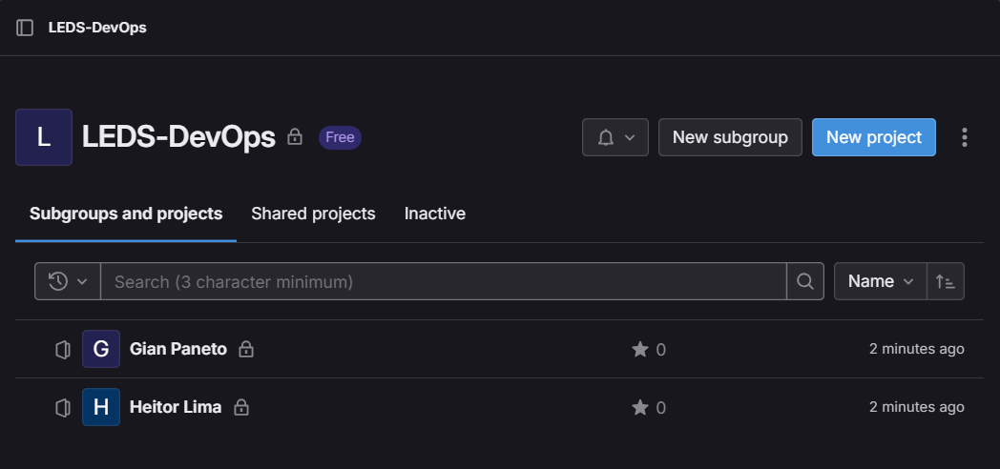
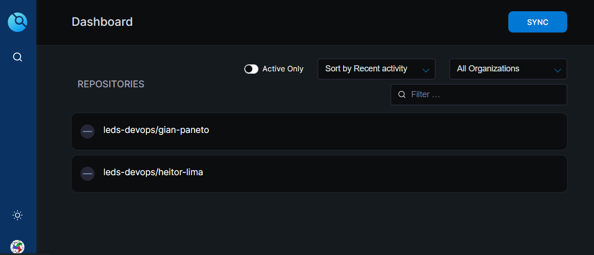
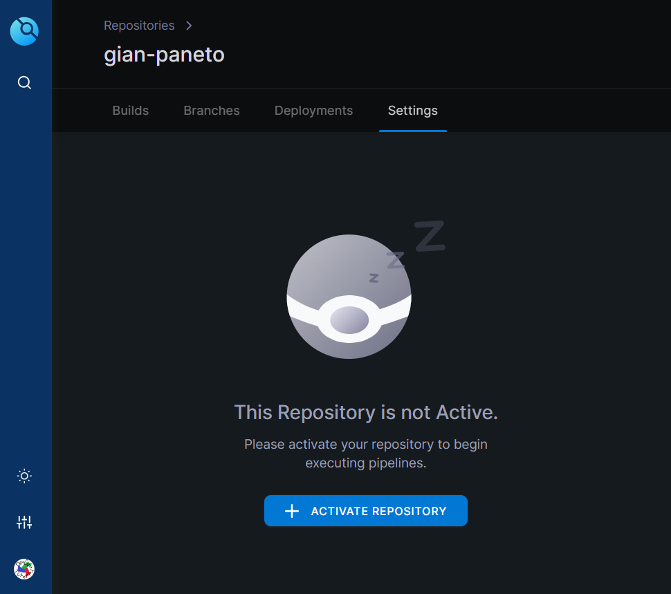
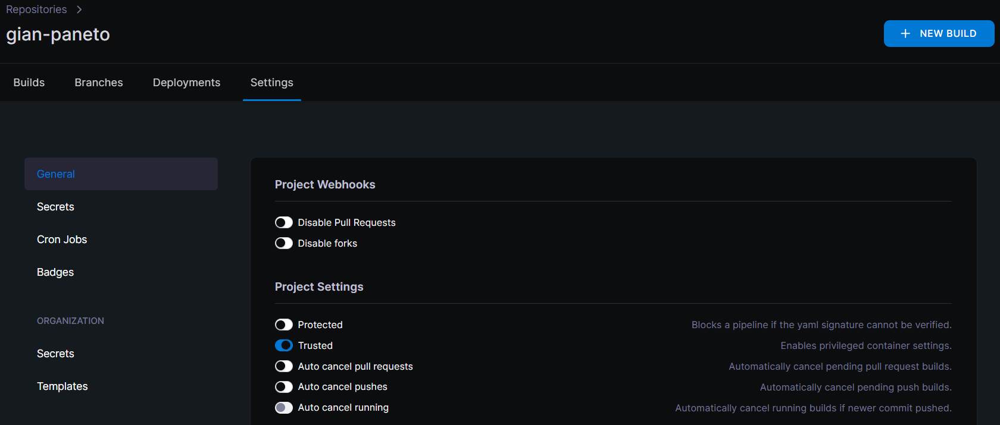
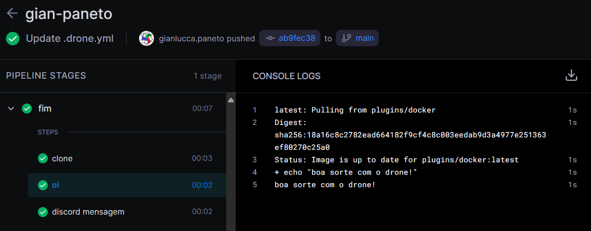
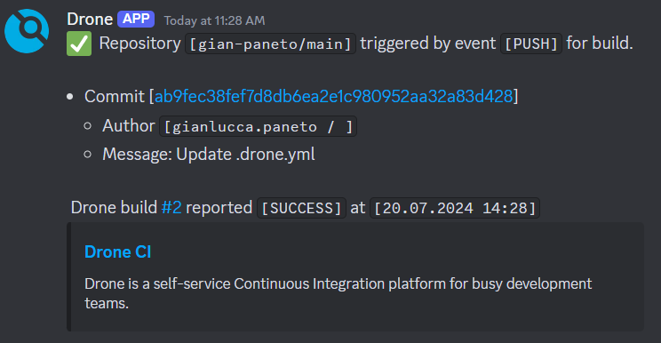

# Utilização do Drone CI

Certo. Agora que está tudo instalado e rodando, olharemos a interface gráfica e as pipelines do Drone CI.

Primeiramente, o Drone não tem acesso aos repositórios que estão dentro de subgrupos no GitLab. Então, se o Drone for uma necessidade, evite o uso de subgrupos.

No meu perfil de exemplo no GitLab, eu criei <b>1 grupo</b> e, nesse grupo, adicionei <b>2 repositórios</b>.



Agora, entrando na interface do Drone CI com o domínio ou IP apresentado na fase de instalação, siga o passo de cadastramento no Drone e login com o GitLab. Após isso, já no Drone, podemos ver os exatos dois repositórios. Vale citar que, para disponibilidade do projeto no Drone, é necessário ser "Owner" do mesmo.



Ótimo. Agora, existem dois passos necessários para garantir o funcionamento correto do software: Ativar os repositórios e a opção Trusted de cada um.





Nas configurações do repositório, também é possível ver a parte dos <b>Secrets</b>. Lá que se configuram as variáveis secretas.

# Pipeline

Agora vamos criar um simples aquivo .drone.yml no root de um dos projetos só para ver um verde de sucesso na interface do Drone CI!

A pipeline de teste consiste de dois Steps, o primeiro chamado "oi", que roda o comando ```echo "boa sorte com o drone"```, para te desejar boa sorte.

Quando commitado o arquivo da pipeline, ela já começa a rodar no Drone:



E, para demonstrar um pouco do potencial de pipelines, o segundo Step "discord mensagem", automatiza uma mensagem em um canal de um servidor do Discord com resultados e informações da Build.



## Pronto! Tudo funcionando!

### Recurso Anterior:
- [Instalação do Drone CI](2InstalaçãoDroneCI.md)
