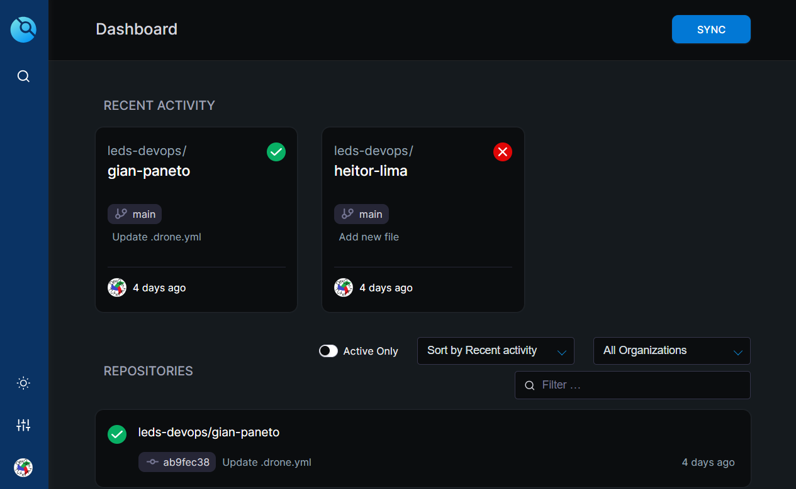
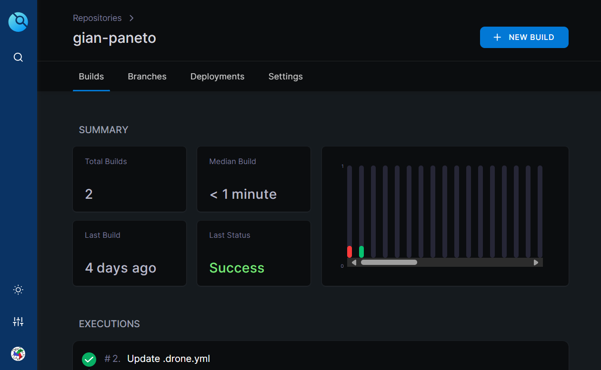
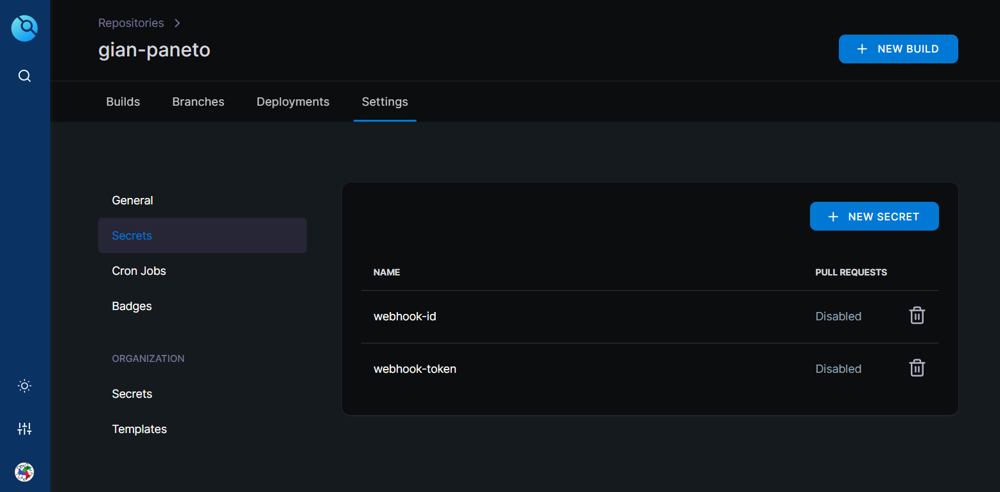

# Secrets

## O Que São Secrets?
Secrets são variáveis contendo informações sensíveis necessárias nas pipelines e que não devem ser expostas públicamente. 

## Criando uma Secret no Drone CI

Abra a interface do Drone e selecione o repositório desejado:



Selecione a aba "Settings":



Agora é só criar novas variáveis secretas!

Vamos criar duas Secrets de exemplo. Uma contendo o ID e outra o token de um webhook. Saiba que: após criadas, não poderão ter seus conteúdos acessados novamente.



## Utilizando Secrets na pipeline
Um exemplo utilizando as Secrets criadas previamente:

```yml
steps:   
- name: exemplo-secret
  environment:
    DISCORD_WEBHOOK_ID:
      from_secret: webhook-id
    DISCORD_WEBHOOK_TOKEN:
      from_secret: webhook-token
  commands:
    - blablabla -i $DISCORD_WEBHOOK_ID -t $DISCORD_WEBHOOK_TOKEN
```
