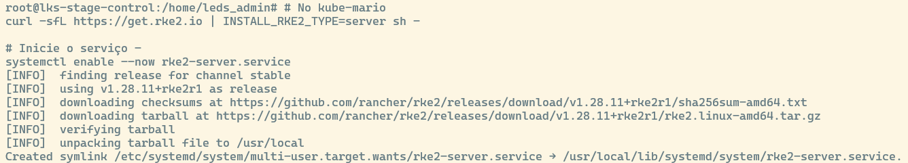
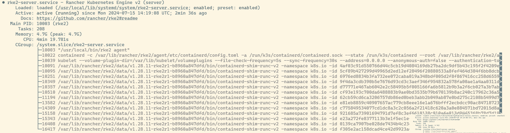
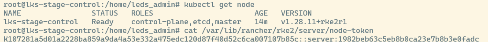
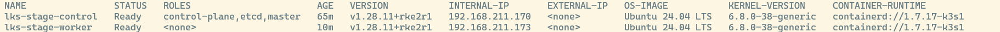
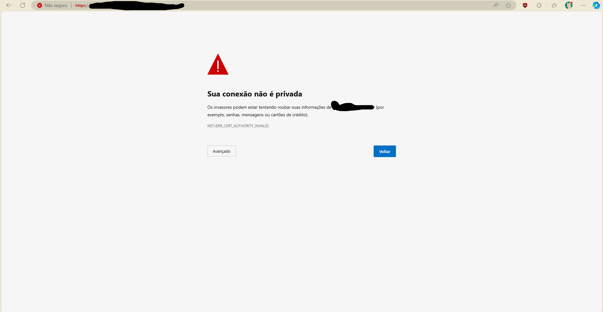
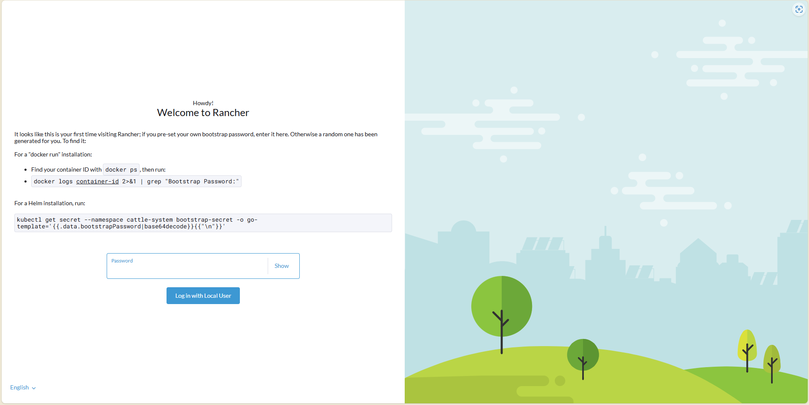
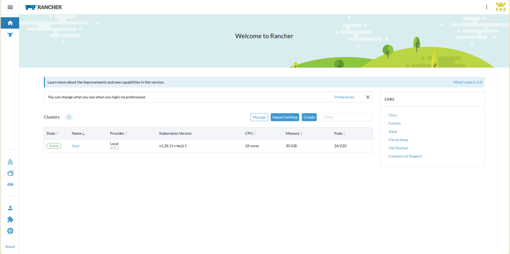

# Instalação do RKE2 e Rancher

## Antes de começar:

Nesse guia, montaremos um cluster Kubernetes rancher, usando a distribução Kubernetes RKE2 em ambiente Ubuntu Server.

Optei pelo Ubuntu Server em oposição ao Debian pela falta de alguns recursos instalados nativamente que dificultam a instalação do Kube, e a falta de recursos na Internet para debugging. E optei pelo RKE2 em oposição ao K3s pelas novas funcionalidades do RKE2.

O cluster será simples, com dois nós (nodes). Dado o escopo do projeto, será o necessário.

O cluster terá um nó de controle e outro de trabalho.

## Requisitos:

1. Duas máquinas (bare-metal ou virtualizadas) com Ubuntu Server:
	-  8GB ou mais de Ram.
	- 60GB ou mais de armazenamento (informação que não consta na página de requisitos do Rancher)
	- 4 CPUs ou mais.
	- Acesso à internet.

2. Um domínio facilita muito o trabalho.

## Começando a instalação:
Primeiro, precisamos delegar as funções de cada máquina (lembre-se de trocar para IPs e nomes reais): 
| NOME | IP |Funcão |
|--|--|--|
| kube_master | 10.0.0.1 | controle (control)
| kube_worker | 10.0.0.2 | trabalho (work)

Dê SSH em ***`TODOS`*** os nodes e execute o seguinte comando para desativar o firewall e evitar conflitos. Note que isso assume que você tenha um outro serviço de firewall externo já rodando.

```
# Pare o firewall
systemctl disable --now ufw

# Atualize e instale o NFS
apt update
apt install nfs-common -y  
apt upgrade -y

# Limpeza
apt autoremove -y
```
## Instalação do RKE2:

No `kube_master` (control node), execute o seguinte comando para baixar a versão mais recente do RKE2. O comando de start pode demorar um pouco, principalmente em hardware mais antigo, portanto, *tenha paciência* :D

```
# No kube_master
curl -sfL https://get.rke2.io | INSTALL_RKE2_TYPE=server sh - 

# Inicie o serviço - 
systemctl enable --now rke2-server.service
```

Se tudo deu certo, a saída deve ser a seguinte:

Podemos validar o procedimento rodando o comando:
```
systemctl status rke2-server
```
Cheque se o status está como ACTIVE.


Se tudo deu certo (se Deus quiser deu), precisamos criar um link simbólico para o `kubectl` no `kube_master` com os comandos:
```
# Criação de um link simbólico para o kubectl
ln -s $(find /var/lib/rancher/rke2/data/ -name kubectl) /usr/local/bin/kubectl

# Configuração persistente do KUBECONFIG
echo "export KUBECONFIG=/etc/rancher/rke2/rke2.yaml PATH=$PATH:/usr/local/bin/:/var/lib/rancher/rke2/bin/" >> ~/.bashrc
source ~/.bashrc

# Verificação do status dos nós do cluster
kubectl get node
```

Também precisamos gerar e salvar o token (em um bloco de notas ou similar) para os outros nós com a saída do seguinte comando:

```
# SALVE ISSO PARA O KUBE_WORKER!!!!
cat /var/lib/rancher/rke2/server/node-token
```


Se a saída se parece com isso, parabéns! 
O arquivo de configuração é o que o kubectl usa para se autenticar no serviço da API. Ah, e tem mais uma coisa: precisamos de outro arquivo do kube_master, também conhecido como o servidor. Esse arquivo é o “agent join token” e fica em `/var/lib/rancher/rke2/server/node-token`, que teoricamente já copiamos. Vamos precisar dele para instalar o agente.

## Instalação do agente (kube_worker)

Na máquina do `kube_worker`, insira os seguintes comandos:
```
# Exporte o IP do kube_master da seguinte forma (lembre-se de mudar).
export kubemaster_IP=10.0.0.1  # MUDE ISSO!

# E exporte o token de kube_master.
export TOKEN=seu_token # MUDE ISSO tambem.

# Instale o RKE2 agente INSTALL_RKE2_TYPE=agent
curl -sfL https://get.rke2.io | INSTALL_RKE2_TYPE=agent sh -  

# Crie arquivo de config
mkdir -p /etc/rancher/rke2/ 

# Mude o IP para refletir o ip de kube_master.
echo "server: https://$KUBE_MASTER_IP:9345" > /etc/rancher/rke2/config.yaml

# Mude o Token para o do kube_master /var/lib/rancher/rke2/server/node-token 
echo "token: $TOKEN" >> /etc/rancher/rke2/config.yaml

# Ative e inicie
systemctl enable --now rke2-agent.service
```

Para checar se tudo deu certo, na máquina do ```kube_master``` (control) rode o comando:
`kubectl get node -o wide`

A saída deve ser similar a essa:

Boa! A instalação do RKE2 está completa :D
Agora só rodaremos comandos dentro do control node, portanto, pode fechar a conexão SSH no kube_worker.

## Instalação do Rancher
Para o rancher, precisaremos do `HELM`, o helm é como um APT do Kubernetes.

Rode os seguintes comandos:
```
# No kube_master
# add helm
curl -#L https://raw.githubusercontent.com/helm/helm/main/scripts/get-helm-3 | bash

# add helm charts
helm repo add rancher-latest https://releases.rancher.com/server-charts/latest
helm repo add jetstack https://charts.jetstack.io
```

O Rancher precisa do jetstack/cert-manager pra criar certificados TLS autossinados. A gente precisa instalar ele com o Custom Resource Definition (CRD). Fique de olho na instalação do helm pro Rancher. O URL mario.super.com vai precisar ser alterado pro seu domínio. E repare que estamos configurando o bootstrapPassword e as réplicas. Isso ajuda a pular uma etapa depois. 

```
# Ainda no kube_master.

# helm install jetstack
helm upgrade -i cert-manager jetstack/cert-manager -n cert-manager --create-namespace --set installCRDs=true

# helm install rancher
# MUDE mario.super.com para seu dominio e troque o bootstrap password.
helm upgrade -i rancher rancher-latest/rancher --create-namespace --namespace cattle-system --set hostname=mario.super.life --set bootstrapPassword=MUDEASENHA --set replicas=1
```
A saída deverá se parecer com isso:
```
root@rancher1:~# helm repo add rancher-latest https://releases.rancher.com/server-charts/latest
"rancher-latest" has been added to your repositories

root@rancher1:~# helm repo add jetstack https://charts.jetstack.io
"jetstack" has been added to your repositories

root@rancher1:~# helm upgrade -i cert-manager jetstack/cert-manager --namespace cert-manager --create-namespace
Release "cert-manager" does not exist. Installing it now.
NAME: cert-manager
LAST DEPLOYED: Mon Mar 21 14:14:47 2022
NAMESPACE: cert-manager
STATUS: deployed
REVISION: 1
TEST SUITE: None
NOTES:
cert-manager v1.14.4 has been deployed successfully!

In order to begin issuing certificates, you will need to set up a ClusterIssuer
or Issuer resource (for example, by creating a 'letsencrypt-staging' issuer).

More information on the different types of issuers and how to configure them
can be found in our documentation:

https://cert-manager.io/docs/configuration/

For information on how to configure cert-manager to automatically provision
Certificates for Ingress resources, take a look at the `ingress-shim`
documentation:

https://cert-manager.io/docs/usage/ingress/

root@rancher1:~# helm upgrade -i rancher rancher-latest/rancher --create-namespace --namespace cattle-system --set hostname=rancher.dockr.life --set bootstrapPassword=bootStrapAllTheThings --set replicas=1
Release "rancher" does not exist. Installing it now.
NAME: rancher
LAST DEPLOYED: Mon Mar 21 14:15:08 2022
NAMESPACE: cattle-system
STATUS: deployed
REVISION: 1
TEST SUITE: None
NOTES:
Rancher Server has been installed.

NOTE: Rancher may take several minutes to fully initialize. Please standby while Certificates are being issued, Containers are started and the Ingress rule comes up.

Check out our docs at https://rancher.com/docs/

If you provided your own bootstrap password during installation, browse to https://rancher.dockr.life to get started.

If this is the first time you installed Rancher, get started by running this command and clicking the URL it generates:

\```
echo https://rancher.dockr.life/dashboard/?setup=$(kubectl get secret --namespace cattle-system bootstrap-secret -o go-template='{{.data.bootstrapPassword|base64decode}}')
\```

To get just the bootstrap password on its own, run:

\```
kubectl get secret --namespace cattle-system bootstrap-secret -o go-template='{{.data.bootstrapPassword|base64decode}}{{ "\n" }}'
\```

Happy Containering!
root@rancher1:~#
```

Podemos executar o comando `kubectl get pod -A` para verificar se tudo está funcionando. Lembre-se de que pode levar um tempo antes do serviço ficar disponível, então não se apavore precocemente. Se tudo deu certo, podemos ir para a interface gráfica e finalmente ver cores!

## Rancher GUI

Assumindo que o DNS está apontado para o domínio do server (kube_master), podemos digitar ele no navegador e acessar a interface gráfica web. Note que se algum erro 500 for exibido, isso significa que os serviços ainda não foram inicializados. Portanto, espere um pouco.



Esse aviso pode ser exibido, ignore-o.



Lembra da senha que foi colocada na instalação do Rancher (bootstrapPassword)? insira no GUI.


Confirme o domínio.



## PRONTO!
Parabéns, o cluster foi instalado com sucesso.
