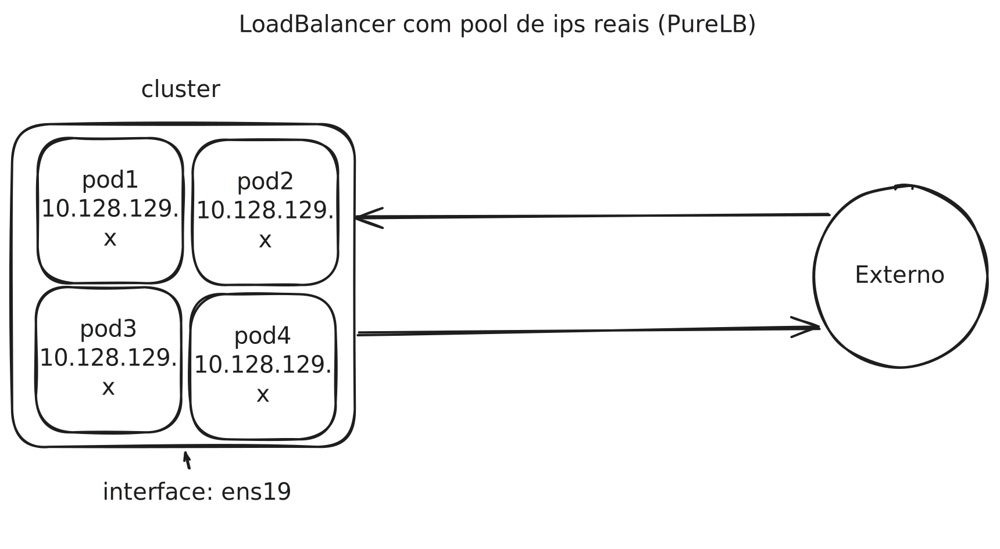

# Load Balancer (PureLB)

The load balancer is a type of service in Kubernetes that provides load balancing functionality for services. It is a network resource that distributes incoming traffic among the pods of a service. Load balancing is essential to ensure the availability and scalability of applications. It also assigns a fixed IP address to the service, allowing clients to access the service consistently.



# PureLB

PureLB was our chosen load balancer for Kubernetes. It is a simple and straightforward load balancer to implement. In short, it requires a deployment and a servicegroup to function.

## Installation

To install **PureLB** on your Kubernetes cluster, follow the steps below:

### 1. Cluster Preparation
Before installing PureLB, check the following requirements:

- **Container Network Interface (CNI)**: Ensure that your container network is configured and working in Kubernetes.
- **Firewall Rules**: PureLB uses the **Memberlist** library for fast network failures. Ensure that TCP/UDP ports 7934 are open on the firewall of each node to avoid "split brain" behavior in the network.
  
  **Command to open TCP/UDP ports 7934**:
  ```bash
  sudo ufw allow 7934/tcp
  sudo ufw allow 7934/udp
  ```

- **Linux Kernel ARP Behavior**: If using kubeproxy in IPVS mode, change the ARP behavior in the kernel so that it only responds to ARP requests on the appropriate interfaces. 
  Run the following commands to configure ARP:

  ```bash
  $ cat <<EOF | sudo tee /etc/sysctl.d/k8s_arp.conf
  net.ipv4.conf.all.arp_ignore=1
  net.ipv4.conf.all.arp_announce=2
  EOF
  $ sudo sysctl --system
  ```

### 2. Install PureLB with Helm

1. Add the PureLB repository to Helm:

   ```bash
   helm repo add purelb https://gitlab.com/api/v4/projects/20400619/packages/helm/stable
   helm repo update
   ```

2. Install PureLB on your Kubernetes cluster with the following command:

   ```bash
   helm install --create-namespace --namespace=purelb purelb purelb/purelb
   ```

### 3. Verify the Installation

After installation, check if the PureLB pods are running correctly:

```bash
kubectl get pods --namespace=purelb --output=wide
```

You should see the following pods:

- **allocator**: A pod running the allocation service.
- **lbnodeagent**: A pod running the agent on each node of the cluster.

### Summary of Installed Components

- **Namespace `purelb`**: Namespace created for PureLB components.
- **CRDs (Custom Resource Definitions)**: `ServiceGroup` and `LBNodeAgent`.
- **Deployments and DaemonSets**: The `Allocator` is installed as a Deployment, and the `LBNodeAgent` is installed as a DaemonSet on the cluster nodes.

These steps should ensure the successful installation of PureLB in your Kubernetes environment.

## Apply servicegroup

To configure PureLB, you need to apply a `ServiceGroup` to the cluster. The `ServiceGroup` defines the load balancing rules for the services.

Example of ServiceGroup:

```yaml
apiVersion: purelb.io/v1
kind: ServiceGroup
metadata:
  name: default
  namespace: purelb
spec:
  local:
    v4pools:
    - subnet: 10.128.128.0/17
      pool: 10.128.129.10-10.128.129.255
      aggregation: default
```

This configuration defines a `ServiceGroup` named `default` that allocates a pool of IP addresses for load balancing. That is, it allocates all IP addresses in the range from `10.128.129.10 to 10.128.128.255` to the services.

To apply the `ServiceGroup` configuration, run the following command:

```bash
kubectl apply -f servicegroup.yaml
```

To learn how to up an applicatio with PureLB, refer to the `servicelb.yaml`