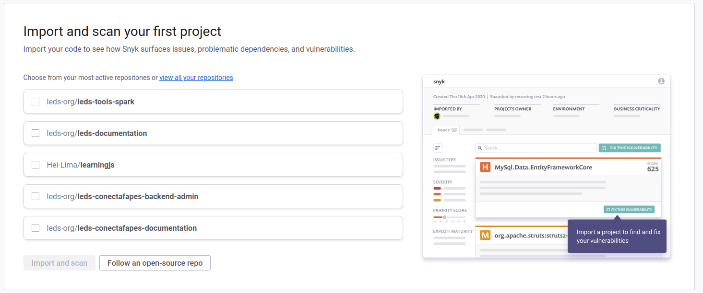
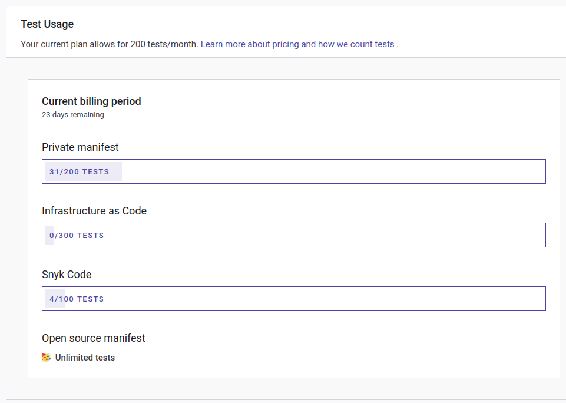

# How to use Snyk

Snyk is not self hosted, it is a service that you can acess via the cloud.

### How to acess Snyk

- Acess the Snyk website at [https://snyk.io/](https://snyk.io/)

- Create an account and login.

Now, you have to select some targets to scan. You can do that by enabaling the Github integration at settings.

Then, you can select the targets that you want to scan.

Note that you need to have specific permissions to acess the targets that you want to scan.

After selecting the projects, you can start the scan. It will scan your projects for vulnerabilities and show you the results, then, on all commits, it will run something like a CI pipeline to check if you are introducing new vulnerabilities. 

It is important to notice that you import the targets, not the projects themselves. This means that a target can have lots of projects. On C#, every .csproj is a project, therefore it will count in our billing as one.

### Settings:

You can configure the settings of your account to better fit your needs.

1) General settings: 

- You can configure the general settings of your account, like the name, slug, and acess to API tokens (we will need them in the Drone CI configuration).

2) Integrations:
- Setting about the integrations that you can use with Snyk. You can enable the Github integration here.

3) Usage:
- Here you can see your usage information. This is very important in our case, as there are some limits on the free plan. 

Theres also some other settings that you can configure, like notifications, plans, billing, and others.