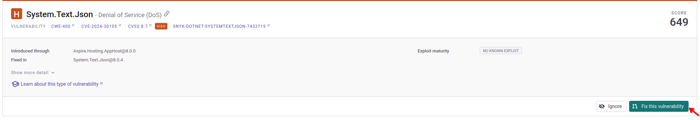

# Snyk

Snyk is a leading and industry standard security tool that helps you find, fix, and prevent vulnerabilities in your open source dependencies. It can be used in a variety of ways, including as a CLI tool, a GitHub Action, or a CI/CD integration.

In our case, we will be using Snyk with Drone CI (Snyk has a built-in Drone CI plugin) to scan our codebase for vulnerabilities and ensure that we are not introducing any new security issues. 

Snyk, unlike others tools in our infrastructure, is a paid service, and is cloud-based. However, it offers a free tier that allows you to scan up to 100 projects for free. This can become a problem in our case, as we use a microservices architeture, with clean architecture principles, that means that we have a lot of projects in our codebase. 

## Snyk features:

__Threats categorization__: Snyk categorizes threats into four categories: critical, high, medium, and low. This elps you prioritize which vulnerabilities to fix first.

__Automatic fixes__: Snyk can automatically fix some vulnerabilities for you, saving you time and effort.

__Automatic PRs__: Snyk can automatically create a PR for you with the fixes for the vulnerabilities it found.

__Built-in Github Integration__: Snyk has a built-in GitHub integration that allows you to easily integrate it into your CI/CD pipeline.

