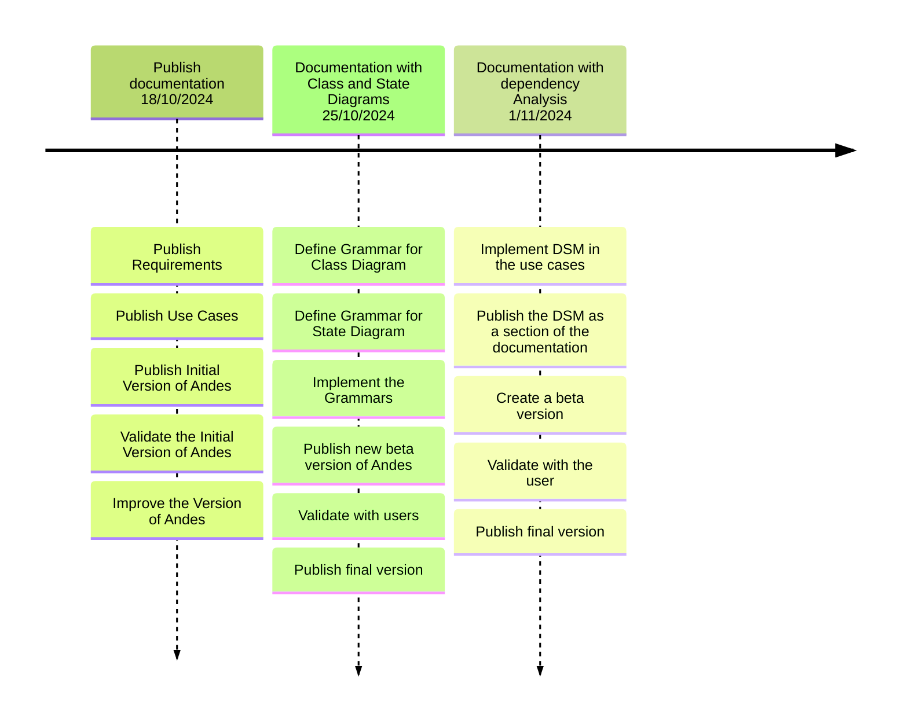

Presents the project`s developing planning.

## Backlog

| ID | Feature | Description | Importance |Proposal|
| -- | ------- | ----------- |----------- |--------|
| 1  | Create Analysis Document | Create an analysis document in Markdown with the following information: Requirements, Use Cases, Class Diagram, and State Diagram, to be published on Docusaurus. | 100 |Improve Comunication betwen teams in 10% |
| 2  | Dependency Analysis | Update the analysis document with a section for dependencies between use cases and events. | 90 |Improve project management in 15% |
| 3  | Module Planning | Create a planning document in the Made format, based on use cases. | 80 |Improve project management in 5% |
| 4  | Update Planning with Tasks | Update the planning document with tasks for each event, based on the development process. | 82 |Improve project management in 10% |
| 5  | Create Development Artifacts | Create a Spark-type document, using the data from the analysis. | 70 |Improve developing process int in 10% |

## General planning

* Release 1.0 - (14/10/2024 - 01/11/2024): create a documentation using Software Requirement information.
* Release 2.0 - (04/11/2024 - 31/11/2024): create a Made and Spark documents

## Release 1.0 - 01/11/2024

* **Goal**: Create an analysis document in Markdown with the following information: Requirements, Use Cases, Class Diagram, and State Diagram, to be published on Docusaurus and Update the analysis document with a section for dependencies between use cases and events. . 

  * **Features**: ID 1 and ID 2

  * **Deadline I**  - 25/10/2024 
      * ID 1: Create an analysis document in Markdown with the following information: Requirements, Use Cases, Class Diagram, and State Diagram, to be published on Docusaurus  
  * **Deadline II** - 01/11/2024 
      * ID 2: Update the analysis document with a section for dependencies between use cases and events.

